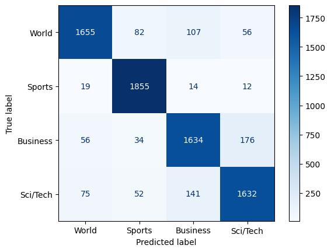

+++
title = 'Building a Text Classifier with PyTorch: A Deep Dive into AG News Dataset'
date = 2025-01-21T19:06:31-05:00
draft = false
summary = "This post explores the process of creating a text classification model using PyTorch and the AG News dataset. We'll cover every stage from dataset loading to model evaluation, providing a comprehensive understanding of text classification and deep learning concepts."
series = ["AI",]
tags = ["AI", "Pytorch", "Machine Learning", "Classification", "Deep Learning", "Neural Networks", "Artificial Intelligence"]
author= ["Me"]
+++

Hey everyone! I'm excited to share my journey into the fascinating world of text classification. As someone relatively new to deep learning, I recently embarked on a project to build a model that can categorize news articles. This blog post documents my exploration, using PyTorch and the popular AG News dataset. I'll be walking you through my process, from the initial setup and data wrangling to building the model and evaluating its performance. This is as much a learning experience for me as it is for you, so I'll be sharing my thought process, the challenges I encountered, and the little victories along the way!

My goal is to not just build a functional classifier, but to truly understand *why* each piece of the puzzle works. If you're also diving into deep learning or simply curious about how text can be understood by machines, then join me as I unpack this project step by step. We'll cover the essential concepts of text classification, explore the power of neural networks, and learn how to build a practical model from scratch. Let's see how far we can go!

## What is Text Classification (and Why Should I Care)?

Text classification is basically the act of teaching a computer to automatically organize and sort through written text into different groups or categories. At first, I was kind of blown away by this idea – that machines can actually "understand" the meaning behind words!

Think about all the ways this could be useful: categorizing customer reviews (positive or negative), filtering out spam emails, or like we're doing here – automatically labeling news articles by topic. Understanding how this works is a critical step to applying deep learning to text data. The model we will build will categorize news articles into the following four categories: World, Sports, Business, and Sci/Tech.


### Why AG News Dataset?

The AG News dataset was chosen because it's often used as a starting point for text classification. Its size and clear categories make it a nice balance between being complex enough to learn from and simple enough to not get lost in the details. For a beginner like me, this is the perfect playground to experiment with and start developing an intuition for this whole text classification thing. It also is readily available from the HuggingFace Dataset library, making it super accessible.

<iframe
  src="https://huggingface.co/datasets/wangrongsheng/ag_news/embed/viewer/default/train"
  frameborder="0"
  width="100%"
  height="560px"
></iframe>

## Setting up the Environment

We'll be working with several essential libraries:

-   **PyTorch:** A deep learning framework for building and training neural networks.
-   **Datasets:** The Hugging Face `datasets` library for easy access to datasets.
-   **Torchmetrics:** A library for evaluating models (accuracy)
-   **Collections:** Used to implement counter for tokenization
-   **Re**: used for regex operations for tokenizing


```python
import torch
from torch import nn
from datasets import load_dataset
from torch.utils.data import DataLoader
from collections import Counter
import re
```

The initial step involves ensuring GPU availability. This code block leverages PyTorch to check and utilize the GPU for faster computation if it's available.


```python
# Setup device agnostic code
device = 'cuda' if torch.cuda.is_available() else 'cpu'
print("Will be using:", device)
```

    Will be using: cuda


We then download the dataset using the datasets library and extract class names. This will help in knowing the number of labels needed for the classification problem.


```python
ag_news_dataset = load_dataset('wangrongsheng/ag_news')
classes = ag_news_dataset['train'].features['label'].names
classes
```


    ['World', 'Sports', 'Business', 'Sci/Tech']


## Preprocessing the Text Data
Preprocessing is a fundamental step in Natural Language Processing (NLP).  Raw text data is inherently messy and unstructured, requiring careful preparation before it can be effectively used by machine learning models.  Two crucial aspects of this preprocessing are tokenization and vocabulary building.  These steps bridge the gap between human-readable text and the numerical data that machines can understand.

### Simple Tokenization
Tokenization is the process of splitting text into individual units, called tokens. These tokens are most often words, but they can also be subwords or even characters.  Think of it as dissecting a sentence into its constituent words.  For learning purposes, I'm using a simple tokenizer:

```python
# Simple tokenizer function
def simple_tokenizer(text):
    # Convert to lowercase and split on whitespace and punctuation
    return re.findall(r'\w+', text.lower())
```

This function performs two main actions:

* Lowercase Conversion: Converting all text to lowercase (using text.lower()) ensures that the model treats "The" and "the" as the same word. This reduces the vocabulary size and improves model efficiency. Without this step, the model would treat these as distinct words, potentially leading to redundant learning.
* Splitting the Text: The core of tokenization is dividing the text into individual words or units. My simple_tokenizer uses regular expressions (re.findall(r'\w+', text.lower())) to identify words based on whitespace and punctuation. This creates a list of tokens, ready for the next stage.

**Important Note**: While this approach works for basic learning, it's a simplified view.  In real-world applications, more sophisticated tokenizers are typically used. Libraries like NLTK and spaCy offer more advanced tokenization methods that handle contractions (like "can't"), punctuation, and other linguistic nuances more effectively.  However, for learning the fundamental concepts, this simplified approach is a good starting point.

### Vocabulary Building

Once we have our tokens, we need to create a vocabulary.  A vocabulary is a list of all the unique words (or tokens) in our dataset.  Each word in the vocabulary is assigned a unique numerical index. This mapping is essential because machine learning models require numerical input.

```python
def build_vocabulary(dataset, max_size=40000):
    word_counts = Counter()
    # Special tokens
    special_tokens = ['<PAD>', '<UNK>']
    
    # Count all words
    print("Building vocabulary...")
    for item in dataset:
        tokens = simple_tokenizer(item['text'])
        word_counts.update(tokens)
    
    # Get most common words
    most_common = [word for word, _ in word_counts.most_common(max_size - len(special_tokens))]
    vocab = special_tokens + most_common
    word2idx = {word: idx for idx, word in enumerate(vocab)}
    
    return word2idx, len(word2idx)

word2idx, VOCAB_SIZE = build_vocabulary(ag_news_dataset['train'])
print(f"Vocabulary size: {VOCAB_SIZE}")
```

    Building vocabulary...
    Vocabulary size: 40000


The build_vocabulary function performs these steps:

1. Counting Word Frequencies: It counts how often each word appears in the training data. This information is used to select the most relevant words for our vocabulary.
2. Selecting Most Common Words: Often, we don't want to include every single word in our vocabulary, especially in large datasets. Many words might appear only once or twice and don't contribute significantly to the model's learning. The max_size parameter lets us limit the vocabulary to the most frequent words.
3. Creating the Word-to-Index Mapping (word2idx): This is the heart of vocabulary building. The word2idx dictionary maps each word in our vocabulary to a unique integer. This is how we convert words into numbers that the machine learning model can use.
4. Adding Special Tokens: The function also adds two special tokens: `<PAD>` and `<UNK>`.
    1. `<PAD>` (padding): This token is used to make all sentences the same length. Many machine learning models require input data to be of a consistent size. We "pad" shorter sentences with the `<PAD>` token.
    2. `<UNK>` (unknown): This token is used for any words that appear in our data but are not in our vocabulary (perhaps because they weren't frequent enough to be included). When the model encounters an unknown word, it uses the `<UNK>` token.

**Important Note**:  Similar to tokenization, this vocabulary building method is a simplified version for learning purposes. More advanced techniques like subword tokenization (e.g., Byte-Pair Encoding) exist to handle rare words and improve model performance. However, understanding the basic concepts of word counting, indexing, and special tokens is essential before moving on to more complex methods.

Why is vocabulary building so important?  It creates the numerical representation of the text that the model uses to learn. Each word is now a number, and the model can learn patterns and relationships between these numbers. The special tokens handle important edge cases, making our model more robust.  Tokenization and vocabulary building are the foundational steps that enable machine learning models to "understand" and process text data.  By using these simplified methods, I'm gaining a solid understanding of these core NLP concepts.

### Creating DataLoaders

The collate_fn function is a function that processes data and prepares it in a way the model can accept.


```python

# Modified collate function
def collate_fn(batch, max_length=128):
    texts = [item['text'] for item in batch]
    labels = torch.tensor([item['label'] for item in batch])
    
    # Tokenize and convert to indices
    sequences = []
    for text in texts:
        tokens = simple_tokenizer(text)[:max_length]
        # Use the PAD and UNK tokens we defined
        indices = [word2idx.get(token, word2idx['<UNK>']) for token in tokens]
        padding = [word2idx['<PAD>']] * (max_length - len(indices))
        indices.extend(padding)
        sequences.append(indices[:max_length])
    
    return torch.tensor(sequences), labels
```

This function converts tokenized texts to sequences of indices, performs padding to ensure consistent sequence length.

For training the model, we need to feed the data in batches. The following creates dataloaders for both training and test data.


```python
BATCH_SIZE = 128
train_dataloader = DataLoader(ag_news_dataset['train'], batch_size=BATCH_SIZE, collate_fn=collate_fn, shuffle=True)
test_dataloader = DataLoader(ag_news_dataset['test'], batch_size=BATCH_SIZE, collate_fn=collate_fn)
next(iter(train_dataloader))
```


    (tensor([[ 3058,   621,    98,  ...,     0,     0,     0],
             [  752,  2530,   154,  ...,     0,     0,     0],
             [ 1428,   662,   685,  ...,     0,     0,     0],
             ...,
             [10564,   115,  2316,  ...,     0,     0,     0],
             [   40,   116,     5,  ...,     0,     0,     0],
             [17210,  2379,     3,  ...,     0,     0,     0]]),
     tensor([1, 0, 0, 0, 2, 0, 3, 1, 2, 3, 1, 0, 1, 0, 2, 0, 1, 3, 3, 1, 3, 0, 0, 3,
             0, 2, 3, 2, 2, 0, 3, 1, 2, 1, 0, 1, 1, 0, 3, 2, 1, 2, 3, 3, 2, 2, 0, 1,
             3, 2, 3, 3, 3, 0, 0, 0, 0, 3, 3, 3, 3, 3, 2, 1, 0, 1, 3, 0, 1, 3, 1, 3,
             1, 3, 1, 0, 2, 3, 2, 0, 2, 2, 1, 1, 3, 1, 2, 3, 3, 1, 2, 3, 2, 1, 0, 1,
             0, 1, 2, 1, 2, 2, 0, 0, 1, 2, 2, 2, 0, 2, 1, 2, 3, 1, 2, 0, 0, 0, 1, 1,
             3, 3, 1, 2, 3, 1, 1, 2]))


## Model Architecture

The model, called AgNewsModal, employs a neural network with these features:

* **Embedding Layer**: The first layer is the embedding layer.  Its role is to convert the input tokens (words or subwords) into dense vector representations called embeddings.  Think of these embeddings as coordinates in a high-dimensional space, where words with similar meanings are located closer together. This layer allows the model to capture semantic relationships between words.  Instead of treating each word as a completely separate entity, the embedding layer represents them as points in a continuous space, enabling the model to learn relationships between them.

* **[LSTM Layer](https://en.wikipedia.org/wiki/Long_short-term_memory)**: The heart of the model is the LSTM (Long Short-Term Memory) layer.  LSTM is a type of recurrent neural network (RNN) specifically designed for processing sequential data like text.  Unlike traditional neural networks that process information in a feed-forward manner, RNNs have loops that allow information to persist across time steps.  In our case, the LSTM processes the sequence of word embeddings, allowing it to understand the context of each word within the sentence.  We use a bidirectional LSTM, which means the network processes the sequence from both left-to-right and right-to-left.  This allows the model to capture information from both directions of the text, leading to a richer understanding of the context.  For example, in the sentence "The farmer planted the seeds," a bidirectional LSTM would understand "planted" in the context of both "farmer" (the subject) and "seeds" (the object).

* **Linear Layers**: Following the LSTM layer, we have additional linear layers. These layers help to further process and refine the features extracted by the LSTM. Our implementation includes a BatchNorm1d (Batch Normalization) layer, ReLU activation, and a dropout layer.
    * **BatchNorm1d** normalizes the activations, which helps stabilize training and can lead to faster convergence. It ensures that the features passed to the next layer are on a similar scale.
    * **ReLU (Rectified Linear Unit)** is a common activation function that introduces non-linearity into the model. Non-linearity is crucial for learning complex patterns in the data.
    * **Dropout** is a regularization technique that randomly "drops out" neurons during training. This helps prevent overfitting, where the model becomes too specialized to the training data and performs poorly on unseen data.   


* **Classifier Layer**:  The final layer is the classifier layer, which is a linear layer that maps the processed features to the output classes.  In our case, these classes represent the different categories of agricultural news. This layer takes the refined features from the previous layers and makes the final prediction about which category the news article belongs to.  It outputs a probability distribution over the classes, and the class with the highest probability is chosen as the predicted category.

In summary, the AgNewsModel uses a combination of embedding layers, bidirectional LSTMs, linear layers with batch normalization, ReLU activation, and dropout, and a final classifier layer to effectively classify agricultural news articles.  This architecture is designed to capture both the semantic meaning of individual words and the contextual information within the text, allowing the model to make accurate predictions.

```python
class AgNewsModal(nn.Module):
    """
    AgNewsModal is a neural network model designed for text classification tasks, specifically for the AG News dataset.
    Args:
        num_emb (int): The size of the vocabulary (number of unique tokens).
        output_size (int): The number of output classes.
        num_layers (int, optional): The number of LSTM layers. Default is 2.
        hidden_size (int, optional): The number of features in the hidden state of the LSTM. Default is 128.
        dropout_rate (float, optional): The dropout rate to be applied in the LSTM and fully connected layers. Default is 0.3.
    Attributes:
        embedding (nn.Embedding): Embedding layer that converts input tokens to dense vectors.
        lstm (nn.LSTM): LSTM layer for sequential processing of the embedded tokens.
        layers (nn.Sequential): A sequence of layers including Linear, BatchNorm1d, ReLU, and Dropout for further processing.
        classifier (nn.Linear): Linear layer that maps the processed features to the output classes.
    Methods:
        forward(x):
            Defines the forward pass of the model.
            Args:
                x (torch.Tensor): Input tensor of shape [batch, seq_len].
            Returns:
                torch.Tensor: Output tensor of shape [batch, output_size] containing the class scores.
    """
    def __init__(self,num_emb, output_size, num_layers=2, hidden_size=128, dropout_rate=0.3):
        super().__init__()
        self.embedding = nn.Embedding(num_emb, hidden_size)
        
        # Add LSTM for sequential processing
        self.lstm = nn.LSTM(
            hidden_size, 
            hidden_size//2, 
            num_layers=num_layers, 
            batch_first=True, 
            bidirectional=True,
            dropout=dropout_rate
        )
        
        self.layers = nn.Sequential(
            nn.Linear(hidden_size, hidden_size//2),
            nn.BatchNorm1d(hidden_size//2),
            nn.ReLU(),
            nn.Dropout(dropout_rate)
        )
        
        self.classifier = nn.Linear(hidden_size//2, output_size)
    
    def forward(self, x):
        x = self.embedding(x)          # [batch, seq_len, hidden_size]
        x, _ = self.lstm(x)           # [batch, seq_len, hidden_size]
        x = x.mean(dim=1)             # [batch, hidden_size]
        x = self.layers(x)            # [batch, hidden_size//2]
        x = self.classifier(x)        # [batch, output_size]
        return x
    
model_0 = AgNewsModal(len(word2idx), len(classes))
model_0
```


    AgNewsModal(
      (embedding): Embedding(40000, 128)
      (lstm): LSTM(128, 64, num_layers=2, batch_first=True, dropout=0.3, bidirectional=True)
      (layers): Sequential(
        (0): Linear(in_features=128, out_features=64, bias=True)
        (1): BatchNorm1d(64, eps=1e-05, momentum=0.1, affine=True, track_running_stats=True)
        (2): ReLU()
        (3): Dropout(p=0.3, inplace=False)
      )
      (classifier): Linear(in_features=64, out_features=4, bias=True)
    )


The forward pass sends the data through the layers mentioned.

## Training and Evaluation
With the model architecture in place, we will now discuss about how we are going to train and evaluate the model.

### Training Setup
The training phase is set up using these important components.


```python
from torchmetrics import Accuracy

acc_fn = Accuracy(task="multiclass", num_classes=10).to(device)
loss_fn = nn.CrossEntropyLoss()
optimizer = torch.optim.Adam(model_0.parameters(), lr=0.02)
```

We set up an accuracy metric, loss function, and the optimizer used for training.

### Training and Test Step

The next part is writing the function that will be used for training and testing.


```python
def train_step(model: torch.nn.Module,
               data_loader: torch.utils.data.DataLoader,
               loss_fn: torch.nn.Module,
               optimizer: torch.optim.Optimizer,
               accuracy_fn,
               device: torch.device = device):
    train_loss, train_acc = 0, 0
    model.to(device)

    model.train()
    for batch, (X, y) in enumerate(data_loader):
        X, y = X.to(device), y.to(device)
        y_pred = model(X)
        loss = loss_fn(y_pred, y)
        acc = accuracy_fn(y_pred.argmax(dim=1), y)
        
        train_loss += loss
        train_acc += acc

        optimizer.zero_grad()
        loss.backward()
        optimizer.step()
        
        # Print out how many samples have been seen
        if batch % 400 == 0:
            print(f"Looked at {batch * len(X)}/{len(train_dataloader.dataset)} samples")

    # Calculate loss and accuracy per epoch and print out what's happening
    train_loss /= len(data_loader)
    train_acc /= len(data_loader)
    print(f"Train loss: {train_loss:.5f} | Train accuracy: {train_acc:.2f}%")

def test_step(data_loader: torch.utils.data.DataLoader,
              model: torch.nn.Module,
              loss_fn: torch.nn.Module,
              accuracy_fn,
              device: torch.device = device):
    test_loss, test_acc = 0, 0
    model.to(device)
    model.eval() # put model in eval mode
    # Turn on inference context manager
    with torch.inference_mode(): 
        for X, y in data_loader:
            # Send data to GPU
            X, y = X.to(device), y.to(device)
            
            # 1. Forward pass
            test_pred = model(X)
            
            # 2. Calculate loss and accuracy
            test_loss += loss_fn(test_pred, y)
            test_acc += accuracy_fn(test_pred.argmax(dim=1), y)
        
        # Adjust metrics and print out
        test_loss /= len(data_loader)
        test_acc /= len(data_loader)
        print(f"Test loss: {test_loss:.5f} | Test accuracy: {test_acc:.2f}%\n")
```

These function will train and test the data using the model and will return results based on the data.

### Model Evaluation
The last piece is evaluating the model using the test set.

This function calculates and prints metrics for model performance.


```python
def eval_model(model: torch.nn.Module, 
               data_loader: torch.utils.data.DataLoader, 
               loss_fn: torch.nn.Module, 
               accuracy_fn):
    """Returns a dictionary containing the results of model predicting on data_loader.

    Args:
        model (torch.nn.Module): A PyTorch model capable of making predictions on data_loader.
        data_loader (torch.utils.data.DataLoader): The target dataset to predict on.
        loss_fn (torch.nn.Module): The loss function of model.
        accuracy_fn: An accuracy function to compare the models predictions to the truth labels.

    Returns:
        (dict): Results of model making predictions on data_loader.
    """
    loss, acc = 0, 0
    model.eval()
    with torch.inference_mode():
        for X, y in data_loader:
            X, y = X.to(device), y.to(device)
            # Make predictions with the model
            y_pred = model(X)
            
            # Accumulate the loss and accuracy values per batch
            loss += loss_fn(y_pred, y)
            acc += accuracy_fn(y_pred.argmax(dim=1), y) # For accuracy, need the prediction labels (logits -> pred_prob -> pred_labels)
        
        # Scale loss and acc to find the average loss/acc per batch
        loss /= len(data_loader)
        acc /= len(data_loader)
        
    return {
            "model_name": model.__class__.__name__, # only works when model was created with a class
            "model_loss": loss.item(),
            "model_acc": acc.item()
        }
```

### Running Training
This section of code loops through the number of epochs and calls the function for training and testing.


```python

epochs = 3
for epoch in range(epochs):
    print(f"Epoch: {epoch}\n---------")
    train_step(data_loader=train_dataloader, 
        model=model_0, 
        loss_fn=loss_fn,
        optimizer=optimizer,
        accuracy_fn=acc_fn
    )
    test_step(data_loader=test_dataloader,
        model=model_0,
        loss_fn=loss_fn,
        accuracy_fn=acc_fn
    )
```

    Epoch: 0
    ---------
    Looked at 0/120000 samples
    Looked at 51200/120000 samples
    Looked at 102400/120000 samples
    Train loss: 0.34499 | Train accuracy: 0.88%
    Test loss: 0.29629 | Test accuracy: 0.91%
    
    Epoch: 1
    ---------
    Looked at 0/120000 samples
    Looked at 51200/120000 samples
    Looked at 102400/120000 samples
    Train loss: 0.23752 | Train accuracy: 0.92%
    Test loss: 0.27870 | Test accuracy: 0.91%
    
    Epoch: 2
    ---------
    Looked at 0/120000 samples
    Looked at 51200/120000 samples
    Looked at 102400/120000 samples
    Train loss: 0.23524 | Train accuracy: 0.92%
    Test loss: 0.33398 | Test accuracy: 0.89%
    


## Results and Conclusion
The training resulted in these results:


```python
model_0_results = eval_model(model=model_0, data_loader=test_dataloader,
    loss_fn=loss_fn, accuracy_fn=acc_fn
)
model_0_results
```


    {'model_name': 'AgNewsModal',
     'model_loss': 0.33398252725601196,
     'model_acc': 0.8918403387069702}


The model achieved an above accuracy, indicating effective learning from the dataset. We also visualize the performance of the model using the confusion matrix to better understand how the model performs.


```python
from sklearn.metrics import confusion_matrix, ConfusionMatrixDisplay

import matplotlib.pyplot as plt

# Get predictions and true labels
all_preds = []
all_labels = []

model_0.eval()
with torch.inference_mode():
    for X, y in test_dataloader:
        X, y = X.to(device), y.to(device)
        y_pred = model_0(X)
        all_preds.extend(y_pred.argmax(dim=1).cpu().numpy())
        all_labels.extend(y.cpu().numpy())

# Compute confusion matrix
cm = confusion_matrix(all_labels, all_preds)

# Plot confusion matrix
disp = ConfusionMatrixDisplay(confusion_matrix=cm, display_labels=classes)
disp.plot(cmap=plt.cm.Blues)
plt.show()
```


    

    


## Wrapping Up: What I've Learned (and Where I'm Going Next)

So, there you have it! That’s my journey of building a text classifier for the AG News dataset. It wasn't always smooth sailing, I had to do a lot of digging, trial and error, and ask a lot of questions (sometimes to myself!), but that’s part of the learning experience, right?

Looking back, I’ve gained some solid understanding:

*   **Data Preprocessing is Key:** I now appreciate how crucial it is to massage raw text into something the model can actually use. From tokenization to vocabulary building, these steps aren't just formalities; they’re fundamental to performance.
*   **Neural Networks are Powerful (but not Magic):** Seeing how the LSTM could learn from sequences of words and then classify them was incredible. The power of these neural network really hit me when I was working with them directly.
*   **The Importance of Iteration:** Training a model isn't a one-and-done thing; it’s about experimenting, monitoring performance, and making adjustments. The more I tried and failed, the more I understood.
*   **Evaluation is Crucial:** It's great to have a model, but knowing how well it actually performs is what really matters. Using the accuracy and confusion matrix has made me better understand what was going on, what works, and what does not.
* **Deep Learning is a Journey:** I realized this process never really stops. There is always more room for improvement and more models to try.

While I’m happy with the results, I know there’s so much more to explore. Here's what I'm thinking about next:

*   **Trying Different Architectures:** I wonder how other models, like Transformers, might perform on this dataset.
*   **Experimenting with Hyperparameters:** Fine-tuning the model's parameters could potentially improve accuracy, so that's something I will look into.
*   **Diving Deeper into NLP Concepts:** There are many more NLP techniques to learn, and I'm eager to understand them.
*   **Visualizations:** Further visualizations would be amazing, such as exploring the embedding space and visualizing attention mechanisms.

This whole project has really ignited my curiosity and motivated me to learn more about text classification. The journey is far from over, but this has been a fantastic step for me and has given me a strong foundation for future endeavors. If you've made it this far, thank you for tagging along on my learning journey! I'm always happy to hear your thoughts and suggestions, so feel free to leave a comment below. Let’s continue learning together!

<div class="meta_for_parser tablespecs" style="visibility:hidden">
text classification, pytorch, deep learning, natural language processing, ag news, lstm, text preprocessing, tokenization, word embeddings, neural networks, machine learning, model training, model evaluation, accuracy, confusion matrix, python, datasets, huggingface, colab.
</div>
