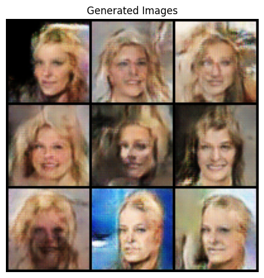

+++
title = 'Next Step with GANs: Adding Control to Generate the Faces I Want'
date = 2025-07-31T23:21:59-04:00
draft = false
summary = "In this post, we'll learn how to add a “steering wheel” to the GAN, and we will be turning our basic GAN into a Conditional GAN (CGAN) that will allow us to control the faces it generates."
series = ["AI",]
tags = ["AI", "Pytorch", "Machine Learning", "Deep Learning", "Neural Networks", "Artificial Intelligence"]
author= ["Me"]
+++

In my [last blog](https://isahil.me/blogs/gan_from_scratch/), we built a Generative Adversarial Network (GAN) from scratch. It was super fun and a great learning experience to see a model generate (somewhat) realistic looking, albeit random, human faces.

But once the excitement wore off, I was left wondering. The GAN was a black box. I could hit a button and get a random face, but I had no way of telling it *what kind* of face to create. What if I wanted a person with blond hair? What if I wanted someone who was smiling?

That is what this post is about. This is the next part in my learning journey where I learned how to add a "steering wheel" to the GAN, and we will be turning our basic GAN into a **Conditional GAN (CGAN)** that will allow us to control the faces it generates.

This post is going to contain a mixture of the code and the ideas behind it. Hopefully that gives you some context for everything below as I figure this out from the perspective of me figuring this out. Let's go ahead and get started!

### The Big Idea: What Does it Mean for a GAN to be "Conditional"?


<centre><sub><sup>[Original Image Source](https://learnopencv.com/conditional-gan-cgan-in-pytorch-and-tensorflow/)</sup></sub></centre>

Imagine you're an artist who can paint any face, but someone walks up and says "paint me a person with blonde hair." That's essentially what a Conditional GAN (CGAN) does, it generates images based on specific instructions or labels.

#### Regular GAN vs Conditional GAN: The Key Difference

In a regular GAN, the Generator is like an artist painting random faces from imagination. You never know what you'll get, maybe brown hair, maybe blonde, maybe a hat, maybe glasses. It's completely unpredictable.

But what if we want control? What if we want to specifically generate a face with blonde hair, or a digit "7", or a cat instead of a dog? That's where Conditional GANs come in.

#### How Does a CGAN Work?

The magic happens by adding one extra ingredient to both networks: **a label or condition**. Think of it as giving both the Generator and Discriminator a "cheat sheet" about what the image should contain.

Here's how each network changes:

**The Generator's New Job:**
- **Before (Regular GAN):** `random_noise → Image` (creates random image)
- **After (CGAN):** `random_noise + label → Image` (creates specific image)
- Example: `random_noise + "Blonde_Hair" → Image of person with blonde hair`

**The Discriminator's New Job:**
- **Before (Regular GAN):** `Image → Real or Fake?` (only checks authenticity)
- **After (CGAN):** `Image + label → Real or Fake?` (checks both authenticity and correctness)
- Example: `Image + "Blonde_Hair" → Is this real AND does it actually show blonde hair?`

#### Why This Simple Change is Powerful

By giving the Discriminator the label, it becomes much stricter. It's no longer just asking "Is this image realistic?" but also "Does this image match what was requested?" 

This forces the Generator to become smarter. It can't just create any realistic image – it must create a realistic image that specifically matches the given condition. If asked for blonde hair, it better deliver blonde hair, or the Discriminator will reject it.

The result? We get controllable image generation where we can specify exactly what we want to create.

### Step 0: Import Necessary Libraries and Packages

Let's start by importing the necessary libraries and packages. We'll need PyTorch for deep learning, torchvision for image data manipulation, and matplotlib for plotting. Also, we will be setting some hyperparameters for our GAN.

```python
import torch
import torch.nn as nn

from torch.utils.data import Dataset
from torch.utils.data import DataLoader
from PIL import Image

from torchvision import transforms
import torchvision.utils as vutils
import torch.optim as optim

import matplotlib.pyplot as plt
import numpy as np
import pandas as pd
import matplotlib.animation as animation
from IPython.display import HTML
import os
```


```python
IMAGE_SIZE = 64

BATCH_SIZE = 1024
WORKERS = 4

NGPUS = 3

NUM_CHANNELS = 3
LATENT_DIM = 100

G_FEATURES = 64
D_FEATURES = 64

BETA1=0.5
LR=0.0002
NUM_EPOCHS=25
```

### Step 1: Getting our Data Ready (with Labels!)

The main hurdle was the data. For this to run, we need data that has images and labels. Once again, I'm using the **CelebA dataset**, and it is nice that it comes with 40 attributes per image, such as, "Male", "Smiling", "Wavy_Hair", etc.
To load the data, I needed to write my own `CelebADataset` class in PyTorch because regular data loaders do not handle this image-and-label combination properly.

```python
class CelebADataset(Dataset):
    def __init__(self, img_dir, attr_file, transform=None, selected_attrs=None):
        """
        Args:
            img_dir: Directory with images
            attr_file: Path to list_attr_celeba.txt
            transform: Image transforms
            selected_attrs: List of attribute names to use (if None, uses all)
        """
        self.img_dir = img_dir
        self.transform = transform
        
        # Read attribute file
        self.attr_df = pd.read_csv(attr_file, header=1)
        
        # Get attribute names from first row (which becomes column names)
        self.attr_names = list(self.attr_df.columns[1:])  # Skip filename column
        
        # Select specific attributes if provided
        if selected_attrs is not None:
            self.selected_attrs = selected_attrs
            # Verify all selected attributes exist
            missing_attrs = set(selected_attrs) - set(self.attr_names)
            if missing_attrs:
                raise ValueError(f"Attributes not found: {missing_attrs}")
        else:
            self.selected_attrs = self.attr_names
        
        self.filenames = self.attr_df.iloc[:, 0].values  # First column is filename
        
    def __len__(self):
        return len(self.attr_df)
    
    def __getitem__(self, idx):
        # Get image
        img_name = self.filenames[idx]
        img_path = os.path.join(self.img_dir, 'img_align_celeba', 'img_align_celeba', img_name)
        image = Image.open(img_path).convert('RGB')
        
        if self.transform:
            image = self.transform(image)
        
        # Get labels for selected attributes
        labels = []
        for attr in self.selected_attrs:
            # Convert from {-1, 1} to {0, 1}
            label = (self.attr_df.loc[idx, attr] + 1) // 2
            labels.append(label)

        labels = torch.tensor(labels, dtype=torch.float32)
        
        return (image, labels)
    
    def get_attr_names(self):
        """Return list of selected attribute names"""
        return self.selected_attrs
```
The most important part here is __getitem__. For every image, it also creates a labels tensor from the attributes file. I did a little trick here to convert the labels from the dataset's {-1, 1} format to a more standard {0, 1} format.

My Assumption: For this project, I decided to use all 40 attributes provided by CelebA. This might actually make it harder for the model, as some attributes could be confusing or rare. A good next step would be to pick a smaller, cleaner set of attributes and see if the results improve.

The rest of the data setup, like the `transforms` and `DataLoader`, is pretty much the same as in our first GAN project.

```python
transform = transforms.Compose([
    transforms.Resize(IMAGE_SIZE),
    transforms.CenterCrop(IMAGE_SIZE),
    transforms.ToTensor(),
    transforms.Normalize((0.5, 0.5, 0.5), (0.5, 0.5, 0.5))
])

dataset = CelebADataset( './data/celeba', './data/celeba/list_attr_celeba.csv', transform=transform)

dataloader = torch.utils.data.DataLoader(dataset, batch_size=BATCH_SIZE,
                                         shuffle=True, num_workers=WORKERS)
NUM_CLASSES = len(dataset.get_attr_names())
device = torch.device("cuda:0" if (torch.cuda.is_available() and NGPUS > 0) else "cpu")

# Plot some training images
(real_batch, labels) = next(iter(dataloader))
plt.figure(figsize=(8,8))
plt.axis("off")
plt.title("Training Images")
plt.imshow(np.transpose(vutils.make_grid(real_batch.to(device)[:64], padding=2, normalize=True).cpu(),(1,2,0)))
plt.show()
```


    

    

### Step 2: Upgrading the Generator and Discriminator

Now for the fun part: updating the models. The architecture is almost identical to our DCGAN from Part 1, with one tiny but critical change.


```python
def weights_init(m):
    classname = m.__class__.__name__
    if classname.find('Conv') != -1:
        nn.init.normal_(m.weight.data, 0.0, 0.02)
    elif classname.find('BatchNorm') != -1:
        nn.init.normal_(m.weight.data, 1.0, 0.02)
        nn.init.constant_(m.bias.data, 0)
```
#### The Generator

Our old Generator took a 100-dimensional noise vector as input. The new one will take the noise vector plus the label vector. So if we have 40 attributes, the new input dimension is 100 (noise) + 40 (labels) = 140.

```python
class Generator(nn.Module):
    def __init__(self):
        super(Generator, self).__init__()
        INPUT_DIM = LATENT_DIM + NUM_CLASSES
        self.model = nn.Sequential(
            # input is Z_DIM, going into a convolutional layer
            nn.ConvTranspose2d(INPUT_DIM, G_FEATURES * 8, 4, 1, 0),
            nn.BatchNorm2d(G_FEATURES * 8),
            nn.ReLU(True),

            # state size. (G_FEATURES * 8) x 4 x 4
            nn.ConvTranspose2d(G_FEATURES * 8, G_FEATURES * 4, 4, 2, 1),
            nn.BatchNorm2d(G_FEATURES * 4),
            nn.ReLU(True),

            # state size. (G_FEATURES * 4) x 8 x 8
            nn.ConvTranspose2d(G_FEATURES * 4, G_FEATURES * 2, 4, 2, 1),
            nn.BatchNorm2d(G_FEATURES * 2),
            nn.ReLU(True),

            # state size. (G_FEATURES * 2) x 16 x 16
            nn.ConvTranspose2d(G_FEATURES * 2, G_FEATURES, 4, 2, 1),
            nn.BatchNorm2d(G_FEATURES),
            nn.ReLU(True),

            # state size. (G_FEATURES) x 32 x 32
            nn.ConvTranspose2d(G_FEATURES, NUM_CHANNELS, 4, 2, 1),
            nn.Tanh()
        )

    def forward(self, z, labels):
        labels = labels.unsqueeze(2).unsqueeze(3)  # [batch_size, num_classes, 1, 1]
        
        # Concatenate noise and labels
        input_tensor = torch.cat([z, labels], dim=1)  # [batch_size, latent_dim + num_classes, 1, 1]
        return self.model(input_tensor)
        
```
That torch.cat line is the key. It's how we inject our "condition" into the generation process.

```python
netG = Generator().to(device)

if (device.type == 'cuda') and (NGPUS > 1):
    netG = nn.DataParallel(netG, list(range(NGPUS)))

netG.apply(weights_init)

netG
```
    DataParallel(
      (module): Generator(
        (model): Sequential(
          (0): ConvTranspose2d(140, 512, kernel_size=(4, 4), stride=(1, 1))
          (1): BatchNorm2d(512, eps=1e-05, momentum=0.1, affine=True, track_running_stats=True)
          (2): ReLU(inplace=True)
          (3): ConvTranspose2d(512, 256, kernel_size=(4, 4), stride=(2, 2), padding=(1, 1))
          (4): BatchNorm2d(256, eps=1e-05, momentum=0.1, affine=True, track_running_stats=True)
          (5): ReLU(inplace=True)
          (6): ConvTranspose2d(256, 128, kernel_size=(4, 4), stride=(2, 2), padding=(1, 1))
          (7): BatchNorm2d(128, eps=1e-05, momentum=0.1, affine=True, track_running_stats=True)
          (8): ReLU(inplace=True)
          (9): ConvTranspose2d(128, 64, kernel_size=(4, 4), stride=(2, 2), padding=(1, 1))
          (10): BatchNorm2d(64, eps=1e-05, momentum=0.1, affine=True, track_running_stats=True)
          (11): ReLU(inplace=True)
          (12): ConvTranspose2d(64, 3, kernel_size=(4, 4), stride=(2, 2), padding=(1, 1))
          (13): Tanh()
        )
      )
    )

#### The Discriminator

The Discriminator gets a similar upgrade. It needs to look at an image and check if it matches the given labels. So, instead of taking just an image as input, it takes the image channels plus the number of labels.

We achieve this by reshaping the label vector into a "channel" and concatenating it with the image channels.

```python
class Discriminator(nn.Module):
    def __init__(self):
        super(Discriminator, self).__init__()

        self.model = nn.Sequential(
            nn.Conv2d(NUM_CHANNELS + NUM_CLASSES, D_FEATURES, 4, 2, 1, bias=False),
            nn.LeakyReLU(0.2, inplace=True),

            nn.Conv2d(D_FEATURES, D_FEATURES * 2, 4, 2, 1, bias=False),
            nn.BatchNorm2d(D_FEATURES * 2),
            nn.LeakyReLU(0.2, inplace=True),

            nn.Conv2d(D_FEATURES * 2, D_FEATURES * 4, 4, 2, 1, bias=False),
            nn.BatchNorm2d(D_FEATURES * 4),
            nn.LeakyReLU(0.2, inplace=True),

            nn.Conv2d(D_FEATURES * 4, D_FEATURES * 8, 4, 2, 1, bias=False),
            nn.BatchNorm2d(D_FEATURES * 8),
            nn.LeakyReLU(0.2, inplace=True),

            nn.Conv2d(D_FEATURES * 8, 1, 4, 1, 0, bias=False),
            nn.Sigmoid(),
        )

    def forward(self, image, labels):
        batch_size = image.size(0)
        
        # Expand labels to match image spatial dimensions
        labels = labels.unsqueeze(2).unsqueeze(3)  # [batch_size, num_classes, 1, 1]
        labels = labels.expand(batch_size, -1, IMAGE_SIZE, IMAGE_SIZE)  # [batch_size, num_classes, 64, 64]
        
        # Concatenate image and labels
        input_tensor = torch.cat([image, labels], dim=1)  # [batch_size, num_channels + num_classes, 64, 64]
        
        return self.model(input_tensor).view(-1)
        
```
This was a part that took me a minute to get right. We can't just attach a small label vector to a big image. We have to expand the labels so they have the same spatial dimensions as the image `(64x64)`, effectively creating 40 extra "channels" that the discriminator can see.


```python
netD = Discriminator().to(device)

if (device.type == 'cuda') and (NGPUS > 1):
    netD = nn.DataParallel(netD, list(range(NGPUS)))

netD.apply(weights_init)

netD
```


    DataParallel(
      (module): Discriminator(
        (model): Sequential(
          (0): Conv2d(43, 64, kernel_size=(4, 4), stride=(2, 2), padding=(1, 1), bias=False)
          (1): LeakyReLU(negative_slope=0.2, inplace=True)
          (2): Conv2d(64, 128, kernel_size=(4, 4), stride=(2, 2), padding=(1, 1), bias=False)
          (3): BatchNorm2d(128, eps=1e-05, momentum=0.1, affine=True, track_running_stats=True)
          (4): LeakyReLU(negative_slope=0.2, inplace=True)
          (5): Conv2d(128, 256, kernel_size=(4, 4), stride=(2, 2), padding=(1, 1), bias=False)
          (6): BatchNorm2d(256, eps=1e-05, momentum=0.1, affine=True, track_running_stats=True)
          (7): LeakyReLU(negative_slope=0.2, inplace=True)
          (8): Conv2d(256, 512, kernel_size=(4, 4), stride=(2, 2), padding=(1, 1), bias=False)
          (9): BatchNorm2d(512, eps=1e-05, momentum=0.1, affine=True, track_running_stats=True)
          (10): LeakyReLU(negative_slope=0.2, inplace=True)
          (11): Conv2d(512, 1, kernel_size=(4, 4), stride=(1, 1), bias=False)
          (12): Sigmoid()
        )
      )
    )


### Step 3: The Training Loop
The training loop follows the same two-step dance as before: first, we train the Discriminator, and then we train the Generator. The main difference is that we now have to pass the labels to the models every time.

One thing I changed from my first attempt was the real_label value.

```python
criterion = nn.MSELoss()

fixed_noise = torch.randn(64, LATENT_DIM, 1, 1, device=device)

real_label = 0.9
fake_label = 0.

optimizerD = optim.Adam(netD.parameters(), lr=LR, betas=(BETA1, 0.999))
optimizerG = optim.Adam(netG.parameters(), lr=LR, betas=(BETA1, 0.999))
```

Using `0.9` instead of `1.0` for real images is a technique called **label smoothing**. I found that without it, my Discriminator would get too confident and its loss would drop to almost zero. When that happens, the Generator can't learn anything. Label smoothing keeps the Discriminator a little "on its toes" and helps stabilize the training. It was a small change that made a big difference.

```python
img_list = []
G_losses = []
D_losses = []
iters = 0

# Create fixed noise and labels for consistent evaluation
fixed_noise = torch.randn(64, LATENT_DIM, 1, 1, device=device)
fixed_labels = torch.randint(0, 2, (64, NUM_CLASSES), device=device).float()

print("Starting Training Loop...")
for epoch in range(NUM_EPOCHS):
    for i, data in enumerate(dataloader):
        
        ############################
        # (1) Update D network: maximize log(D(x,y)) + log(1 - D(G(z,y),y))
        ###########################
        ## Train with all-real batch
        netD.zero_grad()
        # Format batch - now includes labels
        real_cpu = data[0].to(device)
        real_labels = data[1].to(device)  # Get labels from dataset
        b_size = real_cpu.size(0)
        label = torch.full((b_size,), real_label, dtype=torch.float, device=device)
        
        # Forward pass real batch through D with labels
        output = netD(real_cpu, real_labels)
        # Calculate loss on all-real batch
        errD_real = criterion(output, label)
        # Calculate gradients for D in backward pass
        errD_real.backward()
        D_x = output.mean().item()

        ## Train with all-fake batch
        # Generate batch of latent vectors and random labels
        noise = torch.randn(b_size, LATENT_DIM, 1, 1, device=device)

        fake_labels = real_labels  # Same labels as real batch

        # Generate fake image batch with G using labels
        fake = netG(noise, fake_labels)
        label.fill_(fake_label)
        
        # Classify all fake batch with D using same labels
        output = netD(fake.detach(), fake_labels)
        # Calculate D's loss on the all-fake batch
        errD_fake = criterion(output, label)
        # Calculate the gradients for this batch
        errD_fake.backward()
        D_G_z1 = output.mean().item()
        
        # Compute error of D as sum over the fake and the real batches
        errD = errD_real + errD_fake
        # Update D
        optimizerD.step()

        ############################
        # (2) Update G network: maximize log(D(G(z,y),y))
        ###########################
        netG.zero_grad()
        label.fill_(real_label)  # fake labels are real for generator cost
        
        # Since we just updated D, perform another forward pass of all-fake batch through D
        output = netD(fake, fake_labels)
        # Calculate G's loss based on this output
        errG = criterion(output, label)
        # Calculate gradients for G
        errG.backward()
        D_G_z2 = output.mean().item()
        # Update G
        optimizerG.step()

        # Output training stats
        if i % 50 == 0:
            print('[%d/%d][%d/%d]\tLoss_D: %.4f\tLoss_G: %.4f\tD(x): %.4f\tD(G(z)): %.4f / %.4f'
                  % (epoch, NUM_EPOCHS, i, len(dataloader),
                     errD.item(), errG.item(), D_x, D_G_z1, D_G_z2))

        # Save Losses for plotting later
        G_losses.append(errG.item())
        D_losses.append(errD.item())

        # Check how the generator is doing by saving G's output on fixed_noise and fixed_labels
        if (iters % 500 == 0) or ((epoch == NUM_EPOCHS-1) and (i == len(dataloader)-1)):
            with torch.no_grad():
                fake = netG(fixed_noise, fixed_labels).detach().cpu()
            img_list.append(vutils.make_grid(fake, padding=2, normalize=True))

        iters += 1
```
<div style="height:600px;overflow: auto;margin-bottom: 16px;">

    Starting Training Loop...
    [0/25][0/198]	Loss_D: 0.5548	Loss_G: 0.6298	D(x): 0.6188	D(G(z)): 0.5915 / 0.1263
    [0/25][50/198]	Loss_D: 0.1808	Loss_G: 0.8100	D(x): 0.9874	D(G(z)): 0.3594 / 0.0000
    [0/25][100/198]	Loss_D: 0.1790	Loss_G: 0.7655	D(x): 0.7100	D(G(z)): 0.0423 / 0.0284
    [0/25][150/198]	Loss_D: 0.3752	Loss_G: 0.6216	D(x): 0.4401	D(G(z)): 0.1199 / 0.1314
    [1/25][0/198]	Loss_D: 0.5194	Loss_G: 0.4903	D(x): 0.4323	D(G(z)): 0.4491 / 0.2143
    [1/25][50/198]	Loss_D: 0.3804	Loss_G: 0.5375	D(x): 0.5811	D(G(z)): 0.4466 / 0.1824
    [1/25][100/198]	Loss_D: 0.4227	Loss_G: 0.3413	D(x): 0.4031	D(G(z)): 0.3460 / 0.3280
    [1/25][150/198]	Loss_D: 0.3687	Loss_G: 0.3532	D(x): 0.5201	D(G(z)): 0.4413 / 0.3188
    [2/25][0/198]	Loss_D: 0.4082	Loss_G: 0.3306	D(x): 0.4556	D(G(z)): 0.4370 / 0.3337
    [2/25][50/198]	Loss_D: 0.4182	Loss_G: 0.2900	D(x): 0.4841	D(G(z)): 0.4722 / 0.3717
    [2/25][100/198]	Loss_D: 0.3522	Loss_G: 0.3134	D(x): 0.4837	D(G(z)): 0.3842 / 0.3506
    [2/25][150/198]	Loss_D: 0.4197	Loss_G: 0.2599	D(x): 0.4356	D(G(z)): 0.4403 / 0.3931
    [3/25][0/198]	Loss_D: 0.3831	Loss_G: 0.2772	D(x): 0.4497	D(G(z)): 0.3829 / 0.3815
    [3/25][50/198]	Loss_D: 0.3687	Loss_G: 0.3366	D(x): 0.5001	D(G(z)): 0.4389 / 0.3268
    [3/25][100/198]	Loss_D: 0.4180	Loss_G: 0.2940	D(x): 0.4171	D(G(z)): 0.4043 / 0.3638
    [3/25][150/198]	Loss_D: 0.4190	Loss_G: 0.3367	D(x): 0.4586	D(G(z)): 0.4324 / 0.3286
    [4/25][0/198]	Loss_D: 0.3844	Loss_G: 0.3450	D(x): 0.4472	D(G(z)): 0.3854 / 0.3214
    [4/25][50/198]	Loss_D: 0.2833	Loss_G: 0.4206	D(x): 0.6479	D(G(z)): 0.4346 / 0.2627
    [4/25][100/198]	Loss_D: 0.3699	Loss_G: 0.3184	D(x): 0.4324	D(G(z)): 0.3434 / 0.3446
    [4/25][150/198]	Loss_D: 0.3708	Loss_G: 0.2806	D(x): 0.3976	D(G(z)): 0.3044 / 0.3832
    [5/25][0/198]	Loss_D: 0.3039	Loss_G: 0.3596	D(x): 0.4451	D(G(z)): 0.2384 / 0.3127
    [5/25][50/198]	Loss_D: 0.3305	Loss_G: 0.5955	D(x): 0.6131	D(G(z)): 0.4605 / 0.1310
    [5/25][100/198]	Loss_D: 0.4005	Loss_G: 0.4844	D(x): 0.4716	D(G(z)): 0.4101 / 0.2104
    [5/25][150/198]	Loss_D: 0.2596	Loss_G: 0.4403	D(x): 0.4593	D(G(z)): 0.1425 / 0.2472
    [6/25][0/198]	Loss_D: 0.4552	Loss_G: 0.7116	D(x): 0.2656	D(G(z)): 0.0351 / 0.0592
    [6/25][50/198]	Loss_D: 0.2847	Loss_G: 0.5172	D(x): 0.4478	D(G(z)): 0.1523 / 0.1892
    [6/25][100/198]	Loss_D: 0.3290	Loss_G: 0.6304	D(x): 0.6707	D(G(z)): 0.4616 / 0.1108
    [6/25][150/198]	Loss_D: 0.1372	Loss_G: 0.5680	D(x): 0.7281	D(G(z)): 0.2057 / 0.1552
    [7/25][0/198]	Loss_D: 0.2285	Loss_G: 0.5808	D(x): 0.6125	D(G(z)): 0.3062 / 0.1428
    [7/25][50/198]	Loss_D: 0.2587	Loss_G: 0.7436	D(x): 0.6193	D(G(z)): 0.3157 / 0.0387
    [7/25][100/198]	Loss_D: 0.2663	Loss_G: 0.6504	D(x): 0.6728	D(G(z)): 0.3438 / 0.0983
    [7/25][150/198]	Loss_D: 0.2602	Loss_G: 0.5599	D(x): 0.4814	D(G(z)): 0.1856 / 0.1573
    [8/25][0/198]	Loss_D: 0.3013	Loss_G: 0.5708	D(x): 0.5326	D(G(z)): 0.3159 / 0.1510
    [8/25][50/198]	Loss_D: 0.3113	Loss_G: 0.6135	D(x): 0.4050	D(G(z)): 0.0868 / 0.1237
    [8/25][100/198]	Loss_D: 0.3152	Loss_G: 0.5322	D(x): 0.4028	D(G(z)): 0.0954 / 0.1863
    [8/25][150/198]	Loss_D: 0.2476	Loss_G: 0.5371	D(x): 0.5250	D(G(z)): 0.2420 / 0.1750
    [9/25][0/198]	Loss_D: 0.3133	Loss_G: 0.5324	D(x): 0.5167	D(G(z)): 0.3467 / 0.1752
    [9/25][50/198]	Loss_D: 0.1989	Loss_G: 0.6866	D(x): 0.6827	D(G(z)): 0.2949 / 0.0733
    [9/25][100/198]	Loss_D: 0.3015	Loss_G: 0.5611	D(x): 0.5725	D(G(z)): 0.3654 / 0.1579
    [9/25][150/198]	Loss_D: 0.3582	Loss_G: 0.4736	D(x): 0.3792	D(G(z)): 0.2115 / 0.2240
    [10/25][0/198]	Loss_D: 0.3318	Loss_G: 0.5620	D(x): 0.3783	D(G(z)): 0.1114 / 0.1583
    [10/25][50/198]	Loss_D: 0.2871	Loss_G: 0.5357	D(x): 0.5163	D(G(z)): 0.2817 / 0.1759
    [10/25][100/198]	Loss_D: 0.3057	Loss_G: 0.5523	D(x): 0.5422	D(G(z)): 0.3488 / 0.1619
    [10/25][150/198]	Loss_D: 0.2332	Loss_G: 0.4727	D(x): 0.4871	D(G(z)): 0.1461 / 0.2283
    [11/25][0/198]	Loss_D: 0.3315	Loss_G: 0.5373	D(x): 0.5725	D(G(z)): 0.4154 / 0.1746
    [11/25][50/198]	Loss_D: 0.3466	Loss_G: 0.6669	D(x): 0.6648	D(G(z)): 0.4997 / 0.0853
    [11/25][100/198]	Loss_D: 0.2058	Loss_G: 0.6242	D(x): 0.6104	D(G(z)): 0.2693 / 0.1131
    [11/25][150/198]	Loss_D: 0.2437	Loss_G: 0.7064	D(x): 0.7182	D(G(z)): 0.3983 / 0.0607
    [12/25][0/198]	Loss_D: 0.4349	Loss_G: 0.6460	D(x): 0.6818	D(G(z)): 0.5901 / 0.0984
    [12/25][50/198]	Loss_D: 0.3156	Loss_G: 0.4433	D(x): 0.5119	D(G(z)): 0.3382 / 0.2441
    [12/25][100/198]	Loss_D: 0.2529	Loss_G: 0.4618	D(x): 0.6252	D(G(z)): 0.3423 / 0.2365
    [12/25][150/198]	Loss_D: 0.3400	Loss_G: 0.6874	D(x): 0.7105	D(G(z)): 0.5018 / 0.0726
    [13/25][0/198]	Loss_D: 0.2812	Loss_G: 0.5398	D(x): 0.6766	D(G(z)): 0.4291 / 0.1719
    [13/25][50/198]	Loss_D: 0.2640	Loss_G: 0.5811	D(x): 0.6374	D(G(z)): 0.3848 / 0.1424
    [13/25][100/198]	Loss_D: 0.2322	Loss_G: 0.4822	D(x): 0.5514	D(G(z)): 0.2538 / 0.2135
    [13/25][150/198]	Loss_D: 0.2773	Loss_G: 0.4896	D(x): 0.6415	D(G(z)): 0.3956 / 0.2082
    [14/25][0/198]	Loss_D: 0.2477	Loss_G: 0.4474	D(x): 0.5264	D(G(z)): 0.2527 / 0.2409
    [14/25][50/198]	Loss_D: 0.3354	Loss_G: 0.6856	D(x): 0.7321	D(G(z)): 0.5115 / 0.0735
    [14/25][100/198]	Loss_D: 0.2738	Loss_G: 0.4555	D(x): 0.5301	D(G(z)): 0.2828 / 0.2355
    [14/25][150/198]	Loss_D: 0.2905	Loss_G: 0.5539	D(x): 0.5802	D(G(z)): 0.3535 / 0.1615
    [15/25][0/198]	Loss_D: 0.3590	Loss_G: 0.3664	D(x): 0.3489	D(G(z)): 0.1441 / 0.3118
    [15/25][50/198]	Loss_D: 0.2833	Loss_G: 0.5638	D(x): 0.6282	D(G(z)): 0.4042 / 0.1541
    [15/25][100/198]	Loss_D: 0.2815	Loss_G: 0.5606	D(x): 0.6720	D(G(z)): 0.4106 / 0.1597
    [15/25][150/198]	Loss_D: 0.2727	Loss_G: 0.6405	D(x): 0.7255	D(G(z)): 0.4426 / 0.1030
    [16/25][0/198]	Loss_D: 0.2790	Loss_G: 0.6204	D(x): 0.7457	D(G(z)): 0.4591 / 0.1155
    [16/25][50/198]	Loss_D: 0.2553	Loss_G: 0.6144	D(x): 0.7042	D(G(z)): 0.4116 / 0.1202
    [16/25][100/198]	Loss_D: 0.2657	Loss_G: 0.3804	D(x): 0.4525	D(G(z)): 0.1448 / 0.2986
    [16/25][150/198]	Loss_D: 0.3851	Loss_G: 0.4424	D(x): 0.3122	D(G(z)): 0.0890 / 0.2485
    [17/25][0/198]	Loss_D: 0.2217	Loss_G: 0.4680	D(x): 0.5673	D(G(z)): 0.2330 / 0.2264
    [17/25][50/198]	Loss_D: 0.2785	Loss_G: 0.6119	D(x): 0.6932	D(G(z)): 0.4330 / 0.1209
    [17/25][100/198]	Loss_D: 0.2658	Loss_G: 0.2630	D(x): 0.4561	D(G(z)): 0.1784 / 0.4087
    [17/25][150/198]	Loss_D: 0.3141	Loss_G: 0.4150	D(x): 0.4070	D(G(z)): 0.1393 / 0.2690
    [18/25][0/198]	Loss_D: 0.2006	Loss_G: 0.4670	D(x): 0.6964	D(G(z)): 0.3424 / 0.2256
    [18/25][50/198]	Loss_D: 0.2667	Loss_G: 0.3068	D(x): 0.4676	D(G(z)): 0.2068 / 0.3673
    [18/25][100/198]	Loss_D: 0.2906	Loss_G: 0.5292	D(x): 0.5966	D(G(z)): 0.3759 / 0.1795
    [18/25][150/198]	Loss_D: 0.2480	Loss_G: 0.4546	D(x): 0.5725	D(G(z)): 0.2770 / 0.2387
    [19/25][0/198]	Loss_D: 0.2968	Loss_G: 0.4267	D(x): 0.5268	D(G(z)): 0.3221 / 0.2568
    [19/25][50/198]	Loss_D: 0.2799	Loss_G: 0.5682	D(x): 0.7214	D(G(z)): 0.4454 / 0.1536
    [19/25][100/198]	Loss_D: 0.4610	Loss_G: 0.3794	D(x): 0.2415	D(G(z)): 0.0806 / 0.3036
    [19/25][150/198]	Loss_D: 0.3381	Loss_G: 0.6886	D(x): 0.7557	D(G(z)): 0.5301 / 0.0717
    [20/25][0/198]	Loss_D: 0.3057	Loss_G: 0.6645	D(x): 0.7232	D(G(z)): 0.4872 / 0.0866
    [20/25][50/198]	Loss_D: 0.3350	Loss_G: 0.6268	D(x): 0.7073	D(G(z)): 0.5102 / 0.1104
    [20/25][100/198]	Loss_D: 0.3390	Loss_G: 0.2664	D(x): 0.3618	D(G(z)): 0.1487 / 0.4062
    [20/25][150/198]	Loss_D: 0.3207	Loss_G: 0.5489	D(x): 0.6260	D(G(z)): 0.4507 / 0.1636
    [21/25][0/198]	Loss_D: 0.2503	Loss_G: 0.3562	D(x): 0.5342	D(G(z)): 0.2858 / 0.3162
    [21/25][50/198]	Loss_D: 0.2671	Loss_G: 0.4787	D(x): 0.6738	D(G(z)): 0.4126 / 0.2146
    [21/25][100/198]	Loss_D: 0.2303	Loss_G: 0.4942	D(x): 0.6277	D(G(z)): 0.3481 / 0.2028
    [21/25][150/198]	Loss_D: 0.2607	Loss_G: 0.3622	D(x): 0.5170	D(G(z)): 0.2724 / 0.3121
    [22/25][0/198]	Loss_D: 0.2895	Loss_G: 0.5622	D(x): 0.7069	D(G(z)): 0.4613 / 0.1550
    [22/25][50/198]	Loss_D: 0.2580	Loss_G: 0.3352	D(x): 0.4940	D(G(z)): 0.2463 / 0.3362
    [22/25][100/198]	Loss_D: 0.2568	Loss_G: 0.4272	D(x): 0.6030	D(G(z)): 0.3629 / 0.2547
    [22/25][150/198]	Loss_D: 0.3016	Loss_G: 0.5320	D(x): 0.6750	D(G(z)): 0.4485 / 0.1772
    [23/25][0/198]	Loss_D: 0.3133	Loss_G: 0.5806	D(x): 0.6933	D(G(z)): 0.4803 / 0.1418
    [23/25][50/198]	Loss_D: 0.2653	Loss_G: 0.5013	D(x): 0.6780	D(G(z)): 0.4198 / 0.2033
    [23/25][100/198]	Loss_D: 0.3809	Loss_G: 0.3425	D(x): 0.3154	D(G(z)): 0.1303 / 0.3294
    [23/25][150/198]	Loss_D: 0.2750	Loss_G: 0.3751	D(x): 0.4778	D(G(z)): 0.2488 / 0.3004
    [24/25][0/198]	Loss_D: 0.2799	Loss_G: 0.5095	D(x): 0.6901	D(G(z)): 0.4421 / 0.1912
    [24/25][50/198]	Loss_D: 0.2783	Loss_G: 0.5286	D(x): 0.6833	D(G(z)): 0.4378 / 0.1840
    [24/25][100/198]	Loss_D: 0.2347	Loss_G: 0.5505	D(x): 0.6749	D(G(z)): 0.3857 / 0.1625
    [24/25][150/198]	Loss_D: 0.3297	Loss_G: 0.5733	D(x): 0.6996	D(G(z)): 0.5026 / 0.1465

</div>

```python
plt.figure(figsize=(10,5))
plt.title("Generator and Discriminator Loss During Training")
plt.plot(G_losses,label="G")
plt.plot(D_losses,label="D")
plt.xlabel("iterations")
plt.ylabel("Loss")
plt.legend()
plt.show()
```


    

    


```python
fig = plt.figure(figsize=(8,8))
plt.axis("off")
ims = [[plt.imshow(np.transpose(i,(1,2,0)), animated=True)] for i in img_list]
ani = animation.ArtistAnimation(fig, ims, interval=1000, repeat_delay=1000, blit=True)

HTML(ani.to_jshtml())
```


<iframe src='/gan_animation.html' width="100%" height="950px"></iframe>


    

    


```python
# Grab a batch of real images from the dataloader
real_batch = next(iter(dataloader))

# Plot the real images
plt.figure(figsize=(15,15))
plt.subplot(1,2,1)
plt.axis("off")
plt.title("Real Images")
plt.imshow(np.transpose(vutils.make_grid(real_batch[0].to(device)[:64], padding=5, normalize=True).cpu(),(1,2,0)))

# Plot the fake images from the last epoch
plt.subplot(1,2,2)
plt.axis("off")
plt.title("Fake Images")
plt.imshow(np.transpose(img_list[-1],(1,2,0)))
plt.show()
```


    

    
### The Results: Did It Work?

After training for 25 epochs, it was time to see if we could actually control the output. I wrote a small function to generate faces with specific attributes.


```python
def generate_custom_face(netG, device, **attributes):
    """
    Generate face with custom attributes
    Usage: generate_custom_face(netG, device, Male=1, Smiling=1, Blond_Hair=1, Young=1)
    """
    netG.eval()
    
    # Attribute name to index mapping
    attr_map = {
        '5_o_Clock_Shadow': 0, 'Arched_Eyebrows': 1, 'Attractive': 2, 'Bags_Under_Eyes': 3,
        'Bald': 4, 'Bangs': 5, 'Big_Lips': 6, 'Big_Nose': 7, 'Black_Hair': 8, 'Blond_Hair': 9,
        'Blurry': 10, 'Brown_Hair': 11, 'Bushy_Eyebrows': 12, 'Chubby': 13, 'Double_Chin': 14,
        'Eyeglasses': 15, 'Goatee': 16, 'Gray_Hair': 17, 'Heavy_Makeup': 18, 'High_Cheekbones': 19,
        'Male': 20, 'Mouth_Slightly_Open': 21, 'Mustache': 22, 'Narrow_Eyes': 23, 'No_Beard': 24,
        'Oval_Face': 25, 'Pale_Skin': 26, 'Pointy_Nose': 27, 'Receding_Hairline': 28, 'Rosy_Cheeks': 29,
        'Sideburns': 30, 'Smiling': 31, 'Straight_Hair': 32, 'Wavy_Hair': 33, 'Wearing_Earrings': 34,
        'Wearing_Hat': 35, 'Wearing_Lipstick': 36, 'Wearing_Necklace': 37, 'Wearing_Necktie': 38, 'Young': 39
    }
    
    # Create label vector
    label = torch.zeros(40)
    for attr_name, value in attributes.items():
        if attr_name in attr_map:
            label[attr_map[attr_name]] = value
    
    label = label[:40].unsqueeze(0).to(device)
    noise = torch.randn(1, LATENT_DIM, 1, 1, device=device)
    
    with torch.no_grad():
        fake_image = netG(noise, label)
    
    return fake_image

# Let's ask for a person who is Smiling, has Blond Hair, and is Wearing Lipstick
generate_conditions = {'Blond_Hair': 1, 'Smiling': 1, 'Wearing_Lipstick': 1}

IMG_NUM = 9
gen_images = []
for i in range(IMG_NUM):
    image = generate_custom_face(netG, device, **generate_conditions)
    image = image[0]
    gen_images.append(image.cpu())

plt.axis("off")
plt.title("Generated Images")
gen_grid = vutils.make_grid(gen_images, padding=2, normalize=True, nrow=3)
plt.imshow(np.transpose(gen_grid, (1, 2, 0)))
plt.tight_layout()
plt.show()
```

And here are the results:

    

    

It worked! The generated faces aren't perfect, and some look a bit strange, but they clearly have the attributes we asked for. The model learned the connection between the labels and the visual features. Success!

### Final Thoughts on This Step

This project was a great next step in my deep learning journey. Converting the GAN to a CGAN really helped me understand how we can guide and control these powerful models.

#### Key Learnings

My biggest takeaway is that the core concepts are often simpler than they seem. The idea of concatenating the label with the input is straightforward, but it's what enables this whole new level of control. Sometimes the most elegant solutions in machine learning are the simplest ones.

Beyond the technical implementation, this project taught me several important lessons:

**Controllability vs Creativity Trade-off:** While CGANs give us precise control over outputs, I noticed they can sometimes produce less diverse results compared to vanilla GANs. The conditioning acts as both a guide and a constraint.

**Label Quality Matters:** The quality of your generated images is directly tied to the quality and consistency of your training labels. Garbage in, garbage out applies strongly here.

**Architecture Flexibility:** Adding conditions doesn't just work for images - this same principle extends to text generation, audio synthesis, and other domains. It's a fundamental technique for making generative models practical.

#### Looking Ahead

This foundation opens doors to more advanced conditional generation techniques like StyleGAN conditioning, text-to-image models, and even controllable video generation. The core principle of "give the model context about what you want" is everywhere in modern AI.

Thanks for following along! Let me know if you have any questions or suggestions - I'd love to hear about your own experiments with conditional generation.