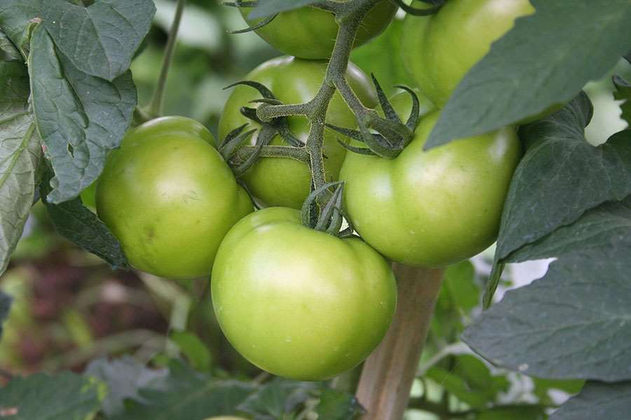
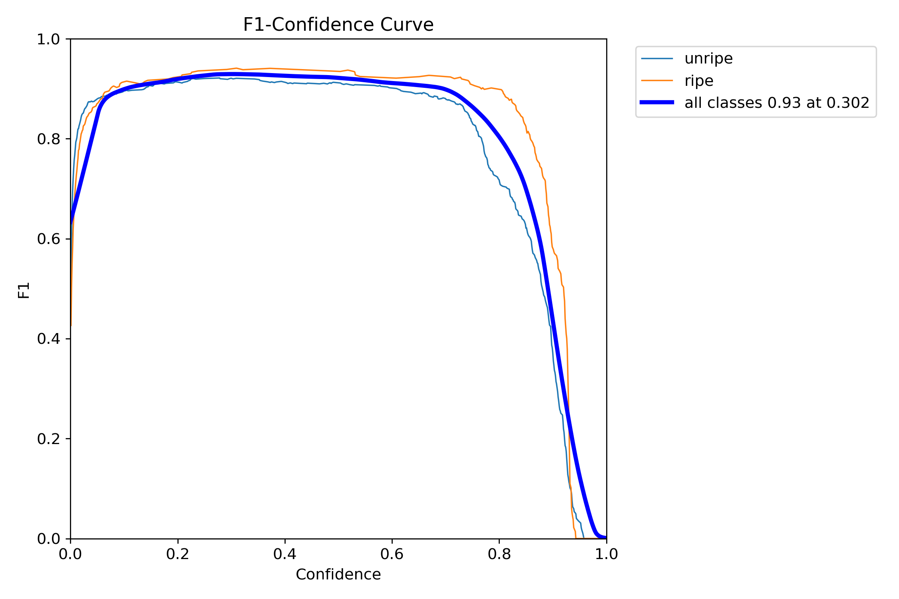
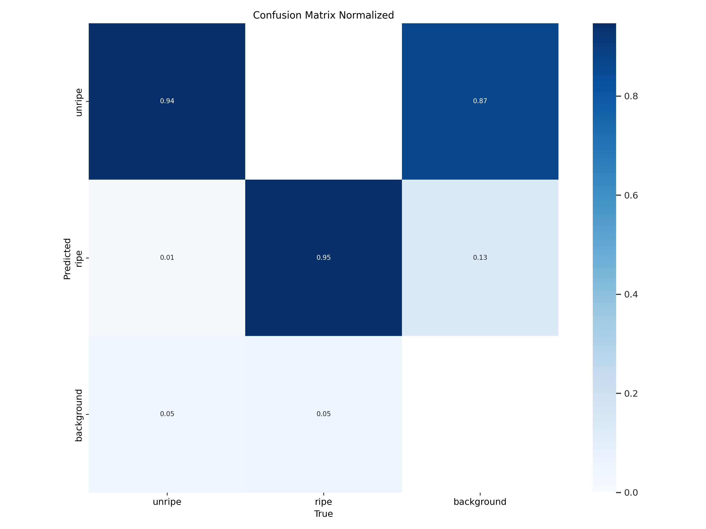
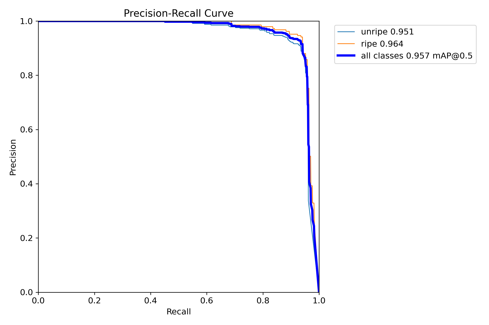
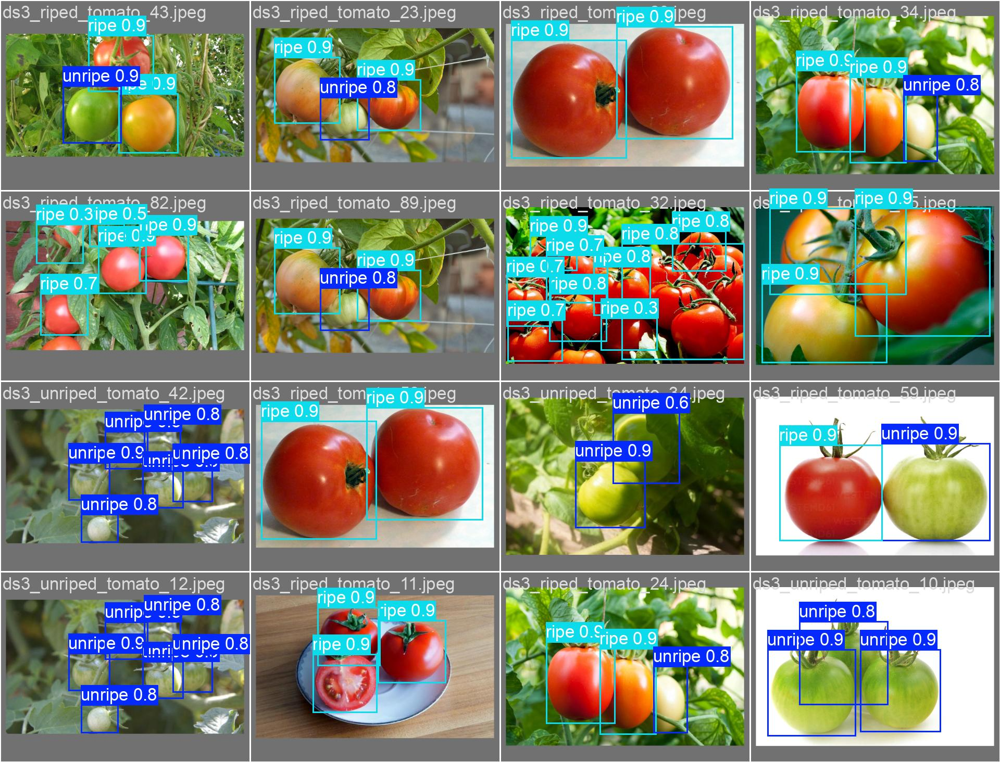

+++
title = 'Edge AI Showdown: Setting the Stage for Efficient Deep Learning (Part 1)'
date = 2025-05-14T17:41:15-04:00
draft = false
summary = "Learn to deploy AI on edge devices! We build a baseline YOLOv11n model for visual classification and benchmark its performance, setting the stage for crucial optimization for Raspberry Pi, Jetson, and more."
series = ["AI", "Edge Deployment", "Machine Vision", "YOLO"]
tags = ["AI", "Pytorch", "Machine Learning", "Classification", "Deep Learning", "Neural Networks", "Artificial Intelligence", "Machine Vision", "YOLO"]
author= ["Me"]
+++

Artificial Intelligence (AI) is transforming our world, but often, these powerful AI models live in big data centers, far away from where they're actually needed. Imagine a smart security camera that has to send video to the cloud just to detect an intruder – that takes time and a good internet connection! This is where **Edge AI** comes in.

## Understanding Edge AI: Bringing Intelligence Directly to Your Devices

Edge AI is all about bringing the smarts directly to the device itself. Think of it as making your gadgets – like your phone, a Raspberry Pi, a specialized Jetson Nano board, or even industrial robots – intelligent on their own, without always needing to talk to a distant server.

### Why is Edge AI Crucial for Modern Applications?

*   **Speed (Low Latency):** Decisions can be made almost instantly. Crucial for things like self-driving cars or fast-moving robots.
*   **Privacy:** Sensitive data (like video from your home) can stay on your device instead of being sent elsewhere.
*   **Bandwidth Savings:** Less data needs to be sent over the internet, saving costs and working even with poor connections.
*   **Offline Capability:** Your AI-powered device can still work even if the internet is down.

The big challenge? These edge devices usually have limited processing power, memory, and battery life compared to giant cloud servers. So, how do we run sophisticated AI models on them efficiently? That's what this blog series is all out! We'll walk you through a practical project to optimize a deep learning model for these resource-constrained environments.

## Selecting Our AI Model: Why YOLOv11n is Ideal for Edge Deployment

For our project, we need an AI model that can "see" and understand images. This is called **computer vision**, and a common task is **object detection** – finding and identifying objects in a picture or video.

There are many object detection models, but the **YOLO (You Only Look Once)** family is famous for being fast and accurate, making it a great candidate for real-time applications. For our edge AI quest, we specifically chose **YOLOv11n**. The 'n' stands for 'nano', meaning it's a smaller, more lightweight version of YOLO, designed with efficiency in mind from the get-go. This makes it an excellent starting point for devices where every bit of performance counts.

## Our Test Case: Demonstrating Edge AI with Visual Classification

To demonstrate how we can optimize an AI model for the edge, we needed a practical example. We chose **vegetable ripeness classification** – specifically, teaching our AI to tell if a tomato is ripe or unripe.

### Why This Specific Use Case for Edge AI?
*   It's a **visual task** that's easy to understand.
*   It has real-world applications, for instance, in **agricultural robots** for automated harvesting or in **quality inspection systems**.
*   Most importantly, it serves as a great **demonstrator** for the optimization techniques that can be applied to *many other* visual AI tasks you might want to run on an edge device. The principles we'll cover are broadly applicable!

## Data for Edge AI: Sourcing and Preparing Our Dataset

No AI model can learn without data. For our tomato ripeness detector, we gathered a diverse set of images from two public sources:
*   **Roboflow (Kyunghee University Tomato Detection dataset):** Provided images with varied lighting and scenes.
*   **Kaggle (Riped and Unriped Tomato Dataset):** Offered clear examples focused on the ripe/unripe states.

|  |   |
|:--:| :--:|
| *Kyunghee University dataset example: Varied lighting and scenes.* | *Kaggle dataset example: Clear focus on ripe/unripe states.* |

Combining these datasets gave us a good mix of images. The data preparation involved:
1.  **Annotation:** Carefully drawing boxes around each tomato and labeling it as 'ripe' or 'unripe'.
2.  **Formatting:** Converting these annotations into the standard YOLO format, which the model understands.
3.  **Splitting:** Dividing our dataset into three parts:
    *   **Training set:** Used to teach the model.
    *   **Validation set:** Used during training to check how well the model is learning and to tune it.
    *   **Testing set:** Kept separate and used only at the very end to see how well our *final* model performs on unseen data.

This careful data preparation is crucial for building a reliable AI model.

## Establishing the Baseline: Training and Initial Performance of Our YOLOv11n Model

With our data ready, we trained our YOLOv11n model. We used a technique called **transfer learning**, where we started with a model that was already pre-trained on a massive dataset (COCO), and then **fine-tuned** it on our specific tomato dataset. This helps the model learn faster and better.

After training for 100 epochs (cycles through the training data), we evaluated its performance on our test set using a standard computer (Intel Core i9 CPU). Let's look at how our *baseline* model performed, not just with overall numbers, but also by diving into some key evaluation graphs.

### Key Performance Metrics:
*   **Overall Accuracy (mAP@0.5:0.95):** ~74.3% – This metric gives a comprehensive score of how well the model detects objects (tomatoes) at various levels of overlap with the true bounding boxes. A score of 74.3% is a solid start.
*   **Accuracy at 50% Overlap (mAP@0.5):** ~95.5% – This tells us that if we consider a detection "correct" when its bounding box overlaps at least 50% with the ground truth, our model is very accurate.
*   **Precision:** ~94.1% – Of all the tomatoes the model *said* were ripe (or unripe), about 94.1% of them actually were. This means few false positives.
*   **Recall:** ~90.7% – Of all the actual ripe (or unripe) tomatoes in the images, the model found about 90.7% of them. This means it missed a few.
*   **Inference Speed (Latency):** ~27.7 milliseconds per image (around 36 frames per second, FPS).
*   **Model Size:** 5.2 Megabytes (MB).

### Digging Deeper with Evaluation Graphs:

Beyond these summary numbers, graphs can give us more insight into the model's behavior:

1.  **F1-Confidence Curve:**
    
    The F1-score is a balance between Precision and Recall. This curve shows the F1-score at different **confidence thresholds**. A confidence threshold is like telling the model, "Only show me detections you are X% sure about." Our model achieved a peak F1-score of around 0.92 at a confidence threshold of about 0.3. This helps us pick an optimal threshold for deployment.

2.  **Confusion Matrix:**
    
    This matrix shows us how well the model distinguishes between our classes ('ripe' and 'unripe') *for the tomatoes it detected*.
    *   The diagonal values (e.g., unripe predicted as unripe, ripe predicted as ripe) are high (over 93%), which is excellent! It means when the model detects a tomato, it's very good at correctly classifying its ripeness.
    *   The off-diagonal values show misclassifications. For instance, a small percentage of actual 'unripe' tomatoes might be classified as 'ripe' by the model, and vice-versa.
    *   The 'background' row/column shows when the model either missed a tomato entirely (confused it with background) or incorrectly detected background as a tomato. Our matrix shows a small percentage (~5-6%) of actual tomatoes were misclassified as background, indicating a slight area for improvement in detection sensitivity.

3.  **Precision-Recall (PR) Curve:**
    
    This curve illustrates the trade-off between Precision and Recall for different thresholds. Ideally, we want high precision and high recall (top-right corner). The area under this curve (Average Precision, AP) is a good measure of performance for each class. Our PR curve shows strong performance for both 'ripe' and 'unripe' classes, with AP values around 0.95-0.96.

*Caption: Sample visual predictions from our baseline YOLOv11n model on the test set.*

### Baseline Conclusion: Good Accuracy, But Is It Edge-Ready?

Our baseline YOLOv11n model demonstrates **strong detection and classification accuracy** for the tomato ripeness task. The F1-score, confusion matrix, and PR curves all confirm that the model learned effectively and can differentiate between ripe and unripe tomatoes with high confidence once an object is detected. The main limitation observed was a small percentage of tomatoes being missed entirely (classified as background).

However, when we consider our goal of **edge deployment**:
*   An **inference latency of ~27.7 ms (~36 FPS)** on a powerful desktop CPU is promising, but this speed will likely decrease significantly on resource-constrained edge devices like a Raspberry Pi or a Jetson Nano. For true real-time interaction on such devices, we need to push this much lower.
*   A **model size of 5.2 MB**, while relatively small for deep learning models, can still be a constraint for embedded systems with very limited flash memory or for applications that need to be downloaded quickly.

**The verdict is clear:** While our baseline model is functionally good, its current speed and size make it a borderline candidate for efficient deployment on low-power edge devices. There's significant room – and need – for optimization!

## The Optimization Roadmap: Our Strategy for Peak Edge AI Performance

This brings us to the core of our journey. Our baseline model is a good start, but it's not yet optimized for the demands of edge computing. In the upcoming parts of this series, we'll explore two powerful optimization strategies:

1.  **Model Quantization (Coming in Part 2):** We'll dive into how reducing the numerical precision of our model (e.g., from 32-bit floating-point numbers to 8-bit integers) can dramatically shrink its size and speed up calculations, often with very little impact on accuracy.
2.  **Format Conversion & Specialized Runtimes (Coming in Part 3):** We'll look at converting our model into different deployment formats (like ONNX or using toolkits like OpenVINO and NCNN) that are specifically designed for efficient execution on various hardware.

Our goal is simple: to achieve significant improvements in inference speed and model size, while keeping the accuracy as high as possible.

Stay tuned for Part 2, where we'll roll up our sleeves and get started with the magic of model quantization!