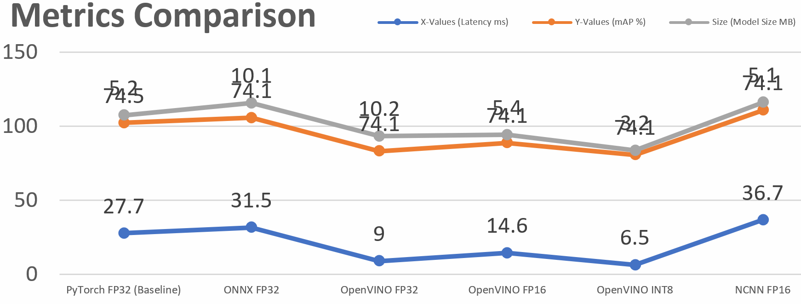

+++
title = 'Edge AI Showdown: Less is More – Supercharging Performance with Quantization (Part 2)'
date = 2025-07-20T15:43:44-04:00
draft = false
summary = "Learn to deploy AI on edge devices! We build a baseline YOLOv11n model for visual classification and benchmark its performance, setting the stage for crucial optimization for Raspberry Pi, Jetson, and more."
series = ["AI", "Edge Deployment", "Machine Vision", "YOLO"]
tags = ["AI", "Pytorch", "Machine Learning", "Classification", "Deep Learning", "Neural Networks", "Artificial Intelligence", "Machine Vision", "YOLO"]
author= ["Me"]
+++

Alright, hi again!

In [Part 1](/blogs/edge_ai_showdown_part_1), we trained our YOLOv11n model to identify ripe and unripe tomatoes. We realized that it was really smart and precise but a bit slow and clunky. On our speedy desktop PC, it ran at about 36 frames per second (FPS). That's not terrible, but on a humble device like a Raspberry Pi, it would run very slowly – probably too slowly for an actual real-time robot arm to harvest tomatoes.

So, our model is smart but not suitable. Now we're going to put it through an exhaustive training regime called **Quantization**.

## What is Model Quantization Anyway? The Art of Making AI Simpler

Think about how you'd represent the value Pi as a string. You could write `3.1415926535.`, which is amazingly precise. Or, for all but the most demanding purposes, you could write `3.14`, which is simpler and usually sufficient.

AI models have a tendency to enjoy being very precise. They store all of their brain power as very long decimal numbers called **32-bit floating-point numbers (FP32)**.

**Quantization** is the process of taking those long, complicated numbers and scaling them down to much simpler, much smaller whole numbers, like **8-bit integers (INT8)**.

Why is this significant to Edge AI?

1. **It minimizes the model size.** An 8-bit value takes up 4 times less space than a 32-bit value. This means that our model file size can really drop!
2. **It makes the model faster.** CPU chips are naturally designed to run extremely fast with basic whole numbers (integers). They're far slower with long, complex decimal numbers (floats). By reducing to integers, we see an enormous speed increase.

It's kind of like asking our model to speak in fewer words and tell more straightforward, simple things. It's telling the same thing, just much faster.

## How We Did It: The Genius of Post-Training Quantization (PTQ)

The best part is how we did it. We employed a technique that is **Post-Training Quantization (PTQ)**.

The name literally says it all: it is done *after* your model is already trained. That is great because it means **you don't have to retrain your model!** You do have your whole, smart model and just run it through an optimization tool.

We used Intel's **OpenVINO toolkit** for our project. The process was basically:

1. Take our FP32 YOLO model that we trained.
2. Feed the OpenVINO tool with about 100 sample images from our dataset. It is called a "calibration set."
3. The tool runs the images through the model, looks at the space of all the complex numbers, and comes up with the best method to map them into simple 8-bit integers without losing too much data.
4. It then outputs a brand-new, extremely optimized INT8 model.

## The Results: Did It Actually Work?

Oh yeah, it worked better than we could have dreamed. The difference was night and day.

Here's a simple "Before vs. After" comparison:

#### Our Baseline Model (FP32)
* **Speed:** ~27.7 ms per image (~36 FPS)
* **Size:** 5.2 MB
* **Accuracy (mAP):** ~74.3%

#### Our Quantized Model (INT8 using OpenVINO)
* **Speed:** ~6.5 ms per image (~154 FPS) ????
* **Size:** 3.2 MB
* **Accuracy (mAP):** ~74.1%

Let's break it down:
* **A ~4.3x Speedup!** We sped up from a respectable 36 FPS to a blazing 154 FPS on the same computer. That is overkill for any real-time system.
* **A 38% Smaller Model!** We cut down by nearly 2 MB, and that really matters for devices with limited storage.
* **Near Zero Loss of Accuracy!** We realized all these benefits at the expense of sacrificing a tiny, insignificant 0.2% accuracy loss. It's a free upgrade.

<!-- 
<centre>A visual comparison of our models. The OpenVINO INT8 (in green) has the lowest latency (fastest) and a small size, with nearly no drop in accuracy.</centre> -->
<figure>
    
    <figcaption>
    <centre>
    A visual comparison of our models. The OpenVINO INT8 (in green) has the lowest latency (fastest) and a small size, with nearly no drop in accuracy.
    
    </centre>
    </figcaption>
</figure>

It is easy to observe the figures, but seeing it in action is different. Here is a video of the side-by-side comparison between our model on a high-end GPU and our optimized model on a standard CPU. The performance is amazing!

<iframe width="560" height="315" src="https://www.youtube.com/embed/bM34kMI0K5E?si=7hiwXrlPzqNfXT0H&amp;controls=0" title="YouTube video player" frameborder="0" allow="accelerometer; autoplay; clipboard-write; encrypted-media; gyroscope; picture-in-picture; web-share" referrerpolicy="strict-origin-when-cross-origin" allowfullscreen></iframe>

> ### A Quick Word on Hardware: The "Home-Field Advantage
> You might've already noticed that OpenVINO gave us the best scores in these cases. It's interesting to mention that our testing machine had an **Intel CPU**, and **OpenVINO is an Intel-built product**. So, it's super-optimized for its own hardware, so it has a "home-field advantage.".
>We also experimented in our report with another toolkit called **NCNN**, developed by Tencent for **mobile phones**. Most phones and devices like the Raspberry Pi use another chip architecture (like ARM). Had we executed this same test on a mobile phone, NCNN would have performed much better, even surpassing OpenVINO in this case.
>
> **The key take-home is:** The *optimal* optimization method typically depends on your *target hardware*.

## Quantization is Your First-Step Superpower

As you might have noticed, quantization gave us enormous performance and efficiency gains for virtually no cost. If you're looking to run AI on edge devices, Post-Training Quantization is one of the first optimization methods you should try.

But our journey is not yet over. We saw how a toolset dedicated to one domain like OpenVINO performed in its native territory. How does it compare to more cross-platform ones like ONNX? And the performance of NCNN in deeper detail?

Catch Part 3, when we'll explore the **"Format Wars & Runtime Showdown,"** pitting all the export formats against each other to find the ultimate configuration for our edge AI model!