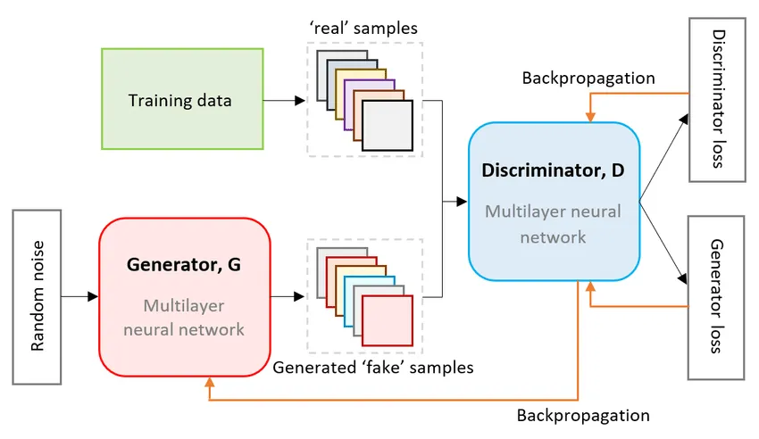
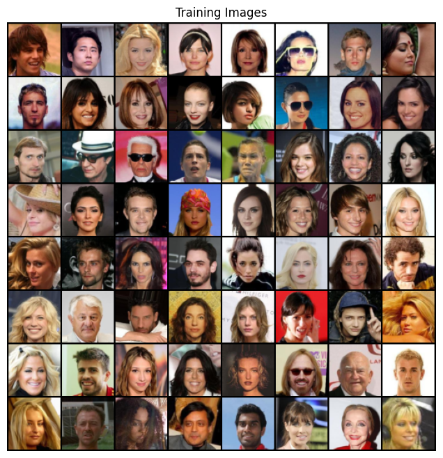
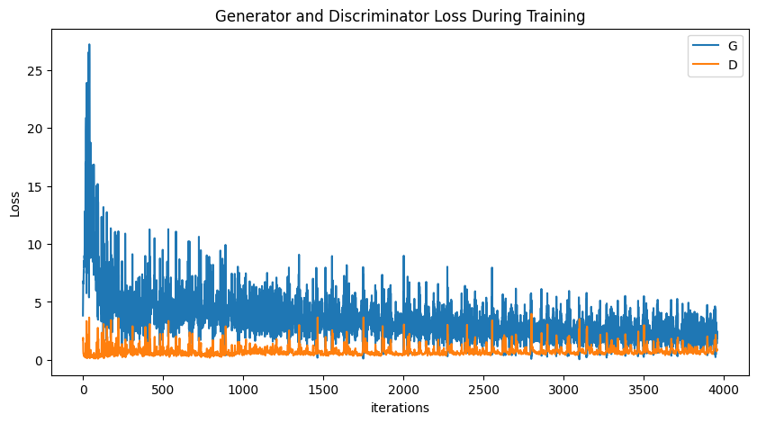
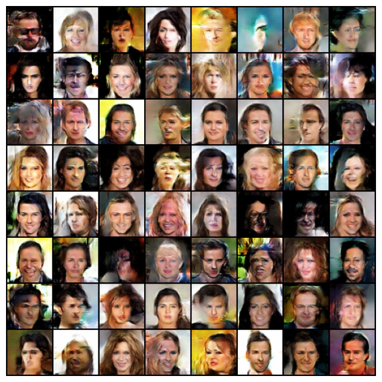
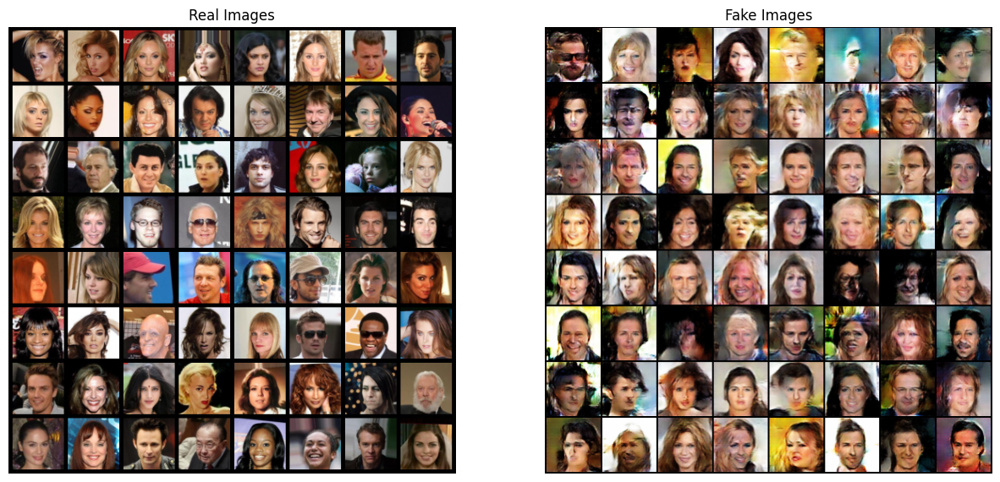

+++
title = 'Creating Faces from Scratch: A Deep Dive into GANs with PyTorch'
date = 2025-07-21T21:55:21-04:00
draft = false
summary = "In this post, we'll walk through the process of building and training a GAN from the ground up to generate photorealistic images of human faces."
series = ["AI",]
tags = ["AI", "Pytorch", "Machine Learning", "Deep Learning", "Neural Networks", "Artificial Intelligence"]
author= ["Me"]
+++

Have you ever wondered if a computer could imagine a human face that doesn't exist? Thanks to a clever class of neural networks called Generative Adversarial Networks (GANs), this is not science fiction, but a reality. Take a look at [https://thispersondoesnotexist.com/](https://thispersondoesnotexist.com/), this site uses [StyleGan](https://arxiv.org/abs/1912.04958) for generating faces that are indistinguishable from real ones. In this post, we'll walk through the process of building and training a very simple GAN from the ground up to generate photorealistic images of human faces.

This project is inspired by and takes reference from the official PyTorch DCGAN tutorial, which you can find [here](https://pytorch.org/tutorials/beginner/dcgan_faces_tutorial.html). We'll be exploring many of the same core concepts.

### The Core Idea: An Adversarial Game


<centre><sub><sup>[Original Image Source](https://commons.wikimedia.org/wiki/File:GANs_Technique.webp)</sup></sub></centre>

A GAN consists of two neural networks locked in a head-to-head competition:

1.  **The Generator:** Think of this as a counterfeiter. Its job is to create fake images that look as realistic as possible. It starts with random noise and tries to transform it into a convincing human face.
2.  **The Discriminator:** This is the detective. Its job is to look at an image and determine if it's a real photo from our dataset or a fake one created by the Generator.

These two networks are trained together. The Generator constantly tries to get better at fooling the Discriminator, while the Discriminator gets better at catching the fakes. Through this adversarial process, the Generator becomes incredibly skilled at creating realistic images.

### Step 0: Import Necessary Libraries and Packages

Let's start by importing the necessary libraries and packages. We'll need PyTorch for deep learning, torchvision for image data manipulation, and matplotlib for plotting. Also, we will be setting some hyperparameters for our GAN.


```python
import torch
import torch.nn as nn
import torchvision.datasets as dset
from torchvision import transforms
import torchvision.utils as vutils
import torch.optim as optim

import matplotlib.pyplot as plt
import numpy as np
import matplotlib.animation as animation
from IPython.display import HTML


```


```python
IMAGE_SIZE = 64

BATCH_SIZE = 512
WORKERS = 4

NGPUS = 2

NUM_CHANNELS = 3
LATENT_DIM = 100

G_FEATURES = 64
D_FEATURES = 64

BETA1=0.5
LR=0.0002
NUM_EPOCHS=10
```

### Step 1: Finding and Prepping the Dataset

For our project, we used the [**CelebFaces Attributes (CelebA) Dataset**](https://mmlab.ie.cuhk.edu.hk/projects/CelebA.html), which is a massive public dataset with over 200,000 images of celebrity faces.

Before feeding these images to our model, we need to process them. This involves:
*   **Resizing and Cropping:** All images are resized to a standard 64x64 pixels.
*   **Converting to Tensors:** We convert the images into a numerical format that PyTorch can work with.
*   **Normalizing:** We scale the pixel values to be in a range of -1 to 1. This helps with training stability, especially since our Generator's final layer uses a Tanh activation function.

This preprocessing ensures our model receives uniform and well-behaved data.


```python
transform = transforms.Compose([
    transforms.Resize(IMAGE_SIZE),
    transforms.CenterCrop(IMAGE_SIZE),
    transforms.ToTensor(),
    transforms.Normalize((0.5, 0.5, 0.5), (0.5, 0.5, 0.5))
])

dataset = dset.ImageFolder('./data/celeba', transform=transform)

dataloader = torch.utils.data.DataLoader(dataset, batch_size=BATCH_SIZE,
                                         shuffle=True, num_workers=WORKERS)

device = torch.device("cuda:0" if (torch.cuda.is_available() and NGPUS > 0) else "cpu")

# Plot some training images
real_batch = next(iter(dataloader))
plt.figure(figsize=(8,8))
plt.axis("off")
plt.title("Training Images")
plt.imshow(np.transpose(vutils.make_grid(real_batch[0].to(device)[:64], padding=2, normalize=True).cpu(),(1,2,0)))
plt.show()
```


    

    


### Step 2: Designing the Model Architecture

We're building a specific type of GAN called a [**Deep Convolutional Generative Adversarial Network (DCGAN)**](https://arxiv.org/abs/1511.06434). This architecture uses convolutional layers to effectively process images.

A key step [highlighted in the official PyTorch DCGAN tutorial](https://docs.pytorch.org/tutorials/beginner/dcgan_faces_tutorial.html#weight-initialization) is the proper initialization of model weights. To help the networks converge effectively, the tutorial advises initializing the weights for all convolutional, convolutional-transpose, and batch normalization layers from a Normal distribution with a mean of 0 and a standard deviation of 0.02. We implement this with a weights_init function, which is applied to both the generator and discriminator immediately after they are created.


```python
def weights_init(m):
    classname = m.__class__.__name__
    if classname.find('Conv') != -1:
        nn.init.normal_(m.weight.data, 0.0, 0.02)
    elif classname.find('BatchNorm') != -1:
        nn.init.normal_(m.weight.data, 1.0, 0.02)
        nn.init.constant_(m.bias.data, 0)
```

#### The Generator

The Generator's architecture is designed to take a 100-dimensional vector of random noise and progressively upsample it into a 64x64 color image. It does this using a series of Transposed Convolutional layers (`ConvTranspose2d`), which can be thought of as the opposite of a standard convolutional layer—they increase spatial dimensions rather than reducing them. Between these layers, we use Batch Normalization to stabilize learning and ReLU activation functions to introduce non-linearity.


```python
class Generator(nn.Module):

    def __init__(self):
        super(Generator, self).__init__()
        self.model = nn.Sequential(
            # input is Z_DIM, going into a convolutional layer
            nn.ConvTranspose2d(LATENT_DIM, G_FEATURES * 8, 4, 1, 0),
            nn.BatchNorm2d(G_FEATURES * 8),
            nn.ReLU(True),

            # state size. (G_FEATURES * 8) x 4 x 4
            nn.ConvTranspose2d(G_FEATURES * 8, G_FEATURES * 4, 4, 2, 1),
            nn.BatchNorm2d(G_FEATURES * 4),
            nn.ReLU(True),

            # state size. (G_FEATURES * 4) x 8 x 8
            nn.ConvTranspose2d(G_FEATURES * 4, G_FEATURES * 2, 4, 2, 1),
            nn.BatchNorm2d(G_FEATURES * 2),
            nn.ReLU(True),

            # state size. (G_FEATURES * 2) x 16 x 16
            nn.ConvTranspose2d(G_FEATURES * 2, G_FEATURES, 4, 2, 1),
            nn.BatchNorm2d(G_FEATURES),
            nn.ReLU(True),

            # state size. (G_FEATURES) x 32 x 32
            nn.ConvTranspose2d(G_FEATURES, NUM_CHANNELS, 4, 2, 1),
            nn.Tanh()
        )
    def forward(self, z):
        return self.model(z)
```


```python
netG = Generator().to(device)

if (device.type == 'cuda') and (NGPUS > 1):
    netG = nn.DataParallel(netG, list(range(NGPUS)))

netG.apply(weights_init)

netG
```


    DataParallel(
      (module): Generator(
        (model): Sequential(
          (0): ConvTranspose2d(100, 512, kernel_size=(4, 4), stride=(1, 1))
          (1): BatchNorm2d(512, eps=1e-05, momentum=0.1, affine=True, track_running_stats=True)
          (2): ReLU(inplace=True)
          (3): ConvTranspose2d(512, 256, kernel_size=(4, 4), stride=(2, 2), padding=(1, 1))
          (4): BatchNorm2d(256, eps=1e-05, momentum=0.1, affine=True, track_running_stats=True)
          (5): ReLU(inplace=True)
          (6): ConvTranspose2d(256, 128, kernel_size=(4, 4), stride=(2, 2), padding=(1, 1))
          (7): BatchNorm2d(128, eps=1e-05, momentum=0.1, affine=True, track_running_stats=True)
          (8): ReLU(inplace=True)
          (9): ConvTranspose2d(128, 64, kernel_size=(4, 4), stride=(2, 2), padding=(1, 1))
          (10): BatchNorm2d(64, eps=1e-05, momentum=0.1, affine=True, track_running_stats=True)
          (11): ReLU(inplace=True)
          (12): ConvTranspose2d(64, 3, kernel_size=(4, 4), stride=(2, 2), padding=(1, 1))
          (13): Tanh()
        )
      )
    )


#### The Discriminator

The Discriminator is essentially an image classification network. It takes a 64x64 image and downsamples it through a series of standard Convolutional layers (`Conv2d`). Its goal is to output a single probability score indicating whether the input image is real or fake. We use Leaky ReLU as our activation function, which is a common choice in GAN discriminators, and a final Sigmoid function to squash the output to a value between 0 and 1.


```python
class Discriminator(nn.Module):
    def __init__(self):
        super(Discriminator, self).__init__()
        
        self.model = nn.Sequential(
            nn.Conv2d(NUM_CHANNELS, D_FEATURES, 4, 2, 1, bias=False),
            nn.LeakyReLU(0.2, inplace=True),

            nn.Conv2d(D_FEATURES, D_FEATURES * 2, 4, 2, 1, bias=False),
            nn.BatchNorm2d(D_FEATURES * 2),
            nn.LeakyReLU(0.2, inplace=True),

            nn.Conv2d(D_FEATURES * 2, D_FEATURES * 4, 4, 2, 1, bias=False),
            nn.BatchNorm2d(D_FEATURES * 4),
            nn.LeakyReLU(0.2, inplace=True),

            nn.Conv2d(D_FEATURES * 4, D_FEATURES * 8, 4, 2, 1, bias=False),
            nn.BatchNorm2d(D_FEATURES * 8),
            nn.LeakyReLU(0.2, inplace=True),

            nn.Conv2d(D_FEATURES * 8, 1, 4, 1, 0, bias=False),
            nn.Sigmoid(),
        )

    def forward(self, x):
        return self.model(x)
```


```python
netD = Discriminator().to(device)

if (device.type == 'cuda') and (NGPUS > 1):
    netD = nn.DataParallel(netD, list(range(NGPUS)))

netD.apply(weights_init)

netD
```


    DataParallel(
      (module): Discriminator(
        (model): Sequential(
          (0): Conv2d(3, 64, kernel_size=(4, 4), stride=(2, 2), padding=(1, 1), bias=False)
          (1): LeakyReLU(negative_slope=0.2, inplace=True)
          (2): Conv2d(64, 128, kernel_size=(4, 4), stride=(2, 2), padding=(1, 1), bias=False)
          (3): BatchNorm2d(128, eps=1e-05, momentum=0.1, affine=True, track_running_stats=True)
          (4): LeakyReLU(negative_slope=0.2, inplace=True)
          (5): Conv2d(128, 256, kernel_size=(4, 4), stride=(2, 2), padding=(1, 1), bias=False)
          (6): BatchNorm2d(256, eps=1e-05, momentum=0.1, affine=True, track_running_stats=True)
          (7): LeakyReLU(negative_slope=0.2, inplace=True)
          (8): Conv2d(256, 512, kernel_size=(4, 4), stride=(2, 2), padding=(1, 1), bias=False)
          (9): BatchNorm2d(512, eps=1e-05, momentum=0.1, affine=True, track_running_stats=True)
          (10): LeakyReLU(negative_slope=0.2, inplace=True)
          (11): Conv2d(512, 1, kernel_size=(4, 4), stride=(1, 1), bias=False)
          (12): Sigmoid()
        )
      )
    )


```python
criterion = nn.BCELoss()

fixed_noise = torch.randn(64, LATENT_DIM, 1, 1, device=device)

real_label = 1.
fake_label = 0.

optimizerD = optim.Adam(netD.parameters(), lr=LR, betas=(BETA1, 0.999))
optimizerG = optim.Adam(netG.parameters(), lr=LR, betas=(BETA1, 0.999))
```

### Step 3: The Adversarial Training Loop

This is where the magic happens. For each batch of data, we perform a two-part update:

1.  **Train the Discriminator:** We show the Discriminator a batch of real images from our dataset and a batch of fake images from the Generator. We calculate its loss based on how well it identified the real from the fake and update its weights.
2.  **Train the Generator:** We then train the Generator. Its goal is to make the Discriminator output "real" (a probability of 1) for its fake images. We calculate the Generator's loss based on the Discriminator's output and update the Generator's weights.

This process is repeated for 10 epochs. The loss function we use is Binary Cross-Entropy (BCELoss), as this is fundamentally a binary classification problem (real vs. fake).


```python
# Initialize tracking variables for training progress
img_list = []    # Store generated images at checkpoints
G_losses = []    # Track generator losses over time
D_losses = []    # Track discriminator losses over time
iters = 0        # Global iteration counter

# DCGAN Training Loop
# Reference: https://docs.pytorch.org/tutorials/beginner/dcgan_faces_tutorial.html#training
print("Starting Training Loop...")

for epoch in range(NUM_EPOCHS):
    for i, data in enumerate(dataloader):
        
        ############################
        # PHASE 1: Update Discriminator Network
        # Goal: maximize log(D(x)) + log(1 - D(G(z)))
        # This means: correctly classify real images as real AND fake images as fake
        ############################
        
        # === TRAIN DISCRIMINATOR ON REAL IMAGES ===
        netD.zero_grad()  # Clear discriminator gradients
        
        # Prepare real image batch
        real_cpu = data[0].to(device)
        b_size = real_cpu.size(0)
        label = torch.full((b_size,), real_label, dtype=torch.float, device=device)
        
        # Forward pass: discriminator classifies real images
        output = netD(real_cpu).view(-1)
        
        # Calculate loss: how well D identifies real images as real
        errD_real = criterion(output, label)
        
        # Backward pass: compute gradients for real image classification
        errD_real.backward()
        D_x = output.mean().item()  # Average discriminator output on real images
        
        
        # === TRAIN DISCRIMINATOR ON FAKE IMAGES ===
        # Generate batch of random noise vectors
        noise = torch.randn(b_size, LATENT_DIM, 1, 1, device=device)
        
        # Generate fake images using generator
        fake = netG(noise)
        label.fill_(fake_label)  # Set labels to "fake" for this batch
        
        # Forward pass: discriminator classifies fake images
        # Note: .detach() prevents gradients from flowing back to generator
        output = netD(fake.detach()).view(-1)
        
        # Calculate loss: how well D identifies fake images as fake
        errD_fake = criterion(output, label)
        
        # Backward pass: accumulate gradients with previous real image gradients
        errD_fake.backward()
        D_G_z1 = output.mean().item()  # Average discriminator output on fake images
        
        # Total discriminator error and update
        errD = errD_real + errD_fake
        optimizerD.step()  # Apply discriminator parameter updates
        
        
        ############################
        # PHASE 2: Update Generator Network
        # Goal: maximize log(D(G(z)))
        # This means: fool the discriminator into thinking fake images are real
        ############################
        
        netG.zero_grad()  # Clear generator gradients
        
        # We want the discriminator to classify our fake images as real
        label.fill_(real_label)
        
        # Forward pass: discriminator re-evaluates the same fake images
        # Note: No .detach() here - we want gradients to flow back to generator
        output = netD(fake).view(-1)
        
        # Calculate generator loss: how well G fools the discriminator
        errG = criterion(output, label)
        
        # Backward pass: compute gradients for generator
        errG.backward()
        D_G_z2 = output.mean().item()  # Discriminator output on fake images (after D update)
        
        # Update generator parameters
        optimizerG.step()
        
        
        ############################
        # LOGGING AND CHECKPOINTS
        ############################
        
        # Print training statistics every 50 iterations
        if i % 50 == 0:
            print('[%d/%d][%d/%d]\tLoss_D: %.4f\tLoss_G: %.4f\tD(x): %.4f\tD(G(z)): %.4f / %.4f'
                  % (epoch, NUM_EPOCHS, i, len(dataloader),
                     errD.item(), errG.item(), D_x, D_G_z1, D_G_z2))
        
        # Save losses for plotting training curves later
        G_losses.append(errG.item())
        D_losses.append(errD.item())
        
        # Generate and save sample images at checkpoints
        if (iters % 500 == 0) or ((epoch == NUM_EPOCHS-1) and (i == len(dataloader)-1)):
            with torch.no_grad():  # Disable gradient computation for inference
                fake = netG(fixed_noise).detach().cpu()  # Generate images from fixed noise
            # Create grid of images and add to list for visualization
            img_list.append(vutils.make_grid(fake, padding=2, normalize=True))
        
        iters += 1  # Increment global iteration counter
```
<div style="height:600px;overflow: auto;margin-bottom: 16px;">

    Starting Training Loop...


    [0/10][0/396]	Loss_D: 1.7563	Loss_G: 3.8221	D(x): 0.4319	D(G(z)): 0.4326 / 0.0372
    [0/10][50/396]	Loss_D: 0.2169	Loss_G: 10.7978	D(x): 0.8917	D(G(z)): 0.0002 / 0.0000
    [0/10][100/396]	Loss_D: 0.3909	Loss_G: 5.6610	D(x): 0.8299	D(G(z)): 0.0798 / 0.0130
    [0/10][150/396]	Loss_D: 2.8939	Loss_G: 7.5873	D(x): 0.1496	D(G(z)): 0.0002 / 0.0057
    [0/10][200/396]	Loss_D: 1.0846	Loss_G: 11.0340	D(x): 0.9322	D(G(z)): 0.5634 / 0.0001
    [0/10][250/396]	Loss_D: 0.5582	Loss_G: 4.0878	D(x): 0.8003	D(G(z)): 0.2266 / 0.0270
    [0/10][300/396]	Loss_D: 0.4483	Loss_G: 4.3256	D(x): 0.8838	D(G(z)): 0.2287 / 0.0244
    [0/10][350/396]	Loss_D: 0.8494	Loss_G: 5.5411	D(x): 0.8327	D(G(z)): 0.4033 / 0.0118
    [1/10][0/396]	Loss_D: 1.0086	Loss_G: 5.2776	D(x): 0.9297	D(G(z)): 0.5249 / 0.0131
    [1/10][50/396]	Loss_D: 0.9715	Loss_G: 3.0538	D(x): 0.5493	D(G(z)): 0.1206 / 0.0715
    [1/10][100/396]	Loss_D: 0.6628	Loss_G: 5.2274	D(x): 0.8468	D(G(z)): 0.3392 / 0.0099
    [1/10][150/396]	Loss_D: 0.6242	Loss_G: 4.2412	D(x): 0.7099	D(G(z)): 0.1616 / 0.0260
    [1/10][200/396]	Loss_D: 0.4382	Loss_G: 3.3037	D(x): 0.7744	D(G(z)): 0.1171 / 0.0472
    [1/10][250/396]	Loss_D: 0.5906	Loss_G: 3.6600	D(x): 0.6706	D(G(z)): 0.0334 / 0.0439
    [1/10][300/396]	Loss_D: 0.5550	Loss_G: 4.8545	D(x): 0.8033	D(G(z)): 0.2256 / 0.0129
    [1/10][350/396]	Loss_D: 0.5039	Loss_G: 2.8764	D(x): 0.8198	D(G(z)): 0.1918 / 0.0845
    [2/10][0/396]	Loss_D: 0.3593	Loss_G: 7.1321	D(x): 0.9454	D(G(z)): 0.2111 / 0.0024
    [2/10][50/396]	Loss_D: 0.4098	Loss_G: 4.2830	D(x): 0.8226	D(G(z)): 0.1409 / 0.0269
    [2/10][100/396]	Loss_D: 2.3691	Loss_G: 7.8207	D(x): 0.9693	D(G(z)): 0.8279 / 0.0018
    [2/10][150/396]	Loss_D: 0.4941	Loss_G: 5.4216	D(x): 0.9230	D(G(z)): 0.2938 / 0.0104
    [2/10][200/396]	Loss_D: 0.6194	Loss_G: 3.8411	D(x): 0.7227	D(G(z)): 0.1655 / 0.0433
    [2/10][250/396]	Loss_D: 1.4438	Loss_G: 1.8884	D(x): 0.3733	D(G(z)): 0.0317 / 0.2343
    [2/10][300/396]	Loss_D: 0.9051	Loss_G: 5.0064	D(x): 0.8104	D(G(z)): 0.4167 / 0.0142
    [2/10][350/396]	Loss_D: 0.6925	Loss_G: 4.5673	D(x): 0.8615	D(G(z)): 0.3379 / 0.0205
    [3/10][0/396]	Loss_D: 0.7128	Loss_G: 5.1723	D(x): 0.8999	D(G(z)): 0.3793 / 0.0140
    [3/10][50/396]	Loss_D: 0.9524	Loss_G: 5.5167	D(x): 0.9446	D(G(z)): 0.5154 / 0.0095
    [3/10][100/396]	Loss_D: 0.8937	Loss_G: 6.0525	D(x): 0.9282	D(G(z)): 0.4714 / 0.0076
    [3/10][150/396]	Loss_D: 0.7497	Loss_G: 2.5558	D(x): 0.5639	D(G(z)): 0.0179 / 0.1211
    [3/10][200/396]	Loss_D: 0.5284	Loss_G: 3.1172	D(x): 0.8099	D(G(z)): 0.2159 / 0.0681
    [3/10][250/396]	Loss_D: 0.6639	Loss_G: 4.7505	D(x): 0.9292	D(G(z)): 0.3930 / 0.0171
    [3/10][300/396]	Loss_D: 0.6024	Loss_G: 2.8988	D(x): 0.7075	D(G(z)): 0.1445 / 0.0822
    [3/10][350/396]	Loss_D: 0.6868	Loss_G: 2.5938	D(x): 0.5956	D(G(z)): 0.0373 / 0.1121
    [4/10][0/396]	Loss_D: 0.5395	Loss_G: 3.1336	D(x): 0.8477	D(G(z)): 0.2617 / 0.0690
    [4/10][50/396]	Loss_D: 0.8453	Loss_G: 2.2059	D(x): 0.5341	D(G(z)): 0.0203 / 0.1744
    [4/10][100/396]	Loss_D: 0.4145	Loss_G: 3.7170	D(x): 0.9256	D(G(z)): 0.2544 / 0.0397
    [4/10][150/396]	Loss_D: 0.4655	Loss_G: 3.9040	D(x): 0.8594	D(G(z)): 0.2345 / 0.0317
    [4/10][200/396]	Loss_D: 0.5604	Loss_G: 3.0123	D(x): 0.7369	D(G(z)): 0.1590 / 0.0717
    [4/10][250/396]	Loss_D: 0.5451	Loss_G: 3.3488	D(x): 0.8342	D(G(z)): 0.2599 / 0.0502
    [4/10][300/396]	Loss_D: 0.6374	Loss_G: 2.2180	D(x): 0.6344	D(G(z)): 0.0834 / 0.1582
    [4/10][350/396]	Loss_D: 0.4331	Loss_G: 2.9784	D(x): 0.7879	D(G(z)): 0.1356 / 0.0723
    [5/10][0/396]	Loss_D: 0.5040	Loss_G: 3.7998	D(x): 0.8911	D(G(z)): 0.2868 / 0.0337
    [5/10][50/396]	Loss_D: 0.3554	Loss_G: 3.3121	D(x): 0.8184	D(G(z)): 0.1095 / 0.0578
    [5/10][100/396]	Loss_D: 0.4603	Loss_G: 2.9474	D(x): 0.7738	D(G(z)): 0.1380 / 0.0754
    [5/10][150/396]	Loss_D: 0.4981	Loss_G: 2.7545	D(x): 0.7665	D(G(z)): 0.1607 / 0.0897
    [5/10][200/396]	Loss_D: 0.4477	Loss_G: 2.4404	D(x): 0.7468	D(G(z)): 0.1007 / 0.1169
    [5/10][250/396]	Loss_D: 0.4278	Loss_G: 2.9543	D(x): 0.8590	D(G(z)): 0.2078 / 0.0772
    [5/10][300/396]	Loss_D: 0.8695	Loss_G: 2.1595	D(x): 0.5317	D(G(z)): 0.0647 / 0.1697
    [5/10][350/396]	Loss_D: 0.4488	Loss_G: 2.4912	D(x): 0.7840	D(G(z)): 0.1509 / 0.1137
    [6/10][0/396]	Loss_D: 0.4691	Loss_G: 2.1044	D(x): 0.7468	D(G(z)): 0.1222 / 0.1577
    [6/10][50/396]	Loss_D: 0.6426	Loss_G: 2.5251	D(x): 0.7613	D(G(z)): 0.2652 / 0.1089
    [6/10][100/396]	Loss_D: 0.6420	Loss_G: 1.7907	D(x): 0.6675	D(G(z)): 0.1571 / 0.2072
    [6/10][150/396]	Loss_D: 0.5504	Loss_G: 2.6173	D(x): 0.7841	D(G(z)): 0.2283 / 0.0982
    [6/10][200/396]	Loss_D: 0.5897	Loss_G: 2.2696	D(x): 0.6764	D(G(z)): 0.1206 / 0.1396
    [6/10][250/396]	Loss_D: 1.5862	Loss_G: 0.3905	D(x): 0.2905	D(G(z)): 0.0305 / 0.7089
    [6/10][300/396]	Loss_D: 0.9916	Loss_G: 4.4447	D(x): 0.9338	D(G(z)): 0.5460 / 0.0193
    [6/10][350/396]	Loss_D: 0.6867	Loss_G: 2.0949	D(x): 0.7239	D(G(z)): 0.2608 / 0.1527
    [7/10][0/396]	Loss_D: 0.5340	Loss_G: 2.3298	D(x): 0.7456	D(G(z)): 0.1732 / 0.1259
    [7/10][50/396]	Loss_D: 0.7548	Loss_G: 2.9423	D(x): 0.8050	D(G(z)): 0.3719 / 0.0719
    [7/10][100/396]	Loss_D: 0.5018	Loss_G: 2.2454	D(x): 0.7126	D(G(z)): 0.1127 / 0.1385
    [7/10][150/396]	Loss_D: 0.6273	Loss_G: 2.3183	D(x): 0.7110	D(G(z)): 0.2014 / 0.1257
    [7/10][200/396]	Loss_D: 0.7036	Loss_G: 1.9992	D(x): 0.6853	D(G(z)): 0.2267 / 0.1684
    [7/10][250/396]	Loss_D: 0.8002	Loss_G: 0.9447	D(x): 0.5223	D(G(z)): 0.0524 / 0.4308
    [7/10][300/396]	Loss_D: 0.6215	Loss_G: 2.9966	D(x): 0.8547	D(G(z)): 0.3418 / 0.0673
    [7/10][350/396]	Loss_D: 0.7387	Loss_G: 1.4343	D(x): 0.5736	D(G(z)): 0.1024 / 0.2814
    [8/10][0/396]	Loss_D: 0.5917	Loss_G: 1.7386	D(x): 0.7048	D(G(z)): 0.1803 / 0.2082
    [8/10][50/396]	Loss_D: 0.6109	Loss_G: 1.4905	D(x): 0.6453	D(G(z)): 0.1144 / 0.2685
    [8/10][100/396]	Loss_D: 1.0683	Loss_G: 4.7833	D(x): 0.9122	D(G(z)): 0.5652 / 0.0128
    [8/10][150/396]	Loss_D: 0.8869	Loss_G: 1.5255	D(x): 0.5140	D(G(z)): 0.1221 / 0.2613
    [8/10][200/396]	Loss_D: 0.4855	Loss_G: 2.8426	D(x): 0.8469	D(G(z)): 0.2507 / 0.0759
    [8/10][250/396]	Loss_D: 1.1174	Loss_G: 0.7577	D(x): 0.3991	D(G(z)): 0.0416 / 0.5101
    [8/10][300/396]	Loss_D: 1.6031	Loss_G: 4.5735	D(x): 0.9569	D(G(z)): 0.7439 / 0.0163
    [8/10][350/396]	Loss_D: 1.3331	Loss_G: 0.8054	D(x): 0.3242	D(G(z)): 0.0297 / 0.4985
    [9/10][0/396]	Loss_D: 1.0779	Loss_G: 3.2770	D(x): 0.9124	D(G(z)): 0.5776 / 0.0526
    [9/10][50/396]	Loss_D: 0.6517	Loss_G: 2.1603	D(x): 0.6811	D(G(z)): 0.1942 / 0.1461
    [9/10][100/396]	Loss_D: 0.6400	Loss_G: 3.0861	D(x): 0.8427	D(G(z)): 0.3453 / 0.0578
    [9/10][150/396]	Loss_D: 1.9249	Loss_G: 4.0160	D(x): 0.9502	D(G(z)): 0.8001 / 0.0301
    [9/10][200/396]	Loss_D: 0.8740	Loss_G: 3.4832	D(x): 0.8945	D(G(z)): 0.4881 / 0.0431
    [9/10][250/396]	Loss_D: 0.7666	Loss_G: 3.3725	D(x): 0.8702	D(G(z)): 0.4301 / 0.0482
    [9/10][300/396]	Loss_D: 0.7425	Loss_G: 0.9968	D(x): 0.5755	D(G(z)): 0.1107 / 0.4010
    [9/10][350/396]	Loss_D: 0.8403	Loss_G: 3.6338	D(x): 0.9123	D(G(z)): 0.4942 / 0.0370
</div>


```python
plt.figure(figsize=(10,5))
plt.title("Generator and Discriminator Loss During Training")
plt.plot(G_losses,label="G")
plt.plot(D_losses,label="D")
plt.xlabel("iterations")
plt.ylabel("Loss")
plt.legend()
plt.show()
```


    

    


The plot above shows the loss for both networks over time. You can see how they fluctuate—as one gets better, the other's loss tends to rise, illustrating the competitive dynamic at the heart of GANs.

### Step 4: The Results - Evaluating Our GAN

After training is complete, how do we know if it worked? We can look at the output! We fed the generator a fixed set of noise vectors throughout training to see how its creations evolved.


```python
fig = plt.figure(figsize=(8,8))
plt.axis("off")
ims = [[plt.imshow(np.transpose(i,(1,2,0)), animated=True)] for i in img_list]
ani = animation.ArtistAnimation(fig, ims, interval=1000, repeat_delay=1000, blit=True)

HTML(ani.to_jshtml())
```


<iframe src='/gan_animation.html' width="100%" height="950px"></iframe>


    

    


As you can see, the model starts by generating noisy, random patterns. As training progresses, it begins to learn the underlying structure of faces, and eventually, it produces coherent, though not always perfect, images.

Finally, let's compare a batch of real images from the dataset with a batch of fake images created by our fully trained generator.


```python
# Grab a batch of real images from the dataloader
real_batch = next(iter(dataloader))

# Plot the real images
plt.figure(figsize=(15,15))
plt.subplot(1,2,1)
plt.axis("off")
plt.title("Real Images")
plt.imshow(np.transpose(vutils.make_grid(real_batch[0].to(device)[:64], padding=5, normalize=True).cpu(),(1,2,0)))

# Plot the fake images from the last epoch
plt.subplot(1,2,2)
plt.axis("off")
plt.title("Fake Images")
plt.imshow(np.transpose(img_list[-1],(1,2,0)))
plt.show()
```


    

    


The generated images on the right were created entirely by our neural network from random noise. They are not real people. While some have artifacts or look a bit "uncanny," they clearly capture the essence of a human face—a remarkable achievement for a model trained from scratch.

### What's Next? From Faces to Text-to-Image

This project was a fantastic demonstration of the power of generative models. But what if we want more control over what the GAN creates? Our current model generates random faces, but we can't tell it *what kind* of face to create.

Our next task will be to explore **Conditional GANs (cGANs)**. By "conditioning" the model on additional information, like a text description, we can guide the image generation process. The goal will be to build a model that can take a text prompt, like "a person with black hair and glasses," and generate an image that matches that description. Stay tuned!
