+++
title = 'Analyzing Systemic Risk With NewsDriven Knowledge Graph And Propogation Algorithms'
date = 2025-12-30T13:55:37-05:00
draft = false
summary = """The global financial ecosystem is a deeply interconnected web where entities, ranging from multinational corporations to key executives, are linked in complex ways. Shaking one of entity often sends immediate and no-obvious ripples down this web. Due to the sheer size of the financial world, these critical connections remain hidden from human eye, buried under massive volumes of financial information like corporate releases, financial news etc.

This project automates the discovery of this "ripple effect". First, we built a large-scale Financial Knowledge Graph (FKG) by training a state-of-the art relation extraction model (SMARTe) on the financial domain FinRED dataset and deploying it over a large news corpus. Second, with this graph as our foundation, we implemented a version of Spreading Activation algorithm to quantify and simulate "what-if" scenarios. The Ripple calculator models a news event as an "impact pulse" (e.g., -0.9 sentiment) that propagates through FKG using a custom Transmission Rules Table based on relationship type (e.g., subsidiary has high transmission).

This entire system is deployed as an interactive web application that visualizes the propagation of systematic risk on a dynamic graph, transforming raw text into a risk analysis tool."""
series = ["AI",]
tags = ["AI", "Pytorch", "Machine Learning", "Deep Learning", "Neural Networks", "Artificial Intelligence"]
author= ["Me"]
+++

_Abstract_- The global financial ecosystem is a deeply interconnected web where entities, ranging from multinational corporations to key executives, are linked in complex ways. Shaking one of entity often sends immediate and no-obvious ripples down this web. Due to the sheer size of the financial world, these critical connections remain hidden from human eye, buried under massive volumes of financial information like corporate releases, financial news etc.

This project automates the discovery of this "ripple effect". First, we built a large-scale Financial Knowledge Graph (FKG) by training a state-of-the art relation extraction model (SMARTe) on the financial domain FinRED dataset and deploying it over a large news corpus. Second, with this graph as our foundation, we implemented a version of Spreading Activation algorithm to quantify and simulate "what-if" scenarios. The Ripple calculator models a news event as an "impact pulse" (e.g., -0.9 sentiment) that propagates through FKG using a custom Transmission Rules Table based on relationship type (e.g., subsidiary has high transmission).

This entire system is deployed as an interactive web application that visualizes the propagation of systematic risk on a dynamic graph, transforming raw text into a risk analysis tool.

Keywords-Natural Language Processing, Artificial Intelligence, Graphs

# Motivation & Problem definition

The idea of this project came to us when we read a news article about a complex series of deals between Nvidia, OpenAI and Oracle. It described a connected loop where Nvidia invests in OpenAI, OpenAI pays Oracle for cloud computing and Oracle then buys Nvidia's chips to build its infrastructure. It is clear that these companies are connected in ways that are not so simple. These scenarios is not just one company buying project from another, it's a "web" where they are all partners, customers and suppliers to each other. Then we started thinking about the incongruities. What if something happened to one of those companies? If oracle's cloud business is in trouble, it isn't just Oracle's problem anymore. Trouble on oracle's side would have cascading or ripple effects, anything but simple based on one stock price.

We concluded that this is probably true for the whole financial market. All of those connections are hidden in the thousands of news articles, press releases, and reports coming out every day. There is too much to read and connect the dots, so we often only learn about those hidden relationships after a crisis, often when a bank fails and we see all the other companies exposed to that bank. We viewed it as a data problem. The information is there, it's just buried in text.

So, the motivation for this undertaking was to build a system that could:

- Read and understand the content of several thousand financial news articles to identify relationships between entities. For example, "Company A owns Company B" or "Person C is the CEO of Company D".
- Use this relatedness to create a large "map", or what we call the Financial Knowledge Graph.
- Finally, use this graph to simulate a ripple effect. Our goal is to develop a platform where users can ask, "What if a negative event hits this one company?" and then watch which other companies might be in trouble. This would be a way to see these hidden risks before they become a problem.

# Literature Review

Our project brings together three different areas, so we needed to look for existing work within each. We need to

## Find a way to find relationships

We need to find an AI model to read the news, we started looking for common research projects. Most projects had a pipelining approach where on model finds entities and another model finds the relations. We were not confident about having two models because this can lead to errors. So, we looked for models that focused on joint relation extraction i.e. the model does both at once. We first found the New York Times (NYT) \[1\] dataset with over 53000 sentences and then also found WebNLG dataset \[2\]. These datasets are useful for extracting relations as they are generally focused on news. However, we needed to extract relations from text that understood specific financial terms (e.g., subsidiary, chief executive officer etc.)

This led us to FinRED dataset \[3\], which was great because it contained financial news and relation triplets in them. In their paper, the authors experimented with several models and one of the stronger performer was Set Prediction Network (SPN) \[4\]. We liked SPN's key idea of treating all the relations in a sentence as one "set" to be predicted at once. The SPN paper was from 2020, so we looked for newer models that improved on the "set" idea. Hence we came up with our model SMARTe \[5\], which we decided to use for our project. SMARTe is an evolution of SPN, making use of Slot Attention Mechanism. We found this to be a very clever way to solve this problem. In essence, it creates a few empty "slots" (15 in our case), and is briefed to "latch onto" one complete triplet (Subject, Relation, Object). This cleans up the cluttered sentence and reduces it into a simple list of statements.

## Representing data as a network

Once we had built the model to extract triplets, we had to figure out how to store them. We could have decided to go with a normal SQL database, but querying a table for multi-step connections is highly complex. For observing a "ripple effect" we needed to be able to "traverse" from one entity to another. And this is why we decided to build a Financial Knowledge Graph (FKG). We used a graph database (Neo4j) to store every entity like "Apple" as a "node" and every relation like "founded by" as an "edge". This "map" is what forms the backbone of our entire project.

## Simulating "Ripple Effect"

Finaly, we built the "Ripple Effect" after we developed the graph. We researched how google ranks web pages using PageRank \[6\]. The best idea came from psychology "Spreading Activation" \[7\]. It's a simple model of how the human brain accesses related ideas. You "activate" one idea (the news event) and then the energy weakens as it radiates to the connected neighbors. Our innovation is to modify the algorithm for finance. In our system, the news event is an "impact sore" (For example, -0.9 for bad news). The impact score travels through the relationships but is limited by a small set of rules we created. This includes "Transmission rules table" that describes how strong the impact will be from a subsidiary relation and also our "Entity multipliers" that make a PERSON more "fragile" than a COUNTRY/GEOGRAPHIC LOCATION node.

# proposed algorithms and applications

Our application isn't one single program but rather a system that is built from three major components working together as one cohesive whole. We decided to separate out our project into two phases of development, an "setup" phase where we actually created our database and a "live" phase that the user would be directly interacting with.

The Data Ingestion pipeline is the first component of our system and it is a series of python script we called "build_kg.py" that processed 347,822 news articles from our dataset. This pipeline runs our trained SMARTe model (running as an API), spaCy to recognize types of entities and our fuzzy-matching logic to clean the data. It's only job is to full our "map", which is the Neo4j graph database.

## Datasets for Training and Knowledge Graph Construction

This project required two different types of datasets to meet its goals. First, we need a high-quality, pre-labeled dataset for training the model proposed for our relation extraction. Second, we need a large, raw corpus of news articles on which to build our financial Knowledge Graph.

In training our project, we chose FinRED dataset. It is a publicaly available dataset specifically designed for relation extraction in the financial domain. It includes relationship triplets such as (Nvidia, manufacturer_of, GPU) compiled from financial news and earnings call transcripts. We utilized this dataset to train SMARTe model for it to be able to recognize the type of language used an relationships that exists in finance.

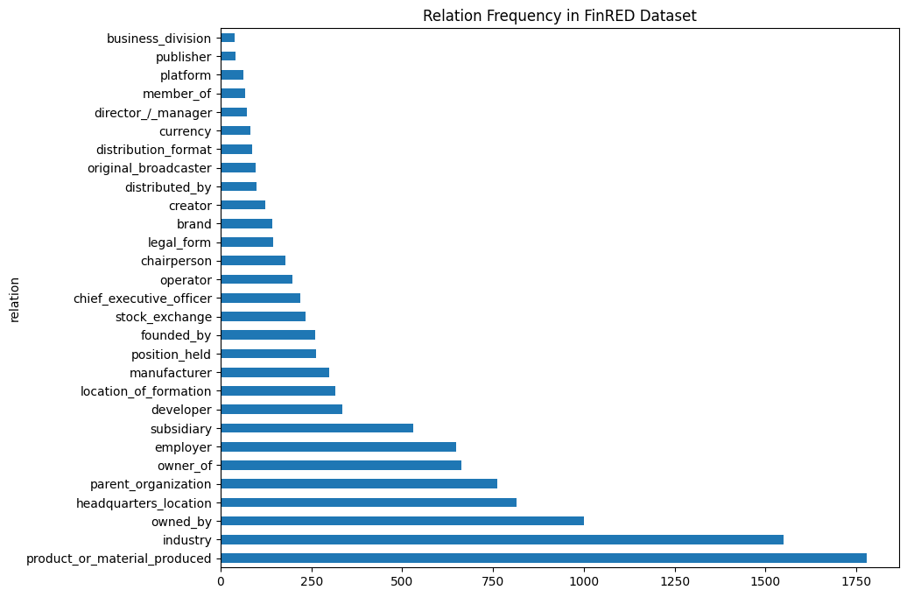

Figure : Relationship frequency in FinRED dataset

For the construction phase of our knowledge graph, we utilized the financial-news-multisource dataset. This is a very large, unified corpus, comprising of 57 million full-text news articles, collected from variety of publicly available sources. Unlike FinRED, the text in this dataset is raw and unstructured, with no pre-extracted relations. This dataset provided the "real-world" data for our project.

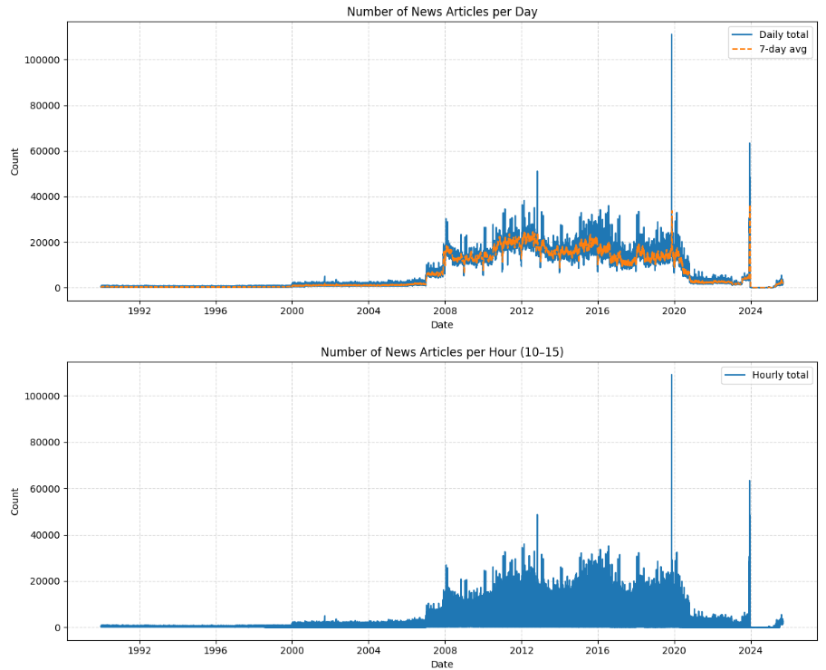

Figure : Distribution of news articles over the years

## Training The Relation Extraction Model

To build our graph, we needed first an model that would read a sentence and extract financial relationships. For this task, we chose SMARTe model. We chose this architecture because it's Slot Attention Mechanism was developed explicitly to adress the same issue that we faced i.e. finding multiple complex facts within a news sentence.

The architecture, illustrated in Figure 3, has three major operations. First, at bottom, the encoder. A BERT model reads raw sentences and converts each word into a series of vectors used by the computers.

Second, the vectors are fed into the most important feature of Slot Attention. As shown by the middle part of the Figure 3. The model has a fixed number of "Slot Queries". These slots act like 15 empty "forms". The goal of each slot is to "grab" one whole triplet (Subject, Relation, Object) from the text. The model ensures the slots "compete" so that every triplet is different.

Third, the data "captured" by each slot in the upper part of the diagram is transferred to a set of classifiers, Feed-Forward Networks (FFN). Each of these classifiers fills out the form for each slot while answering the final question. What is the relation? Where does the subject start and end? Where does object start and end?

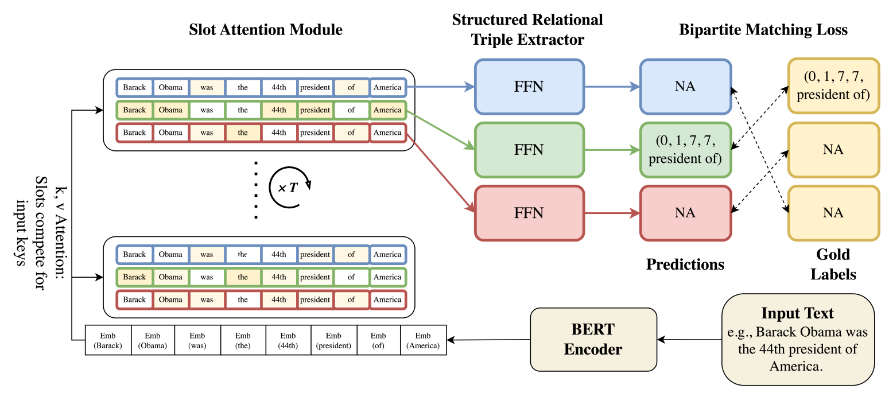

Figure : SMARTe Architecture from original paper

## Algorithm 1: The Graph Building Pipeline

After building a SMARTe model, the next logical step in our approach was to design an algorithm that could make use of it to create our Financial Knowledge Graph, FKG. The goal of this pipeline is to read the millions of raw articles from financial-news-multisource and to produce a structured graph with clean data.

We envisioned this as a multi-step pipeline, as shown in the flowcharts below (Figure 4 & 5), which would run for every individual article that we process.

The first step of the pipeline is simple. The raw text of the article is passed into the trained SMARTe model, and it outputs a list of all the relationship triplets it identified, such as (subject: "Alphabet", relation: "owned_by", object: "Google").

This creates a very challenging situation. These outputs are just text strings-one company could be referred to by company name "Google", or corporate name "Alphabet Inc.", or product name "Google Photos", or stock ticker "GOOGL". We required a way to "normalize" these entities such that all these different entity names point to one node in our graph.

To address this, we created a three-stage Entity Resolution mechanism(Figure 5), which we view as the foundational logic of our pipeline. For each entity string (for example "Google Photos") that was extracted by SMARTe, we implemented the following steps:

- **Enrichment (NER)**: First we take the entity string and send it to a spaCy NER model to determine what the entity is. The NER model applies a tag with one of the types, if recognized, such as ORG (Organization), PERSON, and GPE (Geo-Political Entity). The tag is important for the simulation we will later conduct.
- **Ticker Mapping**: If the entity identified is of type ORG, we first attempt to match to an external dictionary we constructed from the financial-news-dataset. This dictionary is a mapping of common company names and products to their associated stock ticker (i.e. "Google Photos" -> "GOOGL", "Alphabet" -> "GOOGL"). This is our highest priority to make the match as this is the only way to link the text string to a specific financial asset.
- **Fuzzy Caching**: If no ticker is found, we move to our second-highest priority: checking our own entity_cache.json file. This cache stores every official, or "canonical," entity we have saved so far. We first try to find an exact name match. If that fails, we use a fuzzy matching algorithm (thefuzz) with a 95% confidence threshold to check if the name is just a simple typo of an existing entity (e.g., "Microsof" vs. "Microsoft").

If, and only if, an entity passes all three stages without a match, we save it as a new "canonical" entity in our cache. This process ensures that over time, our graph becomes cleaner and more interconnected, as all variations of a company's name resolve to a single node. Finally, the pipeline takes these "resolved" entities and their relationship and loads them into our Neo4j graph database.

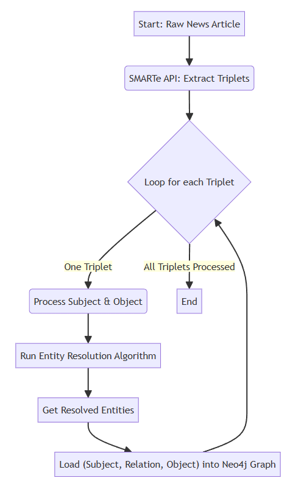

Figure : Main Pipeline Flowchart

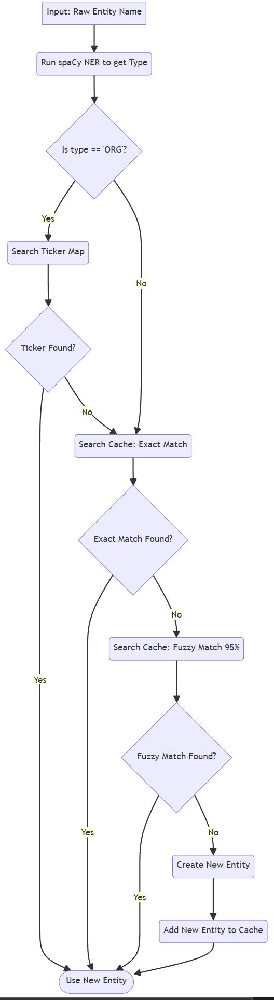

Figure : Entity Resolution Algorithm Flowchart

## Algorithm 2: The Ripple Calculator

Having created our Financial Knowledge Graph, our second major task was to build the "what-if" simulator. We wanted an algorithm to "spread" our sentiment of news events across our graph. The design was inspired by the Spreading Activation mode, which was originally designed to model the spreading of ideas in the human brain.

The idea behind the original algorithm is straightforward-you "activate" one node, it spreads to a neighbor, the neighbor's neighbor, and with each "hop" or step, it gets weaker. The main addition we made to the algorithm for finance was coming up with a sort of "physics model" to control the spreading.

We described our ripple effect by the following central equation:

This formula consists of four components:

- **Current Impact**: This is the immediate "shock" to the system. For example, negative news would present an -0.9 value.
- **Global Decay**: This is a simple value (we used 0.8) that makes the effect decay somewhat on every hop. That way, it ensures that the ripple stops at some point and does not travel forever.
- **Transmission Weight**: This is our first customization. We decided the type of relationship should determine how much impact is transferred. A direct financial relationship (e.g., subsidiary) would have less resistance toward impact (high transmission) and a weaker relationship (e.g. industry) would have high resistance (low transmission).

We created a table of these rules:

Table :Example Transmission Rules

| **Source Entity Type** | **Relation Type** | **Target Entity Type** | **Transmission Weight** |
| --- | --- | --- | --- |
| ORG | parent organization | ORG | 0.9 |
| ORG | subsidiary | ORG | 0.9 |
| ORG | owned by | ANY | 0.8 |
| ORG | stock exchange | ANY | 0.7 |
| ORG | manufacturer | PRODUCT | **0.8** |
| ORG | business division | ORG | **0.8** |
| ORG | competitor | ORG | **\-** **0.2** |
| ORG | distributed by | ORG | **0.4** |
| ORG | industry | ANY | **0.3** |
| ORG | original broadcaster | ORG | **0.3** |
| PERSON | chief executive officer | ORG | **0.8** |
| PERSON | founded by | ORG | **0.6** |
| PERSON | chairperson | ORG | **0.6** |
| PERSON | manufacturer | ORG | **0.7** |
| DEFAULT | (All Others) | DEFAULT | **0.2** |

- **Susceptibility**: This is our second customization. We decided that the type of the node being hit also matters. A person's career is much easier to damage than a whole country's economy.

Table : Example Entity Susceptibility Multipliers

| **Entity Type** | **Susceptibility Multiplier** |
| --- | --- |
| PERSON | 1.2x |
| PRODUCT | 1.1x |
| ORG | 1.0x |
| FAC (Facility) | 0.3x |
| NORP (Group) | 0.2x |
| UNKNOWN | 0.1x |
| GPE (Country) | 0.05x |
| LOC (Location) | 0.05x |
| DATE / CARDINAL | 0.0x |

This algorithm functions as a "generator" (it provides one result for each "yield") and has safety parameters, such as max_depth (how many hops to go down a branch) and the total_node_limit (a global "circuit breaker" to halt the simulation), to ensure that it eventually completes its execution.

Ultimately, we put these algorithms in action in our web dashboard application. The application enables a user to (1) Search for any entity in our graph, (2) Load its local neighborhood to see its connections, and (3) Simulate an event using our Ripple Calculator and watch in real-time as the graph nodes change colors and sizes based on how much impact they receive.

# Implementation and Experimental Results

## Technology Stack and Implementation Environments

Our system was designed to be highly modular so that complex AI logic can run in an isolated and interactive dashboard. For this, we adopted modern multi-component architecture.

Our backend API server was written in Python and used FastAPI framework. The speed of FastAPI was one of the reason responsible for it's selection but more importantly, it's ability to deal with asynchronous calls was critical for providing low latency and uniform interface on simultaneous user requests.

We chose Neo4j as the native Graph Database for storing data. This choice was vital, since the core output of our system is all graph structure by nature. Also, Neo4j is optimized for complex "pathfinding" queries and traversals, which is a requirement for our Ripple Calculation algorithm.

Our AI and Logic depend on three main libraries:

- **Pytorch**: It is the widely accepted based on which to run our custom trained SMARTe model for relation extraction.
- **SpaCy**: It is used for high-speed Name Entity Recognition (NER) required for doing entity typing in general (e.g., as ORG or PERSON), for creation of our Graph Building Pipeline.
- **thefuzz:** It is built on Python's Levenstein distance and is used to do probabilistic entity matching for our normalization algorithm.

The front-end UI is a single-page web application written in vanilla HTML and JavaScript. We chose to use tailwind CSS for an intuitive and clean UI. To visualize the network, we chose the vis.js library which enables the drawing of draggable, physics-based graphs that enabled users to interact with the nodes.

Finally, the entire system uses WebSocket for communication. WebSocket enables the Ripple Calculator Server to stream live results directly into the user's browser and enables the user to visually watch the ripple move across the network rather than waiting for a single delayed complete result.

## Model Training and Validation

To accelerate development and to maintain architectural fidelity, we did not implement the SMARTe model from scratch. Rather, we cloned the official SMARTe repository and created a script to transform FinRED dataset to the format known to SMARTe trainer. Then we modified the data ingestion pipeline in SMARTe so that it can accept the new FinRED dataset. This enabled us to use well-established state-of-the-art architecture while using our development effort on domain adaptation and system integration.

The training was performed on a workstation powered by Intel ® Core ™ i9-10920x CPU, supported by an NVIDIA RTX-2090 GPU. The model was initialized with bert-base-case weights and model was trained on FinRED training split for 100 epochs. The training was set with a batch size of 4, encoder learning rate of 1e-5 and decoder learning rate of 6e-5. The core Slot Attention mechanism was set to 3 iterative refinement steps.

Validation is visualized in Figure 6-8. An early stopping mechanism on the validation F1-score was employed to prevent overfitting. Once the best performance on validation set was achieved, training was stopped. Final evaluation metrics on the FinRED test set are shown in Table 3 below.

Table : Final Model Performance on FinRED Test Set

| **Metric** | **Score** | **Description** |
| --- | --- | --- |
| Precision | 77.29% | The accuracy of the relations the model predicted. |
| Recall | **69.35%** | The percentage of true relations the model successfully found. |
| F1-Score | 73.10% | The harmonic mean of Precision and Recall. |

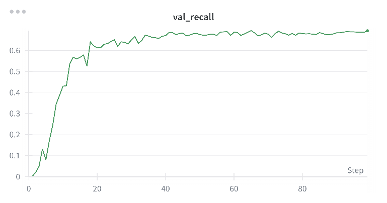

Figure : Validation Recall

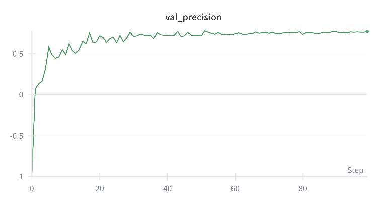

Figure : Validation Precision

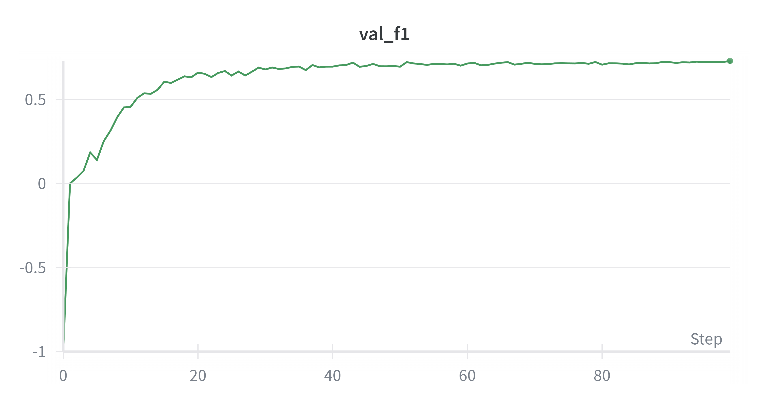

Figure : Validation F1

This 73.10% F1-Score confirmed that our custom-trained model was highly effective at understanding financial text. With this verified "engine," we proceeded to the next phase: constructing the full Knowledge Graph.

## Graph Construction and Data Summary

After validating our model for the extraction of relations, we ran it on the financial-news-multisource dataset. In this phase we turned raw text into a structured network.

In all, our pipeline ingested 347,822 news articles. For each article it called the SMARTe API, ran spaCy NER for entity typing and then performed a fuzzy-matching entity resolution against local cache (as visualized in Figure 5). The results were inserted into our Neo4j database.

- **Overview Statistics:**

After this process, the final FKG contains precisely 200,000 Entities (Nodes) and 754,992 Relationships (Edges), which are illustrated in Figure 9. The high number of Relationships supports our hypothesis that the financial world is a rich, tightly coupled network.

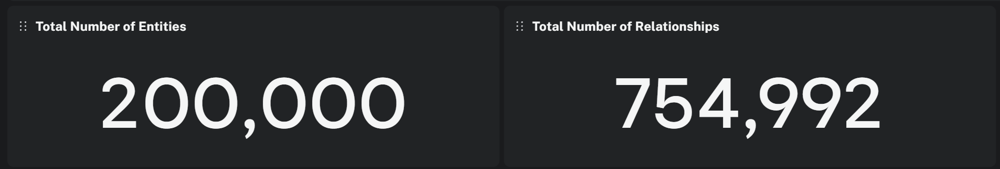

Figure : Neo4j dashboard showing entity and relation count

- **Entity Analysis:**

To identify the composition of our graph, we explored the distribution in types of entities our pipeline extracted. As shown in Figure 10, the graph consists primarily of Organizations (ORGs) (approximate 60,500)- and People (PERSON) (approximate 55,000). This will suit our simulation perfectly, allowing us to model both corporate level risk as well as "key man" risk (CEO scandal for example).

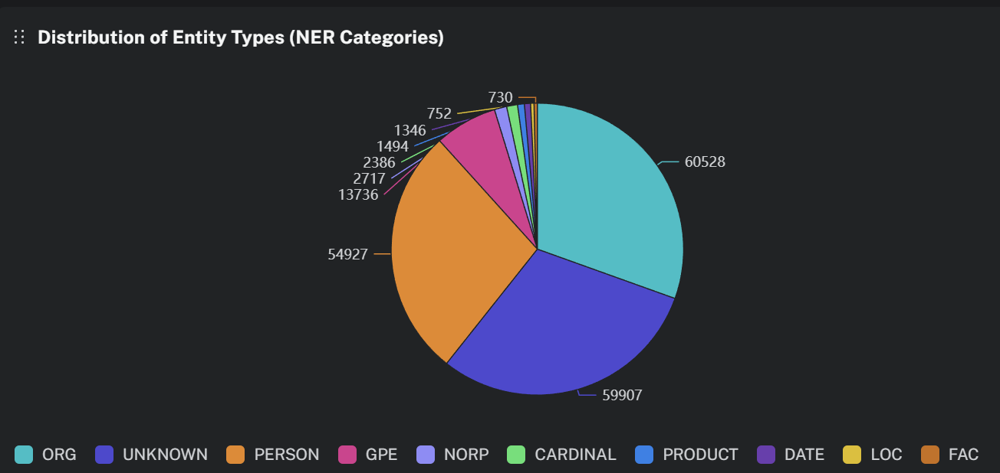

Figure : Entity type distribution

- **Relationship Analysis:**

The effectiveness of the "Ripple Calculator" depends on the specific kinds of relationships involved. Figure 11 depicts the count of relationship types. By far the most common relationship type is headquarters_location, without which geopolitical context would be absent. Yet also significant, even in this graph, is a very large number of high-consequence financial relations including product_or_material_produced, owned_by, and subsidiary that provide our most critical "conductors" for risk simulation.

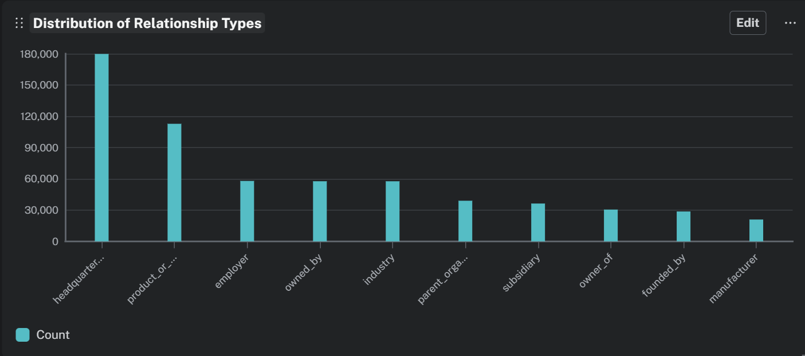

Figure : Relationship distribution

- **Connectivity Analysis:**

Finally, we measured the centrality of the nodes, to identify which entities were most interconnected in our ecosystem. As shown in Figure 12, the global hubs of case studies, like Beijing, London, and Chicago, are the most connected nodes. This is a predictable result, driven by the fact that more headquarters_location relationships point to those cities, which for a geopolitical event originating in one of these would produce the largest initial "fan-out" in the simulation.

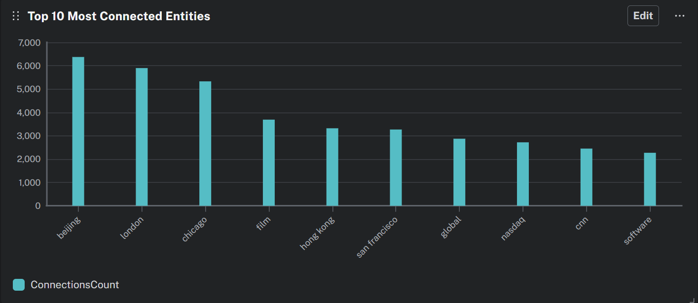

Figure : Most connected entities

# Advantages and drawbacks

Compared to conventional financial analysis, our Financial Ripple Calculator provides a new way of modelling market risk. However, it is still subject to some specific strengths and weaknesses of any system relying on imperfect data.

## Advantages

- **Visibility of Systemic Risk**: The major benefit of our system is that it sheds light on "invisible" risks. Conventional analysis may determine that a company's balance sheet is in good shape, but our tool can show you that it's reliant on a supplier currently in distress. That's the value in visualizing 2nd and 3rd-order connections-we can expose systemic risks that are otherwise impossible to see from a report with only the company in isolation.
- **Real-time and dynamic**: Whereas quarterly corporate filings (10-K reports) are static information, our system is based on news that publishes persisted channel relationships which are always changing. Example: If a new partnership is announced today, our tool extracts the partnership from the news and updates the risk graph immediately. This is where we have an edge in terms of speed of information.
- **Explainable Simulation**: Most AI risk models are a "black box." In our case, the simulator is transparent. Because we use a rules-based model, the user can see exactly what the node was impacted on, the mechanism, and the approximate level of its impact: e.g., "Node A impacted Node B because of a subsidiary relationship with a 0.9 transmission weight."

## Drawbacks

- **Dataset limitations**: We have consciously chosen to train on the FinRED dataset due to its high quality and focus on financial vocabulary. The size of the FinRED dataset is, however, significantly smaller than that of general domain datasets such as the NYT corpus, at approximately **5,700 versus 56,000**. Our model performed decently during testing; however, when applying it to our large corpus of millions of news articles, the small training set will likely inhibit the model's performance from catching some of the linguistic "corner cases" presented in unique and convoluted sentence structures, thus allowing less recall on these structures.
- **Missing Important Relations**: FinRED captures many of the important financial relations, but we noted some gaps in the schema with respect to critical market dynamics. For example, it is missing a competitor relationship. Financial risk is significantly driven by competition that can often carry an inverse relationship-for example, bad news for your competitor being good news for you. The absence of this label in training would limit the simulation's ability to model these naturally occurring "positive ripple" effects.
- **Heuristic Weights**: Currently, "transmission weights" (i.e., subsidiary = 0.9) are based on rational estimates rather than data. Although an appropriate first step for a proof-of-concept, this static table fails to incorporate any nuance that some subsidiaries could be more important than others in driving the transmission.

# Future Work

The research process investigated two feasible ways to take the project, from a successful prototype into an industrial-grade product:

- **Development of a Comprehensive Financial Dataset**: Our reliance on FinRED showed us a significant gap in this research area for project specific purposes. There are few large-scale, high-quality relation extraction dataset available specifically to finance. Building a new, more comprehensive dataset , on par with the NYT corpus, that includes critical relations like competitor and supplier not included in FinRED, is a valuable contribution to be made to the NLP community. Since time and human-annotated money for the compilation of this extensive dataset are out-of-scope of the current research project, this will remain a priority "to-do" for the future.
- **Transition to Graph Attention Networks:** Due to the limits of "Heuristic Weighting", we will fully transition from the (static) Transmission Table to a GAT. While now every relations-link (subsidiary node) were equally treated, a GAT facilitates an "attention mechanism" dynamically against total edges within the network to learn the importance (i.e., weight) of each.

In a subsequent iteration, we would train this GAT on historical data, feeding in a series of news and price movements and having it learn to adjust the attention weights to minimize error between the predicted ripple and actual market reaction. It would "learn" the physics of the market-for instance, that an association of a particular supplier with Apple is way more relevant than with a smaller company-and turn our rules-based simulation into a proper predictive machine learning engine.

# Summary and conclusion

As a result of this, the Financial Ripple Calculator provides an AI prototype capable of translating unstructured news into actionable network intelligence. Our leading-edge relation extraction-SMARTe, along with our custom Spreading Activation algorithm, has demonstrated that automation of identification and simulation of systemic financial risk is possible.

##### References

- S. Riedel, L. Yao, and A. McCallum, "Modeling Relations and Their Mentions without Labeled Text," Machine Learning and Knowledge Discovery in Databases, vol. 6323, pp. 148-163, 2010, doi: <https://doi.org/10.1007/978-3-642-15939-8_10>.
- C. Gardent, A. Shimorina, S. Narayan, and L. Perez-Beltrachini, "The WebNLG Challenge: Generating Text from RDF Data," HAL (Le Centre pour la Communication Scientifique Directe), Sep. 2017, doi: <https://doi.org/10.18653/v1/w17-3518>.
- S. Sharma et al., "FinRED: A Dataset for Relation Extraction in Financial Domain," arXiv.org, 2023. <https://arxiv.org/abs/2306.03736> (accessed Nov. 18, 2025).
- D. Sui, Y. Chen, K. Liu, J. Zhao, X. Zeng, and S. Liu, "Joint Entity and Relation Extraction with Set Prediction Networks," arXiv.org, 2020. <https://arxiv.org/abs/2011.01675> (accessed Nov. 18, 2025).
- X. W. Tan and S. Kok, "SMARTe: Slot-based Method for Accountable Relational Triple extraction," arXiv.org, 2025. <https://arxiv.org/abs/2504.12816> (accessed Nov. 18, 2025).
- L. Page, S. Brin, R. Motwani, and T. Winograd, "The PageRank Citation Ranking: Bringing Order to the Web. - Stanford InfoLab Publication Server," Stanford.edu, Nov. 1999, doi: <http://ilpubs.stanford.edu:8090/422/1/1999-66.pdf>.
- A. M. Collins and E. F. Loftus, "A Spreading Activation Theory of Semantic Processing," ResearchGate, Nov. 1975. <https://www.researchgate.net/publication/200045115_A_Spreading_Activation_Theory_of_Semantic_Processing>