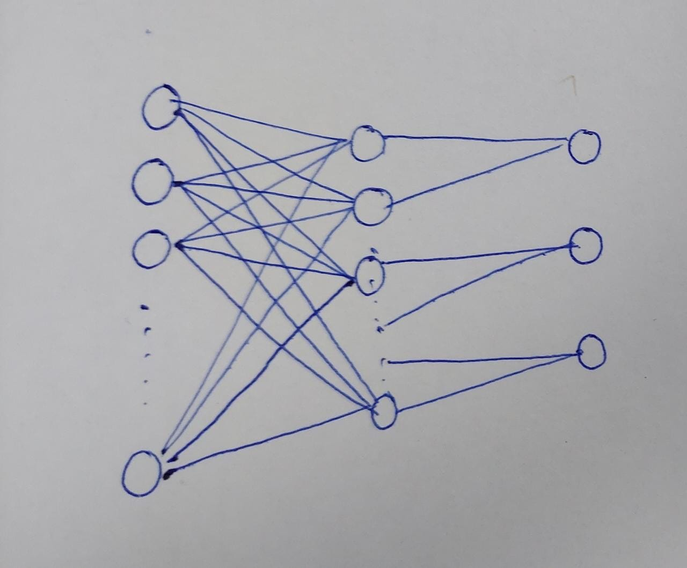

+++
title = "Mastering Custom Layers in PyTorch for AI Applications: A Software Engineer's Guide"
date = 2025-04-15T12:21:30-04:00
draft = false
summary = "Unlock the power of custom layers in PyTorch! This guide provides software engineers with a deep dive into creating and utilizing custom layers for AI applications, including practical examples and advanced optimization techniques. Learn to extend PyTorch and tailor models for specific tasks."
series = ["AI",]
tags = ["AI", "Pytorch", "Machine Learning", "Deep Learning", "Neural Networks", "Artificial Intelligence"]
author= ["Me"]
+++

## I. Introduction

**A.** This blog post explores the creation and utilization of custom layers in PyTorch, a crucial skill for software engineers working on complex AI models and deep learning projects. Understanding **custom layers in PyTorch** can be a game changer.

**B.** Custom layers provide the flexibility to implement specialized functionalities not available in PyTorch's standard library, allowing for tailored solutions to unique problems. This includes creating specialized attention mechanisms or **quantization aware training layers**. PyTorch custom layers allow for tailored solutions to complex problems.

**C.** We will delve into the core concepts of layer creation, explore practical applications with code examples, and discuss advanced considerations for optimization and deployment. This guide provides a comprehensive overview of **PyTorch custom layer implementation**.

**D.** This post is targeted towards intermediate to advanced PyTorch users who want to master **building custom layers**.

## II. Deep Dive into Core Concepts

**A. Concept 1: `nn.Module` as the Base Class**

1. In PyTorch, all layers and models inherit from the `nn.Module` class. This provides a structured framework for defining the layer's behavior, parameters, and forward pass. The `nn.Module` is fundamental for **custom layer development**.
2. Understanding `nn.Module` is foundational for creating custom layers. It allows engineers to encapsulate specific functionalities into reusable blocks for neural networks. For those looking to **extend PyTorch**, mastering `nn.Module` is the first step.
3. Use cases include implementing custom activation functions, novel convolutional operations, or specialized normalization techniques. These techniques showcase the power of **PyTorch custom layers**.

**B. Concept 2: `__init__` Constructor for Parameter Initialization**

1. The `__init__` method is crucial for initializing the layer's parameters (weights and biases). PyTorch's `nn.Parameter` class wraps tensors, informing PyTorch that these tensors require gradient calculation during training. Correct parameter initialization is critical in **custom layer creation**.
2. The `__init__` method is intrinsically linked to `nn.Module`. Inside `__init__`, the parameters required for the layer's operation are defined as `nn.Parameter` objects and are then registered as attributes of the `nn.Module` instance. The use of `nn.Parameter` is essential for **building custom layers**.
3. Example:
    ```python
    import torch
    import torch.nn as nn

    class CustomLinear(nn.Module):
        def __init__(self, in_features, out_features):
            super().__init__()
            self.weight = nn.Parameter(torch.randn(out_features, in_features))
            self.bias = nn.Parameter(torch.randn(out_features))

        def forward(self, x):
            return torch.matmul(x, self.weight.T) + self.bias
    ```

**C. Concept 3: `forward` Method for the Computational Graph**



1. The `forward` method defines the computational graph of the layer, specifying how the input tensor is transformed into the output tensor. This method utilizes the initialized parameters to perform the layer's specific operation. The `forward` pass is key to **PyTorch layer functionality**.
2. A common challenge is ensuring that the `forward` method is differentiable, allowing gradients to be computed during backpropagation. Potential pitfalls arise from using non-differentiable operations within the `forward` pass. Ensuring differentiability is crucial when **building custom layers in PyTorch**.
3. Best practices include leveraging PyTorch's built-in differentiable functions whenever possible and carefully considering the differentiability of custom operations implemented within the `forward` method. This helps ensure the **optimization of custom layers**.

## III. Practical Applications & Examples

**A. Real-world scenario 1: Implementing a Custom Attention Mechanism**
1. Problem: Standard attention mechanisms may not be suitable for specific data modalities or model architectures, requiring a custom implementation to achieve optimal performance. **Custom attention layers** are often required for optimal results.
2. Solution: Create a custom attention layer using `nn.Module`, defining the necessary parameters (query, key, value transformations) in `__init__` and implementing the attention calculation within the `forward` method, likely using `torch.softmax` for normalization. This is a common pattern when **building PyTorch custom layers**.
3. Example (Illustrative):

```python
class CustomAttention(nn.Module):
    def __init__(self, embed_dim, num_heads):
        super().__init__()
        self.num_heads = num_heads
        self.to_qkv = nn.Linear(embed_dim, embed_dim * 3)
        self.scale = (embed_dim // num_heads) ** -0.5

    def forward(self, x):
        B, N, C = x.shape
        qkv = self.to_qkv(x).reshape(B, N, 3, self.num_heads, C // self.num_heads).permute(2, 0, 3, 1, 4)
        q, k, v = qkv.unbind(0)
        attn = (q @ k.transpose(-2, -1)) * self.scale
        attn = attn.softmax(dim=-1)
        out = (attn @ v).transpose(1, 2).reshape(B, N, C)
        return out
```

**B. Real-world scenario 2: Building a Quantization-Aware Training Layer**
1. Problem: Deploying deep learning models on resource-constrained devices often requires quantization, but naive quantization can lead to significant accuracy degradation. Quantization-aware training aims to mitigate this. **Quantization-aware training layers** help improve model deployment on edge devices.
2. Solution: Several approaches exist:
    * **Approach 1: Simulating Quantization in Forward Pass:** Create a custom layer that simulates the effects of quantization (rounding, clipping) during the forward pass. This allows the model to learn to be more robust to quantization.
    * **Approach 2: Straight-Through Estimator (STE):** Approximate the gradient of the quantization operation during backpropagation using the STE. This allows the network to update the weights based on the simulated quantized values.
    * **Approach 3: Learnable Clipping Parameters:** Introduce learnable clipping parameters that control the range of values that are quantized. This allows the network to adapt the quantization range during training.
3. Impact: The chosen solution has a direct impact on the accuracy and efficiency of the deployed model. Quantization-aware training can significantly improve the accuracy of quantized models compared to post-training quantization. The complexity of the custom layer implementation also affects training time. Optimizing for **quantization aware layers** is key.

## IV. Advanced Considerations & Further Exploration

**A.** **Performance Optimization:** Profile custom layers to identify bottlenecks. Consider using optimized tensor operations (e.g., `torch.bmm` for batched matrix multiplication) and leveraging GPU acceleration. Investigate memory usage and optimize data transfers. This is key to the **optimization of custom layers**.

**B.** **Security Considerations:** When dealing with custom layers that process sensitive data, ensure that the implementation is secure and resistant to adversarial attacks. Validate inputs and outputs to prevent unexpected behavior. Protect the layer's parameters from unauthorized access. Security is paramount when **building custom layers** for sensitive applications.

**C.** **Scalability Aspects:** Design custom layers to be scalable to large input sizes and batch sizes. Consider using techniques like tiling or sharding to distribute the computation across multiple devices. Scalability is crucial for **deploying custom layers** in production.

**D.** **Interoperability with Other Technologies:** Ensure that custom layers are compatible with other PyTorch components and libraries (e.g., TorchScript for deployment, ONNX for model exchange). Provide clear documentation and examples to facilitate integration with other systems. Interoperability ensures the usability of **custom PyTorch layers**.

## V. Conclusion

**A.** Custom layers are a powerful tool for extending PyTorch's functionality and tailoring models to specific tasks. Key concepts include understanding `nn.Module`, parameter initialization, and defining the forward pass. **Mastering custom layers** expands the capabilities of PyTorch.

**B.** A solid understanding of custom layers is essential for software engineers working on complex AI applications, allowing them to implement innovative solutions and optimize model performance. This skill is critical for **AI development with PyTorch**.

**C.** Further Reading:
* PyTorch Documentation: [https://pytorch.org/docs/stable/](https://pytorch.org/docs/stable/)
* TorchVision Library: [https://pytorch.org/vision/stable/index.html](https://pytorch.org/vision/stable/index.html)
* Example Custom Layers: [Building a Text Classifier with PyTorch](/blogs/ag_news_classifier/) .

**D.** We encourage you to experiment with custom layers in your own projects. Share your experiences and contribute to the PyTorch community!