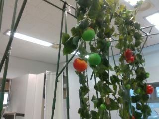
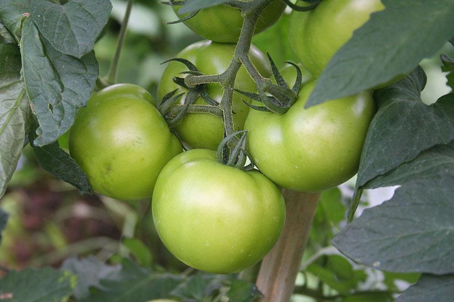
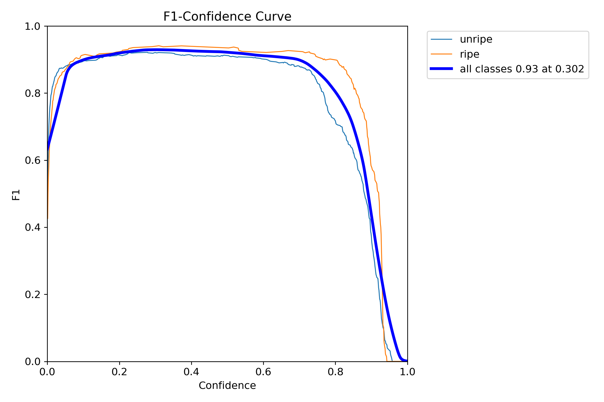
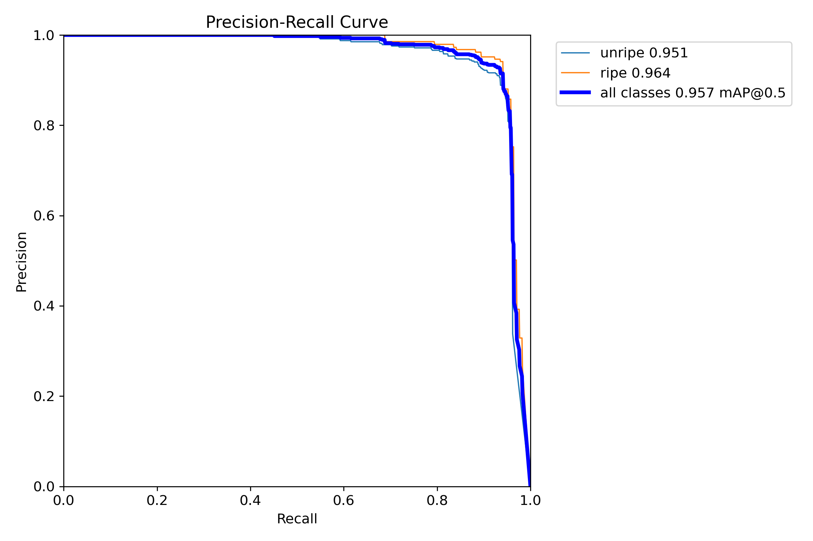
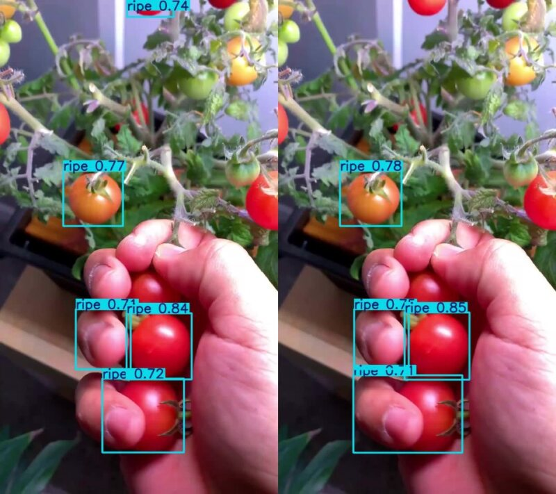

+++
title = 'Quantized YOLO for Efficient Edge Vegetable Classification: A Tomato Ripeness Case Study'
date = 2026-01-11T23:13:21-05:00
draft = false
summary = """Deploying deep learning models for real-time visual tasks
like fruit ripeness classification in smart agriculture is challenging
due to edge hardware constraints. This research presents an optimized
lightweight object detection model for edge deployment, demonstrated
through a tomato ripeness (ripe/unripe) case study using YOLOv11n"""
series = ["AI",]
tags = ["AI", "Pytorch", "Machine Learning", "Deep Learning", "Neural Networks", "Artificial Intelligence", "YOLO", "Machine Vision"]
author= ["Me"]
+++

**Note: This post is a web-adapted version of my formal project report. Hence, this may not be rendered perfectly. If you prefer the original format, you can view the [PDF here](files/mv_project_report.pdf)**

*Abstract*---Deploying deep learning models for real-time visual tasks
like fruit ripeness classification in smart agriculture is challenging
due to edge hardware constraints. This research presents an optimized
lightweight object detection model for edge deployment, demonstrated
through a tomato ripeness (ripe/unripe) case study using YOLOv11n. A
baseline model trained on a combined dataset achieved \~74.5%
mAP@0.5:0.95. Subsequent optimization focused on benchmarking various
export formats and applying INT8 post-training quantization. Results
showed that OpenVINO INT8 optimization delivered the best performance on
a host CPU, achieving a \~4.3x inference speedup (\~6.5ms latency) and a
\~38% model size reduction (3.2MB) compared to the FP32 baseline, while
maintaining accuracy at \~74.1% mAP with negligible degradation. This
validated methodology yields an efficient model suitable for edge
deployment on compatible hardware, demonstrating a practical path for
implementing optimized visual intelligence in agricultural robotics.

Keywords---Computer Vision, Deep Learning, Object Detection, YOLO, Edge
Computing, Model Quantization, Smart Agriculture, Ripeness
Classification, Robotics, OpenVINO

# Introduction

The farming industry is facing increasing calls to enhance productivity
and sustainability amid challenges like shortages of labor and climate
variability. New farming techniques, based on automation and insights
from data analysis, offer promising solutions. Robotics, in particular,
plays a pivotal role in automating tedious tasks such as selective
harvesting, crop monitoring, and precision treatment applications.
Advanced computer vision that can accurately recognize and analyze
complex farming environments in real-time is a key factor in determining
the efficacy of such robotic technologies.

One of the most important vision problems is the categorization of fruit
and vegetables, particularly for assessing ripeness for robotic
harvesting along with quality inspection tasks. Though conventional
computer vision approaches founded on manually designed features such as
texture and color have been investigated, they usually do not possess
sufficient robustness\[2\] to varying field conditions with uncertain
lighting, occlusions, and biological variation. Deep learning, in the
form of using Convolutional Neural Networks (CNNs) and object detection
algorithms such as the YOLO (You Only Look Once)\[1\] family, has been
the preferred choice, providing greater accuracy and generalizability by
learning features from the data itself.

Yet, the use of these sophisticated deep learning models comes with some
challenges, specifically in the agricultural robotics context.
Operations tend to take place in settings characterized by constrained
or intermittent connectivity, hence the need for edge computing---where
computation is directly on the robotic device or a local device. The
necessity for real-time control loops in robot-to-robot communication
also demands very low latency (below 100 milliseconds), which is hard to
realize based on distant cloud servers. Edge devices themselves are also
resource-constrained, with limited computational resources, memory, and
energy budgets, creating a huge gap between the requirements of
state-of-the-art deep learning models and the availability of deployable
hardware.

This work directly tackles the problem of employing precise and speedy
object detection models at the edge in smart agriculture. We report a
step-by-step methodology utilizing the classification of tomato ripeness
as a applicable and meaningful case study. Initially taking the
Efficient YOLOv11n architecture, we first establish the baseline
detection model trained on the merged, diversified dataset. The primary
contribution lies in Phase 2, where we systematically assess and apply
model optimization techniques exhaustively, with the emphasis on INT8
post-training quantization and examining the performance effects under
various deployment settings, including OpenVINO. We aim to measure the
inference speed, model size, and accuracy compromises and thereby
determine an optimized setting that will be appropriate for achieving
real-time performance on resource-scarce edge devices.

This study demonstrates an end-to-end workflow from baseline model
development through edge-targeted optimization and benchmarking,
deriving insights into successful deployment of deep learning-based
computer vision for demanding agricultural use cases. The findings
highlight the necessity of model quantization and hardware-aware
optimization in bridging the gap between computationally intensive AI
models and real-world edge deployment.

# Related work

## Traditional Feature-Based Approaches

Automatic fruit and vegetable recognition using computer vision has been
an active area of research, driven by the needs of smart agriculture.
Early approaches relied heavily on Traditional Feature-Based Methods.
Color space-based methods (e.g., RGB, HSV), texture descriptors (e.g.,
GLCM, LBP), and shape analysis combined with classifiers like SVMs were
common\[2\]. While less computationally demanding, these methods
suffered from a lack of robustness to lighting changes, shadows, and
perspectives typical of field environments, and did not tend to
generalize well to new environments. Multispectral imaging was also
explored for quality assessment, enhancing the detection of invisible
attributes but requiring specialized equipment.

## Deep Learning Revolution in Agricultural Vision

The advent of Deep Learning, and in particular Convolutional Neural
Networks (CNNs), revolutionized the field. Initial applications were
mainly classification with networks like VGG \[3\] achieving great
accuracy on large datasets but generally requiring big computational
resources not suited for edge deployment. Object detection models that
both classify and localize gained traction. Both two-stage detectors
(like Faster R-CNN) and one-stage detectors (like SSD and YOLO) were
employed. Specialized CNNs were developed for specific orchard
conditions, and work modified architectures like ResNet with Transfer
Learning for tasks like field condition strawberry classification\[4\]
Transfer learning significantly reduces training requirements but does
not directly solve the issue of model size for edge deployment.

## Lightweight Models and Optimization for Edge Deployment

Recognizing the need for on-device processing, research shifted towards
Edge AI solutions. This included the development of Lightweight Network
Architectures that were specifically designed for mobile or embedded
deployment, e.g., MobileNet \[5\] and custom variants \[6\]. While
efficient, these architectures sometimes came with a trade-off in
accuracy when compared to their larger counterparts. Architectures like
EfficientNet attempted compound scaling for improved efficiency but may
be sensitive to tuning. MobileNet has been demonstrated for on-device
fruit detection, for instance in classifying strawberry and cherry
types, sometimes highlighting challenges like partial occlusion..
\[8\]\[9\]

Apart from designing light models from scratch, Model Optimization
techniques became crucial to adapt heavy, pre-trained models to edge
constraints. Pruning, knowledge distillation, and quantization (reducing
numeric precision, e.g., from FP32 to INT8) are key techniques to reduce
model size and inference time. Hardware-software co-design approaches
also aim to tune performance on the target embedded platforms.

## Specific Applications and Challenges in Agricultural Vision

In Agricultural-Specific Implementations, deep learning has been applied
to a diverse set of problems including ripeness classification\[7\],
fruit recognition and disease detection combined\[10\], yield estimation
\[11\], and tackling challenges like occlusion handling\[12\] and
illumination invariance.

## Positioning of this Work

This project is founded on these pillars. It starts with a
state-of-the-art one-stage detector family (YOLOv11n), using transfer
learning for efficient baseline training on a specific, real-world task
(tomato ripeness). Most critically, it is focused on bridging the gap to
edge deployment not just through architecture choice (the \'n\'
variant), but via a systematic benchmarking and optimization process,
specifically evaluating the impact of INT8 quantization on a variety of
deployment formats (PyTorch, ONNX, OpenVINO, NCANN). By quantifying the
trade-offs among speed, size, and accuracy, with special focus on
OpenVINO INT8 success, this work provides real-world experience on
achieving real-time performance on agricultural vision applications on
resource-limited hardware.

# Project Design and Architecture

The project was designed with a two-phase approach to systematically
address the goal of developing an efficient vegetable classifier
suitable for edge deployment, using tomato ripeness as a case study. The
architecture encompasses data handling, baseline model development,
optimization, and evaluation pipelines.

## Overall Architecture

The system follows a sequential workflow.

- **Data Acquisition and Preparation**: Gathering and preparing a
  suitable dataset for training and evaluation.

- **Phase 1 - Baseline Model Training**: Developing an initial,
  functional object detection model using a chosen architecture
  (YOLOv11n) and standard deep learning practices

- **Phase 2 - Edge Optimization and Benchmarking**: Taking the baseline
  model and applying optimization techniques (quantization) and testing
  various deployment formats to improve speed and reduce size while
  measuring the impact on accuracy.

- **Evaluation**: Assessing performance at both phases using relevant
  metrics for accuracy and edge suitability (speed, size).

## Data Pipeline

- **Data Sources**: The project utilized a composite dataset created by
  combining images from two public sources:

  - Roboflow (Kyunghee University Tomato Detection)\[13\]: Provided
    diverse scenes with varied lighting (Figure 1), suitable for robust
    object detection training

  - Kaggle (Riped and Unriped Tomato Dataset)\[14\]: Offered clear
    examples (Figure 2) specifically focused on the ripe and unripe
    classification states

    
Figure 1: Example from Kyunghee University

Figure 2: Example from Kaggle Dataset

- **Preprocessing & Annotation**: Images were processed, and annotations
  were unified into the standard YOLO format (class_id center_x center_y
  width height). Two classes were defined: 0: unripe, 1: ripe.

- **Dataset Composition**: The final combined dataset comprised 1489
  images containing 1520 unripe and 582 ripe tomato instances.

- **Splitting**: A stratified split allocated the data into training
  (905 images), validation (290 images), and testing (289 images) sets
  to ensure representative class distribution for reliable model
  training and evaluation.

## Phase 1: Baseline Model Architecture & Training

- **Model Selection:** The YOLOv11n architecture was selected as the
  baseline. The \'n\' (nano) variant was specifically chosen for its
  design emphasis on computational efficiency and low resource
  requirements (2.6M parameters, 6.5B FLOPs), aligning with the ultimate
  edge deployment goal.

- **Training Strategy:**

  - Transfer Learning: The model was initialized with weights
    pre-trained on the COCO dataset to accelerate convergence and
    leverage general object features.

  - Finetuning: The pre-trained model was finetuned on the custom
    combined tomato dataset for 100 epochs using a batch size of 32,
    employing an AdamW optimizer followed by SGD, and a OneCycleLR
    learning rate schedule.

  - Data Augmentation: Extensive augmentation (geometric transforms like
    rotation, scaling, translation, flip; photometric adjustments like
    HSV modification; and mosaic composition) was applied during
    training to enhance model robustness and generalization.

## Phase 2: Edge Optimization & Benchmarking Pipeline

- **Objective**: To convert the baseline model into an edge-ready
  format, optimizing for speed and size while minimizing accuracy loss.

- **Workflow**:

  - Baseline Benchmarking: The trained PyTorch FP32 model\'s inference
    speed (latency/FPS) and file size were measured on the host CPU
    (Intel Core i9-10920X).

  - Format Export: The model was exported to various intermediate and
    deployment formats: ONNX, OpenVINO, and NCNN.

  - Quantization: Post-Training Quantization (PTQ) to INT8 precision was
    applied, primarily focusing on the successful implementation via the
    OpenVINO toolkit. Different precision exports (FP32, FP16) were also
    tested where applicable. *\[Figure 3\]*

  - Optimized Benchmarking: Each successfully converted/quantized
    model\'s inference speed (latency/FPS), file size, and accuracy
    (mAP) were measured on the same host CPU.

Figure 3:Model Quantization
(https://medium.com/@sulavstha007/quantizing-yolo-v8-models-34c39a2c10e2)

## Evaluation Framework

- **Phase 1 Metrics**: Standard object detection metrics were used:
  mAP@0.5:0.95 (primary), mAP@0.5, Precision, Recall, and F1-score
  analysis.

- **Phase 2 Metrics**: Focus shifted to edge-critical metrics: Inference
  Latency (ms) / FPS, Model Size (MB), and the change/trade-off in mAP
  accuracy compared to the FP32 baseline.

## Target Deployment Environment (Conceptual)

- **Goal**: The system is designed conceptually for deployment on
  resource-constrained edge devices typical in robotics (e.g., NVIDIA
  Jetson series, Intel Movidius VPUs, ARM-based systems like Raspberry
  Pi).

- **Simulation**: Performance evaluation (speed, effect of quantization)
  was conducted on a host CPU (Intel Core i9) as a proxy to compare
  relative performance differences between formats and optimizations.
  The results inform which formats (e.g., OpenVINO for Intel targets,
  potentially NCNN/TFLite for ARM targets) are most promising for
  specific hardware

# Implementation and evaliation of proposed approach

This section details the implementation steps and evaluates the
performance of the developed system across its two primary phases:
baseline model development and edge optimization.

## Implementation Eviornment and Tools

The project was implemented using Python 3.9. Key libraries included:

- ***Deep Learning Framework**:* PyTorch, primarily utilized through the
  Ultralytics YOLO framework.

- ***Optimization & Deployment Toolkits**:* ONNX, ONNX Runtime, Intel\'s
  OpenVINO toolkit, and Tencent\'s NCNN were used for model export,
  quantization, and benchmarking.

- ***Data Handling & Visualization**:* OpenCV for image processing,
  NumPy and Pandas for data manipulation, Matplotlib and Seaborn for
  generating plots (like those shown in the results slides).

- ***Hardware**:* Training was accelerated using an NVIDIA GPU \[NVIDIA
  GeForce RTX 2080 Ti\]. Benchmarking for Phase 2 (CPU performance) was
  conducted on an Intel® Core i9-10920X CPU @ 3.50GHz.

## Phase 1: Baseline Model Implementation and Evaluation

1)  Implementation:

    Following the methodology, the YOLOv11n model was implemented via
    the Ultralytics framework, initialized with COCO pre-trained weights
    (transfer learning), and finetuned on the custom combined tomato
    dataset (1489 images, \~2100 instances, split \~70/15/15
    train/val/test). Training ran for 100 epochs (batch size 32) with
    specified optimizers and extensive data augmentation (geometric,
    photometric, mosaic) to enhance robustness.

2)  **Evaluation:**

    The baseline YOLOv11n model\'s performance was evaluated on the
    held-out test set.

    - Quantitative Results: Key performance metrics are summarized in
      Table I. The model achieved strong detection results, including
      \~74.3% mAP@0.5:0.95 and \~95.5% mAP@0.5, with balanced Precision
      (\~94.1%) and Recall (\~90.7%).

      **Table I**: Baseline YOLOv11n Performance Metrics on Tomato Test
      Set.

  ------------------------------------------------------------------------
  Metric                   Value       Notes
  ------------------------ ----------- -----------------------------------
  mAP@.5:.95 IoU           0.74263     Overall detection quality

  mAP @ 0.5 IoU            0.95548     Detection quality at 50% overlap

  Precision (B)            0.94069     Accuracy of positive detections

  Recall (B)               0.90701     Ability to find all ground truth
                                       objects
  ------------------------------------------------------------------------

- **F1-Score & Classification Analysis**: Analysis of the F1-Confidence
  curve (Figure 4) showed a peak F1 of \~0.92. The confusion matrix,
  presented in Figure 5, confirmed excellent differentiation between
  \'ripe\' and \'unripe\' classes (\>93% accuracy within detections).

- **Area for Improvement**: As seen in Fig. 5, the primary limitation
  identified was the misclassification of a small percentage (\~5-6%) of
  actual tomatoes as \'background\', indicating potential for improving
  detection sensitivity. For our project that not a big problem because
  we are targeting high true positive for ripe cases because that's what
  is most relevant for "Automatic Harvesting".

  
Figure 4: Baseline F1 Curve

Figure 5: Confusion Matrix (Normalized)

<figure>

<figcaption>
Figure 6: PR Curve
</figcaption>
</figure>

- **Qualitative Assessment**: Visual inspection of predictions, shown in
  Fig. 7&8, illustrated the model\'s general capability in various
  scenes but also highlighted challenges like confidence variance and
  potential edge cases (e.g., borderline ripeness), reinforcing the need
  for careful threshold selection.

<figure>

<figcaption>
Figure 7: Ground Truths
</figcaption>
</figure>

3)  **Baseline Edge Assessment:**

    The baseline PyTorch model (5.2 MB) had a CPU inference latency of
    \~27.7 ms (\~36 FPS) on the test CPU. This highlighted the need for
    optimization to meet real-time requirements reliably on typical edge
    hardware.

## Phase 2: Edge Optimization Implementation and Evaluation

### **Implementation:** 

 Phase 2 focused on converting and optimizing the baseline model for edge deployment. The PyTorch model was exported to ONNX, OpenVINO IR, and NCNN formats (FP32/FP16 where applicable). Post-Training Quantization (PTQ) to INT8 precision was primarily implemented and evaluated using the Intel OpenVINO toolkit.

### **Evaluation:**

Systematic benchmarking on the host CPU compared the different versions.

- **Quantitative Results (Comparison)**

The results clearly show the effectiveness of specific strategies.
OpenVINO models consistently outperformed others on the Intel CPU. The
OpenVINO INT8 model delivered the best overall performance (Table II),
achieving:

- **Lowest Latency: \~6.5ms** (\~154 FPS)

- **Significant Speedup:** \~4.3x faster than the Pytorch Baseline

- **Smallest Size: 3.2MB** (\~38% reduction)

  - **Preserved Accuracy: \~74.1% mAP**, negligible drop from baseline

    **Table II**: Baseline YOLOv11n Performance Metrics on Tomato Test
    Set.

  ------------------------------------------------------------------------------------
  Format          Precision   INT8      Size (MB)    CPU       CPU FPS   mAP @ .5:.95
                                                     Latency             
                                                     (ms)                
  --------------- ----------- --------- ------------ --------- --------- -------------
  PyTorch         FP32        No        10.1 MB      \~31.5 ms \~32 FPS  \~74.1%

  ONNX            FP32        No        10.1 MB      \~31.5 ms \~32 FPS  \~74.1%

  ONNX            FP16        FP16      10.1 MB      \~29.3 ms \~34 FPS  \~74.1%

  Open-VINO       FP32        No        10.2 MB      \~9.0 ms  \~112 FPS \~74.1%

  Open-VINO       FP16        No        5.4 MB       \~14.6 ms \~69 FPS  \~74.1%

  **Open-VINO**   **FP32**    **Yes**   **3.2 MB**   **\~6.5   **\~154   **\~74.1%**
                                                     ms**      FPS**     

  NCNN            FP16        No        5.1 MB       \~36.7 ms \~27 FPS  \~74.1%
  ------------------------------------------------------------------------------------

- **Hardware Specificity Discussion:**

The dominance of OpenVINO here highlights the benefit of
hardware-specific toolkits (Intel CPU). The relative performance of
formats like NCNN may differ significantly on ARM-based edge targets,
necessitating target-specific testing.

<figure>

<figcaption>
Figure 9: Performance Comparison of YOLOv11n Across
Formats and Optimizations
</figcaption>
</figure>

## Deployment Visualization:

Fig. 10 provides a visual comparison of the model running in a simulated
video context. While the reported CPU inference time (\~11.8 ms)
includes video processing overheads (making it higher than the raw
benchmark in Table II), it demonstrates the optimized model\'s
functional output quality compared to the GPU baseline.

<figure>
<!--  -->

<iframe width="560" height="315" src="https://www.youtube.com/embed/bM34kMI0K5E?si=2BIyR_hBJDBvCb7N" title="YouTube video player" frameborder="0" allow="accelerometer; autoplay; clipboard-write; encrypted-media; gyroscope; picture-in-picture; web-share" referrerpolicy="strict-origin-when-cross-origin" allowfullscreen></iframe>

<figcaption>
Figure 10:Caption: Visual Comparison of GPU vs Optimized
CPU (OpenVINO INT8) Predictions in a Video Context (Note: CPU timing
includes video overhead).
</figcaption>
</figure>

## Overall Evaluation Summary:

The two-phase approach successfully developed and optimized a YOLOv11n
model for tomato ripeness detection. Phase 1 validated the baseline
accuracy (\~74.3% mAP). Phase 2 demonstrated that OpenVINO INT8
quantization provided significant speed (\~4.3x) and size (\~38%)
improvements with minimal accuracy loss on the test hardware, resulting
in a model (3.2 MB, \~6.5ms latency) highly suitable for deployment on
compatible edge platforms. The study validates a practical workflow for
optimizing object detectors for edge applications in smart agriculture.

# Conclusion and discussion

This project aimed to address the critical challenge of deploying
accurate and efficient deep learning models for fruit and vegetable
classification on resource-constrained edge devices, a key enabler for
smart agriculture and robotic automation. Using tomato ripeness
detection as a practical case study, we demonstrated a systematic
two-phase approach, starting with establishing a robust baseline model
and culminating in significant performance optimization for edge
suitability.

### Summary of Findings

The initial phase confirmed the viability of using a recent, highly
effective object detector, YOLOv11n, on the problem. Trained by transfer
learning on an aggregated dataset for diversity, the baseline model
worked well, with its accuracy achieving around 74.3% mAP@0.5:0.95 and
being extremely accurate (\>93%) in distinguishing between ripe and
unripe tomatoes, asserting the baseline detection and classification
capability. However, its inference latency on a typical CPU (\~27.7 ms)
and model size (5.2 MB) offered potential limits for real-time
deployment on typical edge hardware.

The second phase focused exclusively on edge optimization through
benchmarking various export formats and post-training INT8 quantization.
The results clearly showed the advantages of using hardware-aware
toolkits. Notably, using the Intel OpenVINO toolkit and INT8
quantization produced significant gains on the Intel Core i9 test CPU.
This new configuration reduced inference latency by a staggering \~6.5
ms (a \~4.3x speedup), reduced model size by \~38% to 3.2 MB, and
crucially preserved the model\'s accuracy (\~74.1% mAP) with negligible
degradation. This outcome represents an extremely appealing balance
achieved in the accuracy-speed-size trade-off.

### Discussion and Implications

The initial phase confirmed the viability

1.  **Edge AI Viability**: The dramatic acceleration and size reduction
    accomplished with optimization make the model shift from a
    borderline prospect to one highly well-suited for real-time running
    on suitable edge hardware. The capability to achieve inference rates
    potentially above 150 FPS (on the host CPU) leaves ample headroom
    for taxing robotic tasks requiring rapid visual feedback.

2.  **Necessity for Post-Training Optimization**: This study emphasizes
    that the selection of a good base architecture (e.g., YOLOv11n) is
    only the first step. Targeted post-training optimization,
    particularly quantization, is often required to meet edge
    hardware\'s high-performance needs without losing too much in
    accuracy. The minimal accuracy loss observed with OpenVINO INT8
    demonstrates the power of current quantization techniques when used
    appropriately.

3.  **Hardware-Software Co-dependency**: OpenVINO\'s improved
    performance on the Intel test CPU also highlights the key
    co-dependency between the hardware architecture and the software
    toolkit. This would quite strongly indicate that optimizing for
    maximum performance on a range of edge platforms (for example,
    ARM-based hardware like Raspberry Pi or Jetson, or specialized
    accelerators like Google Coral) would likely involve benchmarking
    and perhaps using different optimization toolkits (for example,
    TensorFlow Lite, NCNN, NVIDIA TensorRT) specifically optimized for
    that given hardware. A \"one-size-fits-all\" export format may not
    offer the best result across different edge targets.

4.  **Practical Workflow Validation**: The project successfully
    demonstrated an end-to-end workflow: from data gathering and
    baseline training to systematic benchmarking, optimization, and
    testing with edge-specific metrics in mind. Such a workflow can
    serve as a template for similar deployment work in agricultural
    vision.

### **Limitations**

Despite the positive results, several limitations should be
acknowledged. Firstly, all performance benchmarks (latency, FPS) were
conducted on a host CPU as a proxy for edge devices; performance on
actual, less powerful edge hardware needs direct verification. Secondly,
while the dataset was combined for diversity, real-world agricultural
environments present immense variability in lighting, weather,
occlusions, and crop varieties that may not have been fully captured,
potentially affecting generalization. Thirdly, the baseline evaluation
identified minor issues with background misclassifications, which were
not the primary focus of the optimization phase but would need
addressing for maximum reliability in production.

### **Conclusion**

In conclusion, this paper was able to optimally design and optimize a
YOLOv11n model for efficient tomato ripeness classification suitable for
edge deployment. Through the strict use of INT8 quantization through the
OpenVINO toolset, inference performance and model size improvements were
highly achieved while maintaining high accuracy. This demonstrates the
applicability and usefulness of post-training optimization towards the
enablement of real-time deep learning on constrained hardware in smart
agriculture. The proposed methodology provides an applied means for
researchers and practitioners to utilize cutting-edge computer vision
ability in the field directly. The application lays the foundation for
more intelligent and autonomous agricultural systems. Validation on
target edge hardware and extension to more crops and classification
tasks is the path ahead.

# ACKNOWLEDGMENT

Sincere appreciation is extended to Professor Sanghoon Lee, instructor
for the MSCS Machine Vision course. His instructions and support were
invaluable throughout the execution of this project.

# References

1.  A. Wang et al., "YOLOv10: Real-Time End-to-End Object Detection,"
    May 2024. Available: <https://arxiv.org/pdf/2405.14458>

2.  S. Arivazhagan, R. Newlin Shebiah, S.S. Nidhyanandhan, and L.
    Ganesan, "Fruit Recognition using Color and Texture Features," Fruit
    Recognition using Color and Texture Features, vol. 1, no. 2, pp.
    90--94, Oct. 2010, Available:
    <https://www.researchgate.net/publication/286181643_Fruit_Recognition_using_Color_and_Texture_Features>

3.  H. Mureşan and M. Oltean, "Fruit recognition from images using deep
    learning," arXiv.org, 2017. https://arxiv.org/abs/1712.00580v10
    (accessed Apr. 27, 2025).

4.  J. Steinbrener, K. Posch, and R. Leitner, "Hyperspectral fruit and
    vegetable classification using convolutional neural networks,"
    Computers and Electronics in Agriculture, vol. 162, no. C, pp.
    364--372, Jul. 2019, doi:
    <https://doi.org/10.1016/j.compag.2019.04.019>.

5.  A. G. Howard et al., "MobileNets: Efficient Convolutional Neural
    Networks for Mobile Vision Applications," arXiv.org, Apr. 17, 2017.
    <https://arxiv.org/abs/1704.04861>

6.  Y. Tian, G. Yang, Z. Wang, H. Wang, and E. Li, "Apple detection
    during different growth stages in orchards using the improved
    YOLO-V3 model," Elsevier.com, Feb. 2019.
    https://linkinghub.elsevier.com/retrieve/pii/S016816991831528X
    (accessed Apr. 27, 2025).

7.  E. Tapia-Mendez, I. A. Cruz-Albarran, S. Tovar-Arriaga, and L. A.
    Morales-Hernandez, "Deep Learning-Based Method for Classification
    and Ripeness Assessment of Fruits and Vegetables," Applied Sciences,
    vol. 13, no. 22, p. 12504, Jan. 2023, doi:
    <https://doi.org/10.3390/app132212504>.

8.  T. B. Shahi, C. Sitaula, A. Neupane, and W. Guo, "Fruit
    classification using attention-based MobileNetV2 for industrial
    applications," PLOS ONE, vol. 17, no. 2, p. e0264586, Feb. 2022,
    doi: <https://doi.org/10.1371/journal.pone.0264586>.

9.  N. Venkatesh, Nagaraju Y, S. U. Hegde, and Stalin S, "Fine-tuned
    MobileNet Classifier for Classification of Strawberry and Cherry
    Fruit Types," 2022 International Conference on Computer
    Communication and Informatics (ICCCI), pp. 1--8, Jan. 2021, doi:
    <https://doi.org/10.1109/iccci50826.2021.9402444>.

10. A. Fuentes, S. Yoon, S. Kim, and D. Park, "A Robust
    Deep-Learning-Based Detector for Real-Time Tomato Plant Diseases and
    Pests Recognition," Sensors, vol. 17, no. 9, p. 2022, Sep. 2017,
    doi: <https://doi.org/10.3390/s17092022>.

11. S. W. Chen et al., "Counting Apples and Oranges With Deep Learning:
    A Data-Driven Approach," IEEE Robotics and Automation Letters, vol.
    2, no. 2, pp. 781--788, Apr. 2017, doi:
    <https://doi.org/10.1109/lra.2017.2651944>.

12. Z. Chen, K. Granland, Y. Tang, and C. Chen, "HOB-CNNv2: Deep
    learning based detection of extremely occluded tree branches and
    reference to the dominant tree image," Computers and Electronics in
    Agriculture, vol. 218, p. 108727, Mar. 2024, doi:
    <https://doi.org/10.1016/j.compag.2024.108727>.

13. KyungHee Univercity, "Tomato_detetion_yolo Dataset," Roboflow,
    Feb. 2025.
    https://universe.roboflow.com/kyunghee-univercity/tomato_detetion_yolo
    (accessed Apr. 26, 2025).

14. Suman Kunwar, "Ripe and Unripe Tomatoes Dataset," Kaggle.com, 2024.
    https://www.kaggle.com/dsv/8796473 (accessed Apr. 27, 2025).