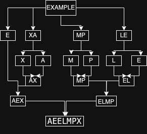

+++
title = 'Homework 4'
date = 2024-11-21T11:57:07-05:00
draft = false
summary = "My homework backup for Advance Algorithm subject."
series = ["Advance Algorithm",]
tags = ["Advance Algorithm", "homework", "university", "school"]
author= ["Me"]
+++
## Answer 1

### a
According to Russian Peasant Algo for a * b. We add b to result in case of odd a and we keep halving a and doubling b.

```
a      -> 26 13 6   3   1   0
b      -> 47 94 188 376 752 1504
result -> 0  0  94  94  470 1222
```

Therefore, 26 * 47 = 1222

### b

the Russian Peasant algorithm depends on the first number (a) according to current implementation. The while loop continues until a becomes 0. The number of operations will be greater when a is larger.
 

```
FUNCTION RussianPeasantMultiplication(a, b)
    result = 0
    
    WHILE a > 0 DO
        
        IF a is odd THEN
            result = result + b
        ENDIF
        
        a = floor(a / 2)
        b = b * 2
    ENDWHILE
    
    RETURN result
```

## Answer 2

len(arr) = 7
k = (7-1)//2 = 3
Median will be 4th smallest element in array.
We will be using Lomuto's algo for portioning.

```
Partition #1
Pivot = 8 (last element)
After partition: [5, 8, 9, 17, 20, 30, 12]
                        ^
```

Pivot index is 2. We need 3rd index. So, we will recurse on right partition.

```
Partition #2
Subarray: [17, 20, 30, 12]
Pivot = 12 (last element)
After partition: [12, 17, 20, 30]
                  ^
```

Pivot index is 3 in original array which is what we need. Therefore, the median (4th smallest element) is 12.


## Answer 3
### a
In BST, larger values are always stored on right node.

```
    max_value(root):
        curr = root

        while curr.right:
            curr = curr.right

        return curr.value

```
This, can't be classified as variable-size decrease algo because this ia decrease by constant factor (half in this case) algo.

### b
$C_\textrm{worst}$(n)=O(h) where he is height of tree.


## Answer 4

### a
```
ALGORITHM findLargest(A[l..r])
if l = r
    return l
else
    m ← ⌊(l + r)/2⌋
    p1 ← findLargest(A[l..m])
    p2 ← findLargest(A[m+1..r])
    if A[p1] ≥ A[p2]
        return p1
    else
        return p2
```

### b
For arrays with several elements of the largest value, this algorithm will return the position of the first occurrence of the largest value.

### c
Recurrence relation for the number of key comparisons T(n):

T(n) = 2T(n/2) + 1 for n > 1

T(1) = 0

We can solve this using the Master Theorem. Here, a = 2, b = 2, d = 0, and f(n) = 1.

Since a > b^d, we have:

T(n) ∈ Θ(n^(log_b(a))) = Θ(n^(log_2(2))) = Θ(n)

### d
* Bruteforce algo is also of same asymptotic efficiency.
* It follows same number of comparisons.
* This algo uses more space (O(log n)) for recursing call stack. Where as bruteforce uses constant space.


## Answer 5
Please find image displaying merge sort algorithm with intermediate states.

Here instead of numerical comparisons, we use lexicographical (alphabetical) order comparisons.



## Answer 6

Same as previous answer, we will compare characters in lexicographical order.
In the psedocode below we are using Lomuto's partitioning algo for partitioning by keep right most value of sub array as pivot.

```
FUNCTION Quicksort(A, start, end)
    if start < end
        p = Partition(A, start, end)
        Quicksort(A, start, p - 1)
        Quicksort(A, p + 1, end)

FUNCTION Partition(A, start, end)
    pivot = A[end]
    i = start - 1
    for j = start to end - 1
        if A[j] <= pivot
            i = i + 1
            swap A[i] and A[j]
    swap A[i+1] and A[end]
    return i + 1
```

Recursion Call Stack

```
                    Quicksort(0,6)
                  /               \
                 /                 \
                /                   \
        Quicksort(0,1)               Quicksort(3,6)
       /            \                 /            \
      /              \               /              \
Quicksort(0,-1)  Quicksort(1,1)  Quicksort(3,5)  Quicksort(7,6)
                                /            \
                               /              \
                      Quicksort(3,2)     Quicksort(4,5)
                                         /            \
                                        /              \
                               Quicksort(4,3)     Quicksort(5,5)
```


## Answer 7
Pre-Order = a b d e c f

In-Order = d b e a c f

Post-Order = d e b f c a 
