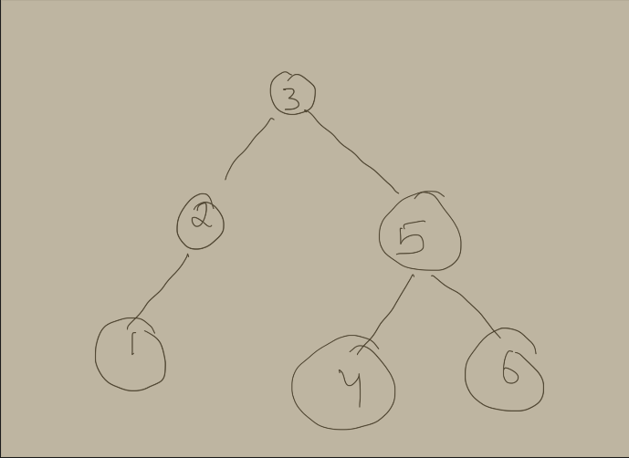
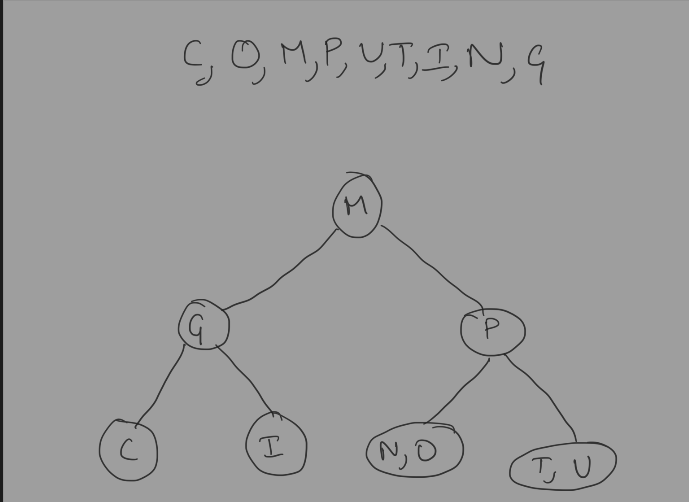
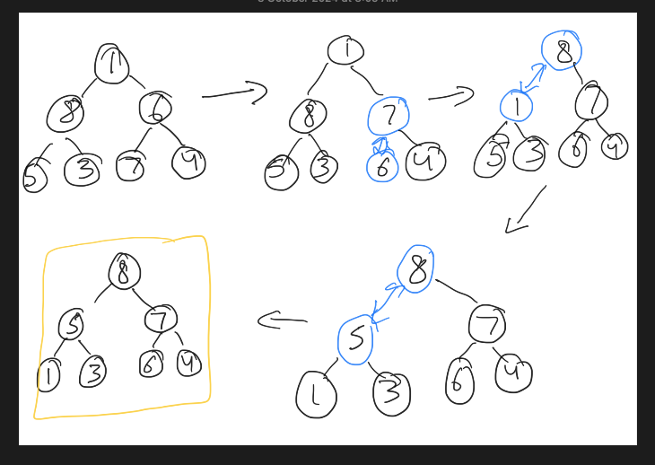
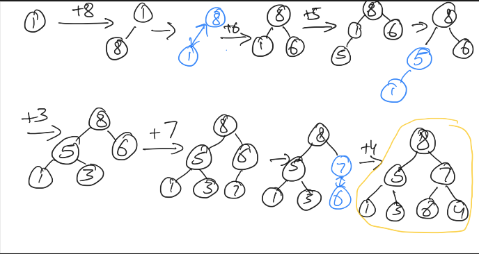

+++
title = 'Homework 5'
date = 2024-11-21T11:57:07-05:00
draft = false
summary = "My homework backup for Advance Algorithm subject."
series = ["Advance Algorithm",]
tags = ["Advance Algorithm", "homework", "university", "school"]
author= ["Me"]
+++

## Answer 1

### a

We can sort the array first (using merge or quick sort. This takes O(nlog(n)) time). Initialize the `min_distance` to some infinite value and then iterate through index 1 -> n-1. Compare distance between current element and previous element. If the distance is smaller than `min_distance` update it.

```
closest_num(A[0...n-1]):
    sort(A)

    min_distance = inf

    for i = (1 -> n-1):
        distance = |A[i] - A[i - 1]|

        min_distance = min(distance, min_distance)

    return min_distance
```

### b

In bruteforce algo, efficiency is O($n^2$) because that considers n(n-1)/2 pairs of the array's elements.

In this algo, sorting takes O(nlog(n)) time. So, overall efficiency becomes

```
    O(nlogn) + Θ(n) = O(nlogn)
```


## Answer 2

### a

We can use sorting for this problem as following

1. Sort both bill and checks array by telephone.
2. Start iterating over both arrays using 2 pointers.
3. If bill number == check number, move both pointers.
4. If bill number < check number, bill is unpaid, add to unpaid list and increment bill pointer.
5. If bill number > check number, move check pointer.
6. Any remaining bill after iteration are unpaid. (Add to unpaid set).

Time complexity : `O(nlogn) + O(mlogm) = O(nlogn)` because n>=m

### b

We don't need to sort array here because regardless of order, we will be updating state counter.

1. Initialize a dictionary for each state with count 0.
2. Start iterating the student array, and increment counter for each start by 1 per iteration.
3. return this dictionary.

## Answer 3

```

1 1 1 2
2 1 1 3
1 −1 3 8

row 2 - 2/1 row 1
row 3 - 1/1 row 1
```

```
1  1  1  2
0 −1 −1 −1
0 −2  2  6

row3 - (-2/-1) row 2
```

```
1  1  1  2 
0 −1 −1 −1
0  0  4  8 
```

Using backward substitution.

```
x3 = 8/4              =  2

x2 = (−1 + x3)/(−1)  = −1

x1 = (2 − x3 − x2)/1  =  1
```

## Answer 4

### a
Unique solution:

System: 2x + y = 5, x - y = 1

Solution: x = 2, y = 1

### b
No solution:

System: 2x + y = 4, 2x + y = 5

Result: 0 = 1 (contradiction)

### c

Infinitely many solutions:

System: 2x + y = 5, 4x + 2y = 10

Result: y = 5 - 2x, where x is any real number


### Answer 5

Only (a) is valid AVL trees others are violating properties of AVL tree/ binary tree.


### Answer 6



### Answer 7



## Answer 8

### a



### b



### c

No, It is not necessary that heap by both the algos is same.


## Answer 9

Constructed Heap (in array representation).

Heap = [T S R O I N G]

```
Order Of Deletion and re-structuring
T S R O I N G // Deleted
G S R O I N // T
S O R G I N
N O R G I // S,T
R O N G I
I O N G // R,S,T
O I N G
G I N // O,R,S,T
N I G
G I // N,O,R,S,T
I G
G //I,N,O,R,S,T
G
```

Sorted Order `G,I,N,O,R,S,T`

## Answer 10

No, heap sort is not stable. Positions can be interchanged for same values.