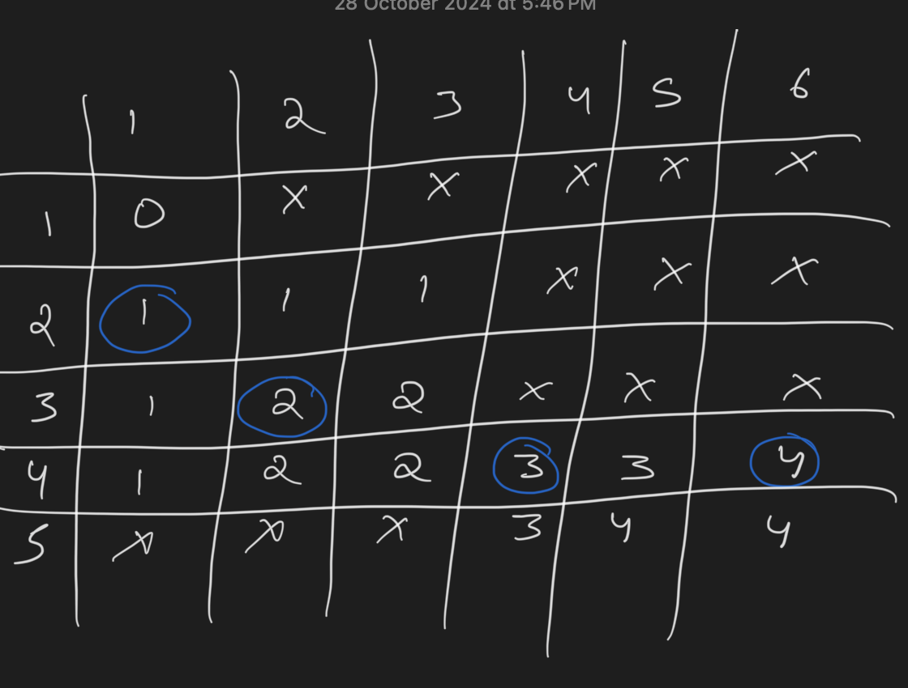
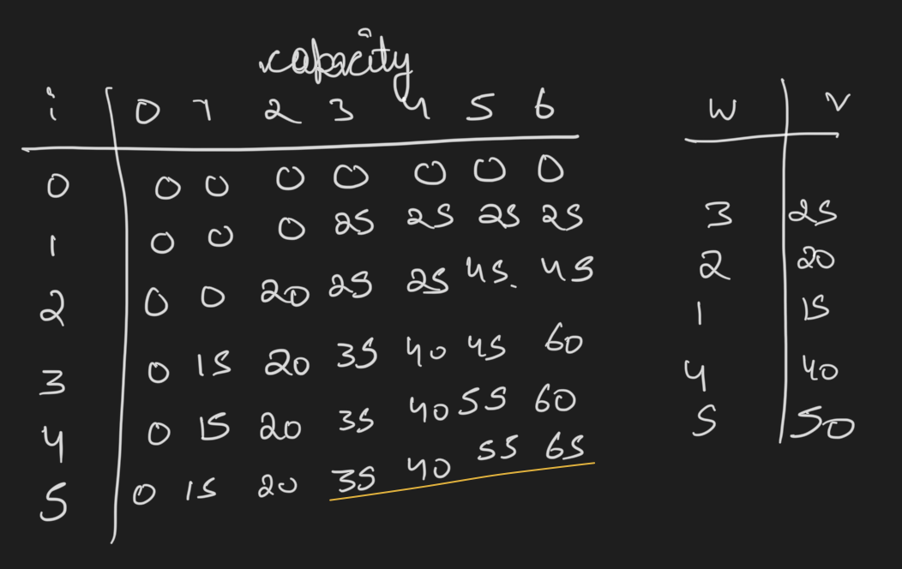
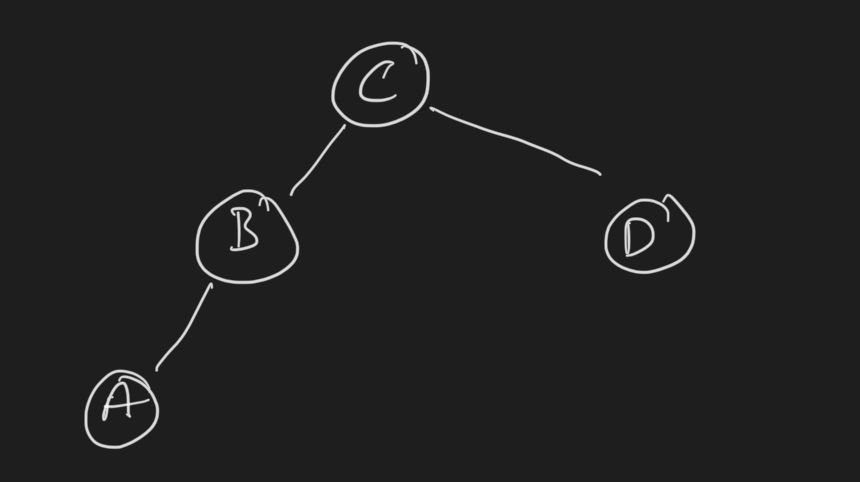

+++
title = 'Homework 7'
date = 2024-11-21T11:57:07-05:00
draft = false
summary = "My homework backup for Advance Algorithm subject."
series = ["Advance Algorithm",]
tags = ["Advance Algorithm", "homework", "university", "school"]
author= ["Me"]
+++

## Answer 1

- Both divide the problem into sub-problems. 
- In divide and conquer, the sub-problems do not overlap therefore not saved. Where as in dynamic programming, the sub-problems overlap hence saved for reuse.

## Answer 2

We can create following table

| Index | 0   | 1   | 2   | 3   | 4   | 5   | 6   |
| ----- | --- | --- | --- | --- | --- | --- | --- |
| C     |     | 5   | 1   | 2   | 10  | 6   | 2   |
| F     | 0   | 5   | 5   | 7   | 15  | 15  | 17  |

Highest amount of money that can be yielded is **F(5) = 15** by taking C4 and C1

## Answer 3

### a
The algorithm's running time matches with how long it takes to calculate Fibonacci numbers using the top-down method. Its time complexity is Θ(φⁿ), where φ is the golden ratio (~1.618). This means the time grows exponentially as the input size increases.

### b

Let's look at how many different valid coin selections we can make:

* If we check every possible coin combination, we'd have 2ⁿ possibilities
* Even when we only look at valid selections (where no two adjacent coins are picked), we still get a lot of combinations
* We can calculate this using a simple rule:

F(n) = F(n-2) + F(n-1)

Starting with F(1) = 2 and F(2) = 3


This pattern follows the Fibonacci numbers, just shifted up by two positions. Therefore, the number of valid coin selections also grows exponentially, specifically at the rate of Θ(φⁿ).

## Answer 4

Let's find all the longest common subsequences (LCS) by:

Building the table:
```
    0  1  0  1  1  0  1  1  0
1   0  0  0  0  0  0  0  0  0
0   0  0  1  1  1  1  1  1  1
0   0  0  1  1  1  2  2  2  2
1   0  1  1  2  2  2  2  2  2
0   0  1  2  2  2  3  3  3  3
1   0  1  2  3  3  3  4  4  4
0   0  1  2  3  3  4  4  4  5
1   0  1  2  3  4  4  5  5  5
```

Working backwards through the table from the bottom right, we can find three different longest sequences:

0,1,0,1,0

0,1,1,0,0

0,0,1,1,0

Each of these sequences:

* Is 5 elements long
* Can be found in both original sequences
* Represents the maximum possible length

Therefore, these three sequences are all possible longest common subsequences.

## Answer 5

DP algorithm of given problem yields following table

n = 0 1 2 3 4 5 6 7 8 9       

```
Starting array F: [0]

Step 1: Calculate F[1]
Min(F[0]) + 1 = 1
Array: [0, 1]

Step 2: Calculate F[2]
Min(F[1]) + 1 = 2
Array: [0, 1, 2]

Step 3: Calculate F[3]
Min(F[2], F[0]) + 1 = 1
Array: [0, 1, 2, 1]

Step 4: Calculate F[4]
Min(F[3], F[1]) + 1 = 2
Array: [0, 1, 2, 1, 2]

Step 5: Calculate F[5]
Min(F[4], F[2], F[0]) + 1 = 1
Array: [0, 1, 2, 1, 2, 1]

Step 6: Calculate F[6]
Min(F[5], F[3], F[1]) + 1 = 2
Array: [0, 1, 2, 1, 2, 1, 2]

Step 7: Calculate F[7]
Min(F[6], F[4], F[2]) + 1 = 3
Array: [0, 1, 2, 1, 2, 1, 2, 3]

Step 8: Calculate F[8]
Min(F[7], F[5], F[3]) + 1 = 2
Array: [0, 1, 2, 1, 2, 1, 2, 3, 2]

Step 9: Calculate F[9]
Min(F[8], F[6], F[4]) + 1 = 3
Final Array: [0, 1, 2, 1, 2, 1, 2, 3, 2, 3]
```

Final table

| n   | 0   | 1   | 2   | 3   | 4   | 5   | 6   | 7   | 8   | 9   |
| --- | --- | --- | --- | --- | --- | --- | --- | --- | --- | --- |
| F   | 0   | 1   | 2   | 1   | 2   | 1   | 2   | 3   | 2   | 3   |

Minimum coins are F(9) = 3. 
And there are two optimal coin sets: {1, 3, 5} and {3, 3, 3}.

## Answer 6

Default formula is 

F (i, j ) = max{F (i − 1, j ), F (i, j − 1)} + ${c_{ij}}$ for 1 ≤ i ≤ n, 1 ≤ j ≤ m`

This formula should be modified as follows:

* For inadmissible cells:
  * Mark as inadmissible
  * Skip coin calculation


* For admissible cells:
  * If no valid neighbors (above/left): Mark inadmissible
  * If one valid neighbor: Use only that value
  * If both neighbors valid: Use original formula (maximum of above + current, left + current)

The rest of the table-filling process remains unchanged, moving right and down through the board.

Applying the above said formula to given problem.



Blue circles show the profit earned, hence the path followed.

## Answer 7

Dynamic Programming Solution:
* Let F(n) represent maximum price for rod length n

Recurrence relation:
* F(n) = max{pi + F(n-i)} for i = 1 to n
* Base case: F(0) = 0

Algorithm Analysis:
* Time Complexity: O(n²)
  * Computing each F(i) needs i operations
  * Total operations: 1 + 2 + ... + n = n(n+1)/2
  * Therefore quadratic time


* Space Complexity: O(n)
  * Needs one array of size n+1 to store results


Optimal cutting pattern can be found through backtracking
Solution can store cut positions if needed.

## Answer 8

### a



Maximum profit is 65 (item3 and item5)

b. Only 1 unique instance

c. If during backtracing the path there is no equality between $F[i − 1, j] and  v_i + F[i − 1, j − w_i]$, the solution set will be unique.

## Answer 9

```
Computing Optimal Costs:

For range [1,2]:
Choice of root:
Root 1: Left(0) + Right(0.2) + P(0.5) = 0.5
Root 2: Left(0.1) + Right(0) + P(0.3) = 0.4*
Final: 0.4

For range [2,3]:
Choice of root:
Root 2: Left(0) + Right(0.4) + P(0.6) = 1.0
Root 3: Left(0.2) + Right(0) + P(0.6) = 0.8*
Final: 0.8

For range [3,4]:
Choice of root:
Root 3: Left(0) + Right(0.3) + P(0.7) = 1.0*
Root 4: Left(0.4) + Right(0) + P(0.7) = 1.1
Final: 1.0

For range [1,3]:
Choice of root:
Root 1: Left(0) + Right(0.8) + P(0.7) = 1.5
Root 2: Left(0.1) + Right(0.4) + P(0.7) = 1.2
Root 3: Left(0.4) + Right(0) + P(0.7) = 1.1*
Final: 1.1

For range [2,4]:
Choice of root:
Root 2: Left(0) + Right(1.0) + P(0.9) = 1.9
Root 3: Left(0.2) + Right(0.3) + P(0.9) = 1.4*
Root 4: Left(0.8) + Right(0) + P(0.9) = 1.7
Final: 1.1

For range [1,4]:
Choice of root:
Root 1: Left(0) + Right(1.4) + P(1.0) = 2.4
Root 2: Left(0.1) + Right(1.0) + P(1.0) = 2.1
Root 3: Left(0.4) + Right(0.3) + P(1.0) = 1.7*
Root 4: Left(1.1) + Right(0) + P(1.0) = 2.1
Final: 1.7
```

Main Table

|     | 0   | 1   | 2   | 3   | 4   |
| --- | --- | --- | --- | --- | --- |
| 1   | 0   | 0.1 | 0.4 | 1.1 | 1.7 |
| 2   | -   | 0   | 0.2 | 0.8 | 1.4 |
| 3   | -   | -   | 0   | 0.4 | 1.0 |
| 4   | -   | -   | -   | 0   | 0.3 |
| 5   | -   | -   | -   | -   | 0   |

Root Table

| | 0 | 1 | 2 | 3 | 4 |
|-|---|---|---|---|---|
|1| - | 1 | 2 | 3 | 3 |
|2| - | - | 2 | 3 | 3 |
|3| - | - | - | 3 | 3 |
|4| - | - | - | - | 4 |
|5| - | - | - | - | - |

Optimal Tree

