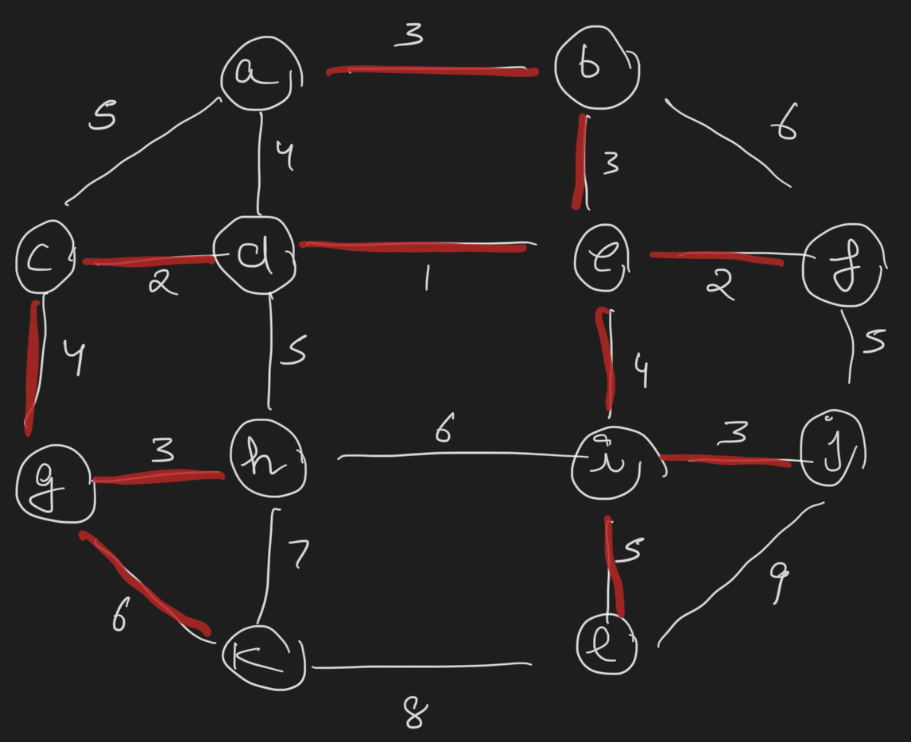
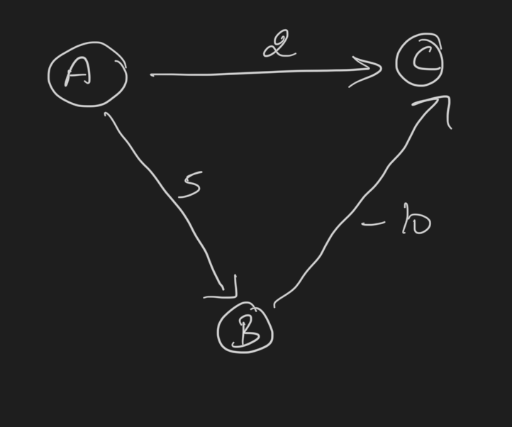
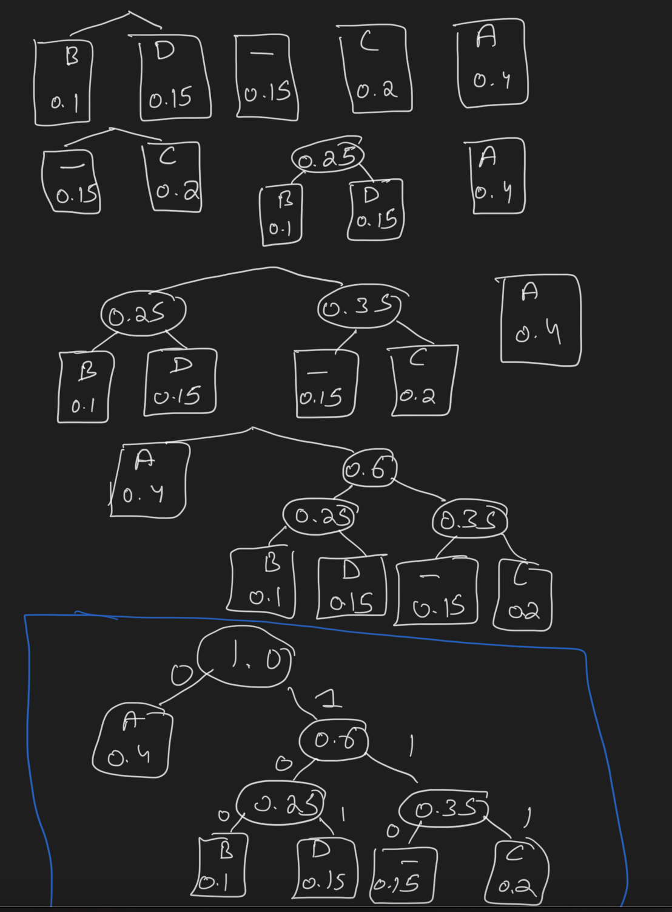

+++
title = 'Homework 8'
date = 2024-11-21T11:57:07-05:00
draft = false
summary = "My homework backup for Advance Algorithm subject."
series = ["Advance Algorithm",]
tags = ["Advance Algorithm", "homework", "university", "school"]
author= ["Me"]
+++

## Answer 1

``` c

algorithm change(D[1...m], n) {
    C[m] = []
    for itr = [1->m] {
        C[itr] = (n/D[itr])
        n = n % D[itr]
    }

    if n == 0 {
        return C
    }
    // No Answer
    print("N/A")
    return null
}

```

Time efficiency Θ(m)

## Answer 2

- Sorts intervals by execution time
- Processes them in order, tracking both current and total time
- Returns sorted intervals and final total time


```c
    algorithm sortAndExecute(intervals[1...n]) {
        // Sort intervals based on execution time
        sort(intervals)   // assumes sorting by execution time in ascending order
        
        current_time = 0
        total_time = 0
        
        // Execute intervals in sorted order
        for i = [1 -> n] {
            current_time = current_time + intervals[i].time
            total_time = total_time + current_time
        }
        
        return intervals, total_time
    }
```
Yes, 

When a job runs, every other job waiting in line has to wait that long. So if we put a long job first, lots of other jobs have to wait longer. But if we put short jobs first, fewer jobs have to wait through the long ones. 

## Answer 3

| Step | Selected Tree Vertex | Priority Queue (Remaining Edges) |
|------|---------------------|----------------------------------|
| 1    | a                   | b(a,5), c(a,7), d(a, 'inf'), **e(a,2)**  |
| 2    |  e(a,2)           | **b(e,3)**, c(e,4), d(e,5)          |
| 3    |  b(e,3)           | **c(e,4)**, d(e,5)                  |
| 4    |  c(e,4)           | **d(c,4)**                          |
| 5    |  d(c,4)           | -                               |


Final MST Edges: (a,e), (e,b), (e,c), (c,d)

## Answer 4

Prim's Algorithm is self-checking for connectivity:
- If it can reach all vertices → Graph is connected
- If it can't reach all vertices (or finds infinite edge lengths) → Graph is disconnected

No need for a separate connectivity check - the algorithm tells us this automatically while building the MST!

## Answer 5
Yes

- Proof Perspective:
  - The correctness proof never assumes weights must be positive
  - It only compares weights, not their signs


- Simple Transformation Method:
  - Add constant C to all edge weights
  - New weight = original weight + C
  - Every spanning tree will increase by C(n-1)
    - Because every spanning tree has exactly (n-1) edges and
    n = number of vertices

## Answer 6



## Answer 7

### a

| Step | Tree Vertex (Distance) | Fringe Vertices (Distance, Via) | Shortest Path from a |
|------|----------------------|--------------------------------|-------------------|
| 1    | a(0,)               | b('+inf'), c('+inf'), **d(a,7)**, e('inf')      | d: a->d (7)        |
| 2    | d(a,7)              | **b(d, 9)**, c(d, 12), e('+inf')         | b: a->d->b (9)      |
| 3    | b(d,9)              | **c(d, 12)**, e('+inf')                 | c: a->d->c (12)     |
| 4    | c(d,12)             | **e(c, 18)**                       | e: a->d->c->e (18)   |
| 5    | e(c,18)             | -                             | -                 |

### b

| Step | Tree Vertex (Distance) | Fringe Vertices (Distance, Via) | Shortest Path from a |
|------|----------------------|--------------------------------|-------------------|
| 1    | a(0,)              | **b(a,3)**, c(a,5), d(a,4)        | b: a->b (3)        |
| 2    | b(a,3)              | c(a, 5), **d(a,4)**, e(b,6), f(b,9) | d: a->d (4)        |
| 3    | d(a,4)              | **c(a, 5)**, e(d,5), f(a,9), h(d,9) | c: a->c (5)        |
| 4    | c(a,5)              | **e(d,5)**, f(a,9), h(d,9), g(c,9) | e: a->d->e (5)      |
| 5    | e(d,5)              | **f(e,7)**, h(d,9), g(c,9), i(e, 9) | f: a->d->e->f (7)    |
| 6    | f(e,7)              | **h(d,9)**, g(c,9), i(e,9), j(f, 12)| h: a->d->h (9)      |
| 7    | h(d,9)              | **g(c,9)**, i(e,9), j(f,12), k(h,16)| g: a->c->g (9)      |
| 8    | g(c,9)              | **i(e,9)**, j(f,12), k(g,15)      | i: a->d->e->i (9)    |
| 9    | i(e, 9)              | **j(12,f)**, k(g,15), l(i,14)     | j: a->d->e->f->j (12) |
| 10   | j(f,12)             | k(g,15), **l(i, 14)**              | l: a->d->e->i->l (14) |
| 11   | l(i,14)             | **k(15,g)**                       | k: a->c->g->k (15)   |
| 12   | k(g,15)             | -                             | -                 |


## Answer 8



Dijkstra's algorithm normally wouldn't consider the path A→B→C because:

- Direct path to C doesn't exist
- Path through B looks longer initially (5)

But actually A→B→C gives us:

- A to B: 5
- B to C: -10
- Total: 5 + (-10) = -5

## Answer 9

### a 



| Letter | A | B | C | D | _ |
| -- | -- | -- | -- | -- | -- |
| Prob. | 0.4 | 0.1 | 0.2 | 0.15 | 0.15 |
| Code-word | 0 | 100 | 111 | 101 | 110 |

### b

0100011101000101

### c
```
'100'|'0'|'101'|'110'|'0'|'101'|'0'
B      A    D     _    A    D    A
```

## Answer 10

### a
True

They are always placed as sibling nodes at the same level in the Huffman tree, resulting in identical codeword lengths

### b
True

A symbol that appears more frequently will always have a codeword length that is shorter than or equal to the code-word length of a less frequent symbol.