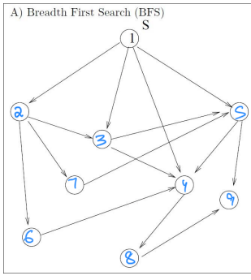
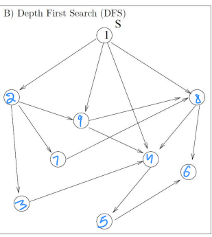
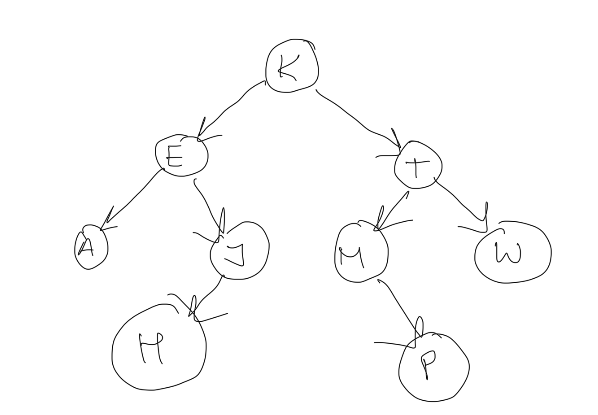
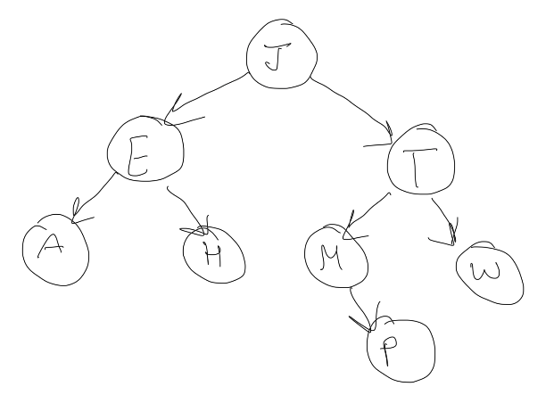

+++
title = 'Midterm 1'
date = 2024-11-21T11:57:07-05:00
draft = false
summary = "My homework backup for Advance Algorithm subject."
series = ["Advance Algorithm",]
tags = ["Advance Algorithm", "midterm", "university", "school"]
author= ["Me"]
+++

## Answer 1

(a) True

(b) True

(c) False

(d) False

(e) True

(f) False

(g) True

(h) False

(i) True

(j) False

(k) False

(l) False


## Answer 2

*I think in question pseudo code on line 8 it should be A[j]. Answering accordingly*


a. DOES_SOMETHING procedure implements a partitioning algorithm ("Hoare's" partitioning algorithm to be specific).

b. Worst case for this algo is $O(n^2)$ where n is length of input array.

This will only happen in case of sorted array. The pivot is chosen which will be the smallest/largest element of array. Which will lead to more operations.

c. [24, 19, 9, 15, 30, 46, 29, 86, 78]


## Answer 3

a. This algo is finding $log_2(n)$

b. The efficiency of this algo is O(log(n)). This is proved below.

```
We know T(1) = 0 (This is base case)

and     T(n) = T(n/2) + 1 (Basic operation is addition) [EQ #1]

        T(n/2) = T(n/4) + 1  [EQ #2]

        Substituting EQ #2 in #1

        T(n) = [T(n/4) + 1] + 1
        Expanding further

        T(n) = [T(n/8) + 1] + 2
        .
        . We can generalize
        T(n) = T(n/2^i)+i
        
        when i = log(n)

        T(n) = T(n/(2^log(n))) + log(n)

             = T(n/n) + log(n)
             = T(1) + log(n)
             = log(n)

```

## Answer 4

Order of growth (lowest to highest):

ln² n, ³√n, n²(log n)², n² log(n²), n² + n³ + log n, 2²ⁿ, 3ⁿ, (3/2)ⁿ, n!, (5/8)ⁿ

## Answer 5

Pseudo Code
```

    multiply(a, b):
        result = 0
        while a>=0:
            if a is odd:
                result += b
            
            a = a // 2
            b = b * 2

        return result

```

a = 25, b = 47

a   b  result

25  47  0

12  94  47

6   188 47

3   376 47 

1   752 423

        1175

Therefore, 25X47 = 1175

## Answer 6


a



b





## Answer 7

For this, first let's find adjacency list.

```
a: c, d
b: d
c: e, d
d: []
e: h
f: e, g
g: h
h: []
```

There is not cycle, so topological sort is possible.

We will use source removal algorithm. In this we will remove a source (node which as no incoming node) one at a time. And order of removal of source is topological order.

```
Initial sources: a, b, f

Remove: a
Remaining graph:
b: d
c: e, d
d: []
e: h
f: e, g
g: h
h: []

Remove: b
Remaining graph:
c: e, d
d: []
e: h
f: e, g
g: h
h: []

Remove: f
Remaining graph:
c: e, d
d: []
e: h
g: h
h: []

Remove: c
Remaining graph:
d: []
e: h
g: h
h: []

Remove: d
Remaining graph:
e: h
g: h
h: []

Remove: g
Remaining graph:
e: h
h: []

Remove: e
Remaining graph:
h: []

Remove: h
Graph is empty
```

Final topological ordering: a, b, f, c, d, g, e, h


## Answer 8

* Last Swap -> 10 <-> 71
* First Sawp -> 45 <-> 12
* Number of Swap -> 3
* Number of Comparison -> 6 (once for each element except the pivot)


## Answer 9
a



b

* Pre-order traversal: K, E, A, J, H, T, M, P, W
* In-order traversal: A, E, H, J, K, M, P, T, W
* Post-order traversal: A, H, J, E, P, M, W, T, K

c. Here Root node is "K". Deleting that yields following Tree.



## Answer 10

```
Using this algo as a merge phase

FUNC Combine(sequenceA, sequenceB)
    PRINT sequenceA, sequenceB
    
    combinedSequence = empty list
    indexA = 0
    indexB = 0
    
    WHILE indexA < length of sequenceA AND indexB < length of sequenceB
        IF sequenceA[indexA] < sequenceB[indexB] THEN
            APPEND sequenceA[indexA] to combinedSequence
            INCREMENT indexA
        ELSE
            APPEND sequenceB[indexB] to combinedSequence
            INCREMENT indexB
        END IF
    END WHILE
    
    APPEND remaining elements of sequenceA to combinedSequence
    APPEND remaining elements of sequenceB to combinedSequence
    
    PRINT "COMBINATION RESULT", combinedSequence
    RETURN combinedSequence
```

According to this algo first combination will be held on `[27] [43]`And result will be `MERGE RESULT [27, 43]`.

This will be because, merge sort divide the problem in half subproblem and calls the mergeSort function recursively on first part and then on second part.

Because second part is called later, recursively it will be combined first and then it's result is combined with other subpart after that.