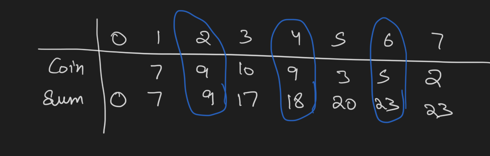
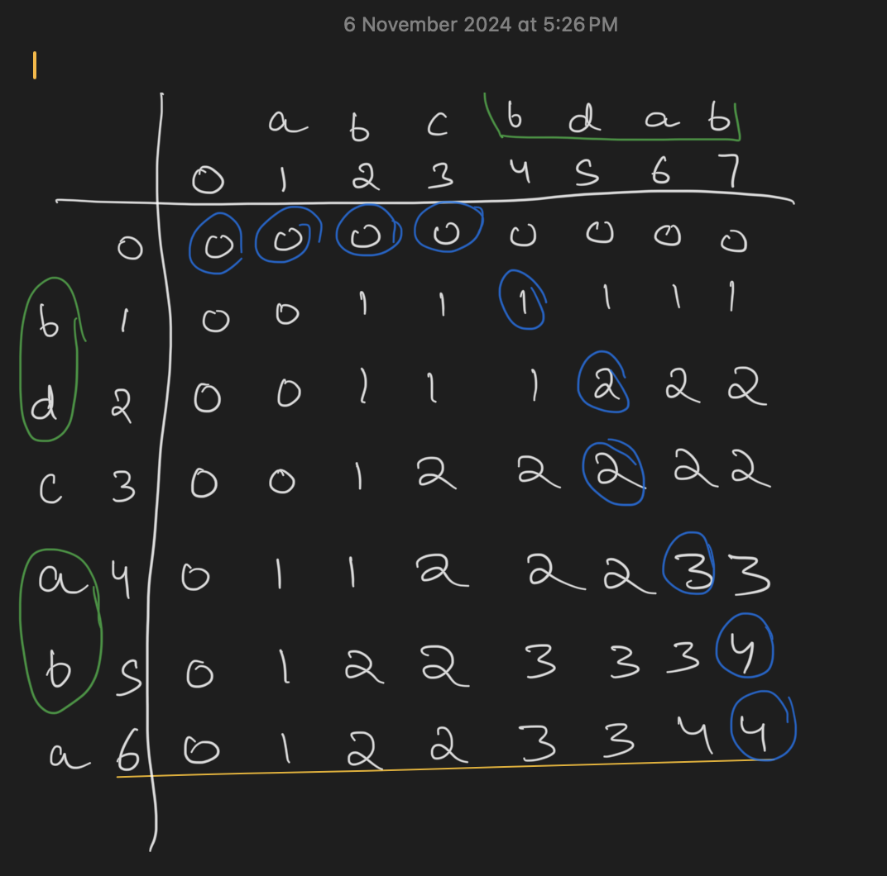
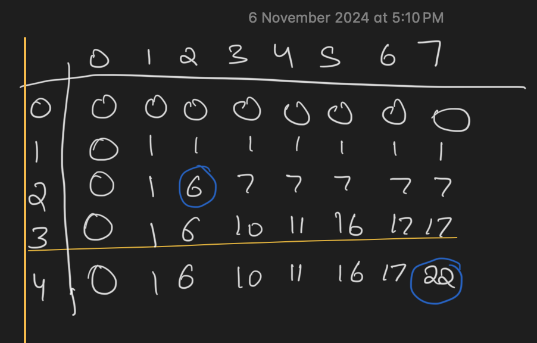
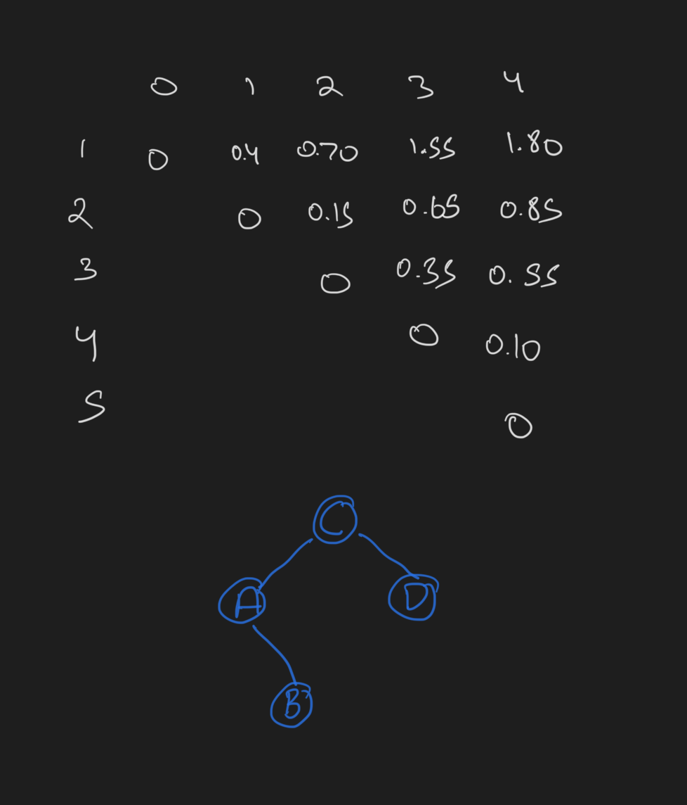

+++
title = 'Midterm 2'
date = 2024-11-21T11:57:07-05:00
draft = false
summary = "My homework backup for Advance Algorithm subject."
series = ["Advance Algorithm",]
tags = ["Advance Algorithm", "midterm", "university", "school"]
author= ["Me"]
+++


# Answer 1
1. T
1. F
1. T
1. F
1. F
1. F
1. T
1. F
1. F
1. T
1. T
1. T
1. F
1. T
1. F

# Answer 2

## a.

The function of procedure DOES_SOMETHING is a Counting Sort algorithm that sorts the given array A. It counts how many times each number appears, then uses this information to put them in correct sorted order in the final array C.

## b.

The worst-case running time is O(n + k) where n is array length and k is range (y-x). 

Line 1: loop runs (y-x) times = O(k)

Line 2: loop runs n times = O(n)

Line 3: loop runs (y-x) times = O(k)

Line 4-7: loop runs n times = O(n)

However, in most practical cases where range is small compared to n, we can consider it O(n), as k becomes insignificant compared to n.

## c.

For A = [6, 0, 2, 0, 1, 3, 4, 6, 1, 3, 2]

After line 1:
B = [0, 0, 0, 0, 0, 0, 0] *(creates array of zeros of size y-x+1)*

After line 2:
B = [2, 2, 2, 2, 1, 0, 2] *(counts each number's frequency)*

After line 3:
B = [2, 4, 6, 8, 9, 9, 11] *(cumulative sum of frequencies)*

Final array C:
C = [0, 0, 1, 1, 2, 2, 3, 3, 4, 6, 6] *(sorted array)*

# Answer 3

Sum[i] = Max(Coin[i]+Sum[i-2], Sum[i-1])


Blue circle shows the optimal selection.

# Answer 4

Shift Table
| A | T | G | * |
| - | - | - | - |
| 4 | 1 | 2 | 5 |


```

GTACTAGAGGACGTATGTACTG
ATGTA
 ATGTA
     ATGTA
       ATGTA
            ATGTA
              ATGTA

Shift 1 for T
Shift 4 for A
Shift 2 for G
Shift 5 for C
Shift 1 for G

Match Found
```

# Answer 5



Blue circle show the profit path followed and green circle shows the subsequence.

**LCS = bdab**

# Answer 6


Blue circles is the optimal selection

# Answer 7



This is the search cost table and optimal tree.