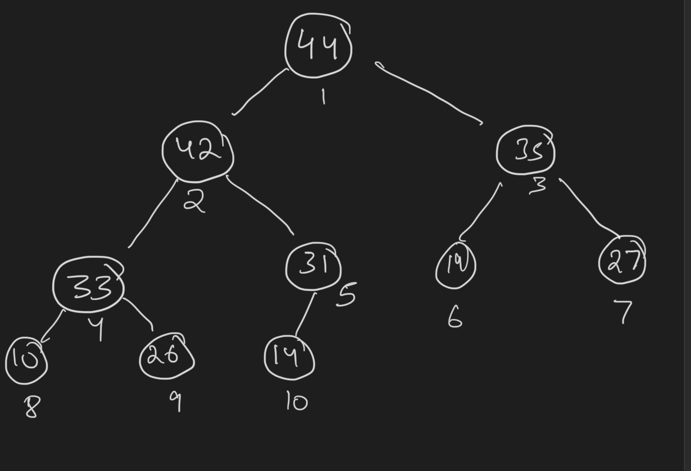
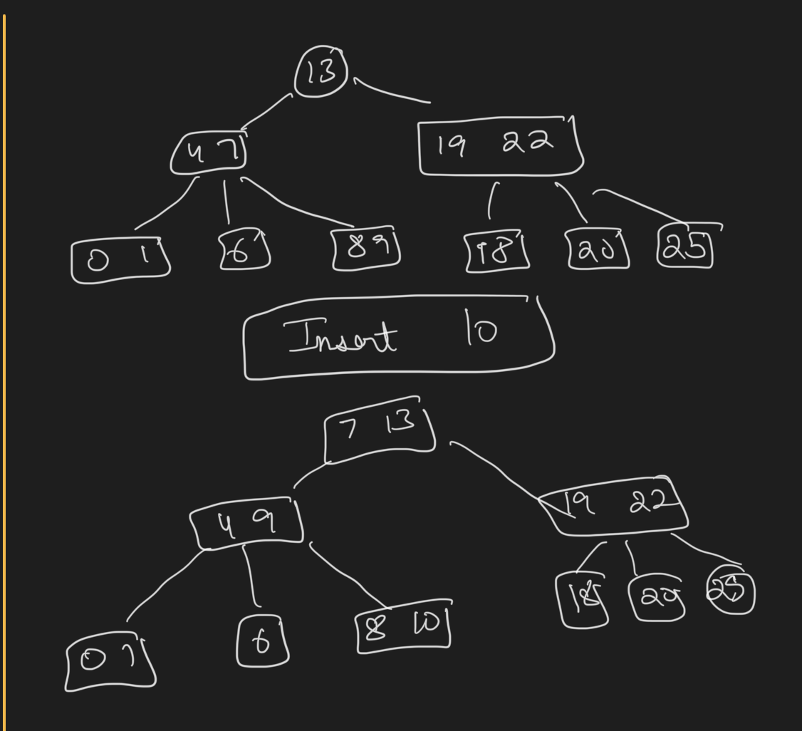
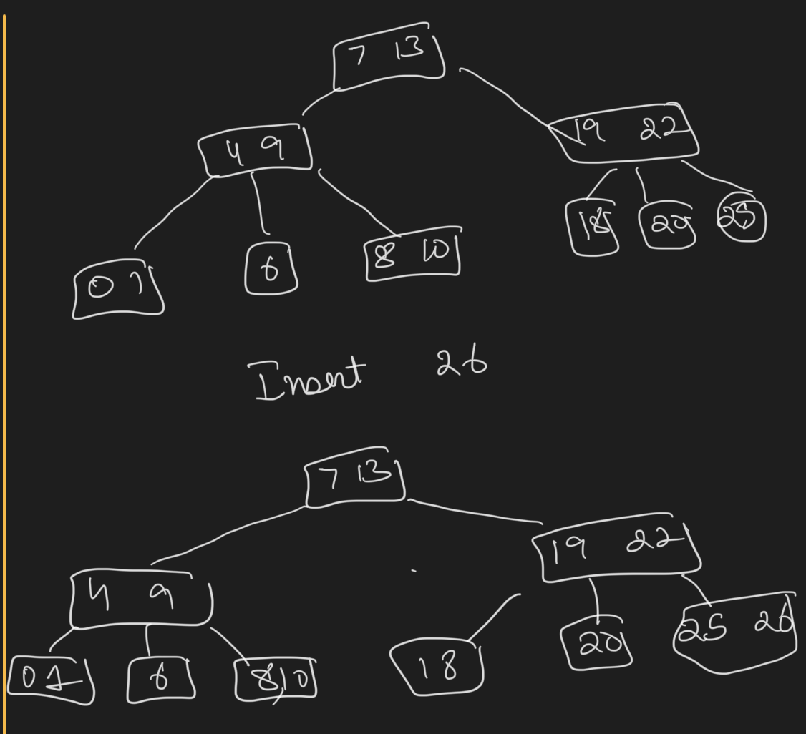
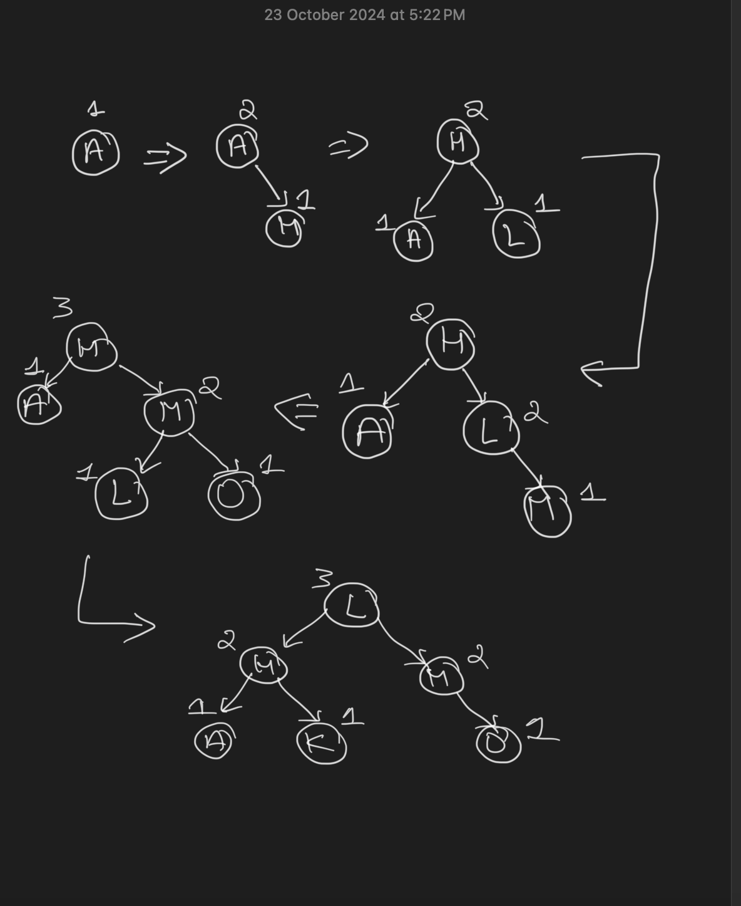

+++
title = 'Quiz 2'
date = 2024-11-21T11:57:07-05:00
draft = false
summary = "My homework backup for Advance Algorithm subject."
series = ["Advance Algorithm",]
tags = ["Advance Algorithm", "midterm", "university", "school"]
author= ["Me"]
+++


## Answer 1



## Answer 2





## Answer 3

Initial: 90, 57, 25, 13, 11, 9, 17, 1, 2, 3
1) 90 <-> 3: 3, 57, 25, 13, 11, 9, 17, 1, 2, [90]
2) 57 <-> 2: 3, 2, 25, 13, 11, 9, 17, 1, [57, 90]
3) 25 <-> 1: 3, 2, 1, 13, 11, 9, 17, [25, 57, 90]
4) 17 <-> 13: 3, 2, 1, 13, 11, 9, [17, 25, 57, 90]
5) 13 <-> 9: 3, 2, 1, 9, 11, [13, 17, 25, 57, 90]


## Answer 4

Initial coff. Values (Signified in matrix format)

```
[2  -2   0 | -6]
[1  -1   1 |  1]
[0   3  -2 | -5]
```

Row2 - (1/2)Row1

```
[2  -2   0 | -6]
[0   0   1 |  4]
[0   3  -2 | -5]
```

Swap R2 and R3 (since R2 has zeros in first two positions):

```
[2  -2   0 | -6]
[0   3  -2 | -5]
[0   0   1 |  4]
```

R2 = R2 - 0R1 (already 0 in first position)

```
[2  -2   0 | -6]
[0   3  -2 | -5]
[0   0   1 |  4]
```

Back substitution:
z = 4

y = (-5 + 2z)/3 = 1

x = (-6 + 2y)/2 = -2


Final answer: **x = -2, y = 1, z = 4**


## Answer 5



## Answer 6

### a

Hashes
| x  | h(x) |
| -- | --   |
| 15 | 1    |
| 17 | 3    |
| 8 | 1 -> 2    |
| 23 | 2 -> 3 -> 4   |
| 3 | 3 -> 4 -> 5    |
| 5 | 5 -> 6   |

| idx| Values |
| -- | --   |
| 0 |     |
| 1 |   15  |
| 2 |   8  |
| 3 |   17  |
| 4 |   23  |
| 5 |   3  |
| 6 |   5  |

No overflow

### c

Reference h = (h1(k) + i*h2(k))%n

Hashes
| x  | h(x) | h2(x) |
| -- | --   | -- |
| 15 | 1 |   |
| 17 | 3 ||
|8 |  1 |  2|
|23 |  2 ||
|3 |  3 | 1 -> 4|
|5 |  5 | 1 -> 6|


| idx| Values |
| -- | --   |
| 0 |     |
| 1 |   15 |
| 2 |   23  |
| 3 |   17  |
| 4 |    3 |
| 5 |   8  |
| 6 |   5  |

No overflow