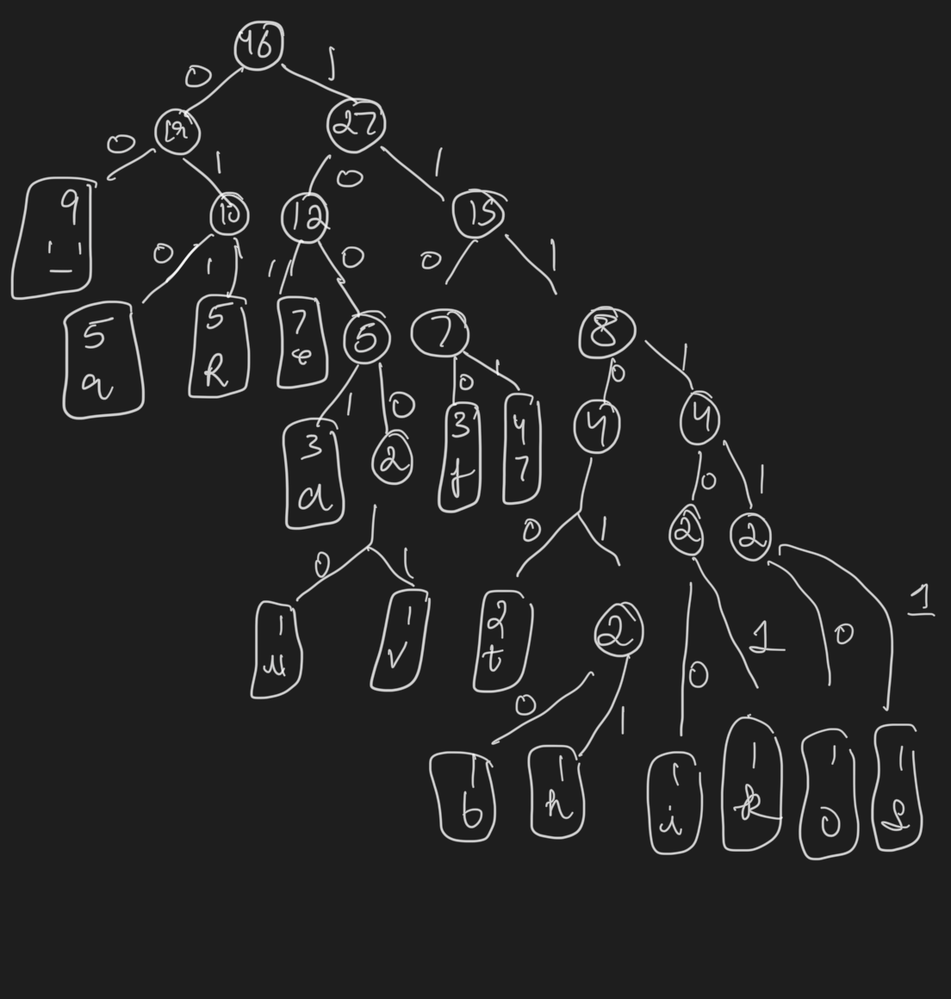
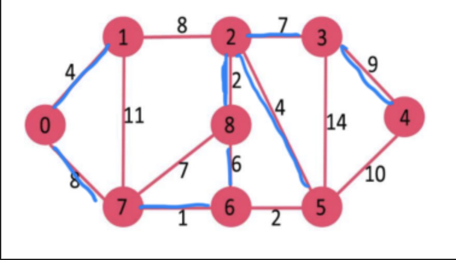
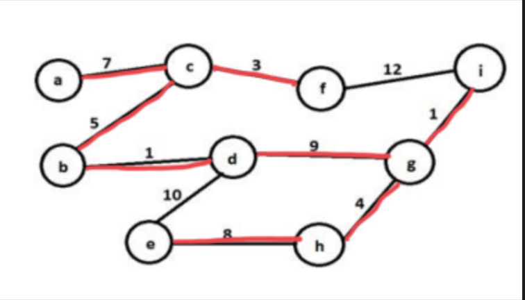

+++
title = 'Quiz 3'
date = 2024-11-21T11:57:07-05:00
draft = false
summary = "My homework backup for Advance Algorithm subject."
series = ["Advance Algorithm",]
tags = ["Advance Algorithm", "midterm", "university", "school"]
author= ["Me"]
+++

## Answer 1

## Answer 2

Blue edges show updated graph.

## Answer 3

Red lines how the paths selected for MST. They are selected by picking n - 1 (n = number of vertices) edges in acceding order of their weights.

Total Weight = 38

## Answer 4

 Solution isn't actually possible because Dijkstra's algorithm doesn't work with negative weights.

 For accurate shortest paths with negative weights, we should use Bellman-Ford algorithm instead. Bellman ford will look something like this.

 | Step | Tree Vertex (Distance) | Fringe Vertices (Distance, Via) | Shortest Path from a |
 |------|----------------------|--------------------------------|-------------------|
 | 1 | a(0,) | b(1,a), c(2,a), d(2,a), e(∞), f(∞), g(∞) | b: a->b (1) |
 | 2 | b(1,a) | c(2,a), d(2,a), e(-2,b), f(∞), g(∞) | c: a->c (2) |
 | 3 | c(2,a) | d(2,a), e(-2,b), f(∞), g(∞) | d: a->d (2) |
 | 4 | d(2,a) | e(-2,b), f(∞), g(4,d) | e: a->b->e (-2) |
 | 5 | e(-2,b) | f(0,e), g(-1,e) | g: a->b->e->g (-1) |
 | 6 | g(-1,e) | f(0,e) | f: a->b->e->f (0) |
 | 7 | f(0,e) | - | - |

## Answer 5

| Item | 1 | 2 | 3 | 4 |
| -- | -- | -- | -- | -- |
| Profit per weight | 10/5 = 2 | 40/4 = 10 | 30/6 = 5 | 50/3 ~= 16.6 |

Total Weight (W) = 10

Picking item with most profit/weight in each iteration until we fill the capacity of knapsack.

| Pending Weight | Picked Item | Qty | Profit |
| -- | -- | -- | -- |
| 10 | 4 | 3 | 50 |
| 7 | 2 | 4 | 90 |
| 3 | 3 | 3 | 15 |

Total Profit = 105